# Fetpal 시스템 흐름도

> **4차 스프린트 발표** (2025.11.14)  
> **최종 발표**: (2025-11-21)

---

## 📋 문서 개요

이 문서는 Fetpal 프로젝트의 주요 기능별 사용자 플로우와 시스템 간 상호작용을 다이어그램과 함께 설명합니다.

---

## 🎯 전체 시스템 아키텍처 개요

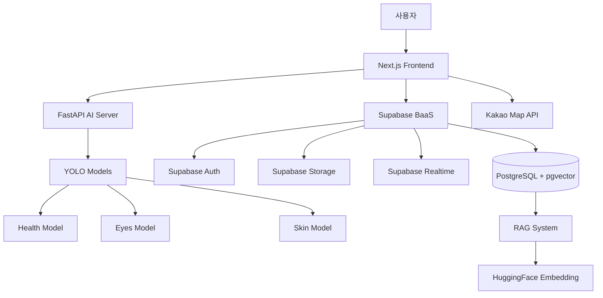
```mermaid
graph TB
    User[사용자] --> Frontend[Next.js Frontend]
    Frontend --> Supabase[Supabase BaaS]
    Frontend --> FastAPI[FastAPI AI Server]
    Frontend --> KakaoAPI[Kakao Map API]

    Supabase --> PostgreSQL[(PostgreSQL + pgvector)]
    Supabase --> Auth[Supabase Auth]
    Supabase --> Storage[Supabase Storage]
    Supabase --> Realtime[Supabase Realtime]

    FastAPI --> YOLO[YOLO Models]
    YOLO --> HealthModel[Health Model]
    YOLO --> EyesModel[Eyes Model]
    YOLO --> SkinModel[Skin Model]

    PostgreSQL --> RAG[RAG System]
    RAG --> HuggingFace[HuggingFace Embedding]
```

---

## 🔐 1. 회원가입 및 로그인 플로우

### 1.1. 회원가입 프로세스

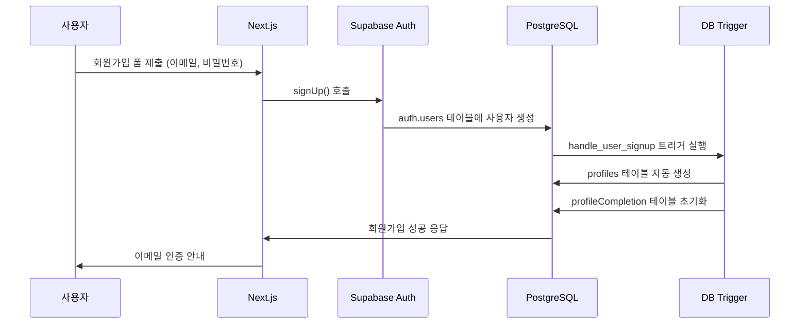
```mermaid
sequenceDiagram
    participant User as 사용자
    participant Frontend as Next.js
    participant SupaAuth as Supabase Auth
    participant DB as PostgreSQL
    participant Trigger as DB Trigger

    User->>Frontend: 회원가입 폼 제출 (이메일, 비밀번호)
    Frontend->>SupaAuth: signUp() 호출
    SupaAuth->>DB: auth.users 테이블에 사용자 생성
    DB->>Trigger: handle_user_signup 트리거 실행
    Trigger->>DB: profiles 테이블 자동 생성
    Trigger->>DB: profileCompletion 테이블 초기화
    DB->>Frontend: 회원가입 성공 응답
    Frontend->>User: 이메일 인증 안내
```

**주요 특징**:

- 트리거 기반 자동 프로필 생성
- 이메일 인증 시스템
- profileCompletion으로 가입 진행도 추적

### 1.2. 로그인 프로세스

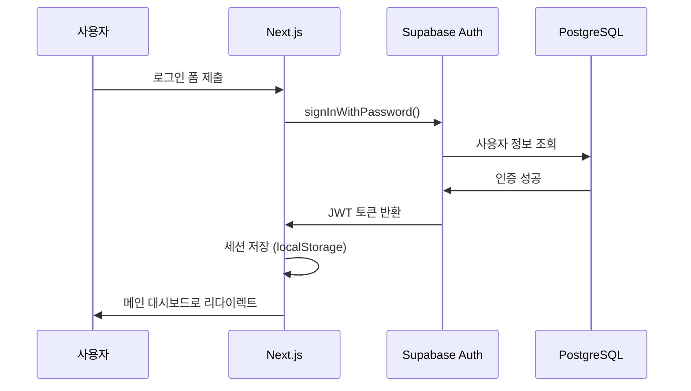
```mermaid
sequenceDiagram
    participant User as 사용자
    participant Frontend as Next.js
    participant SupaAuth as Supabase Auth
    participant DB as PostgreSQL

    User->>Frontend: 로그인 폼 제출
    Frontend->>SupaAuth: signInWithPassword()
    SupaAuth->>DB: 사용자 정보 조회
    DB->>SupaAuth: 인증 성공
    SupaAuth->>Frontend: JWT 토큰 반환
    Frontend->>Frontend: 세션 저장 (localStorage)
    Frontend->>User: 메인 대시보드로 리다이렉트
```

---

## 🏠 2. 메인 대시보드 플로우

### 2.1. 대시보드 초기 로딩

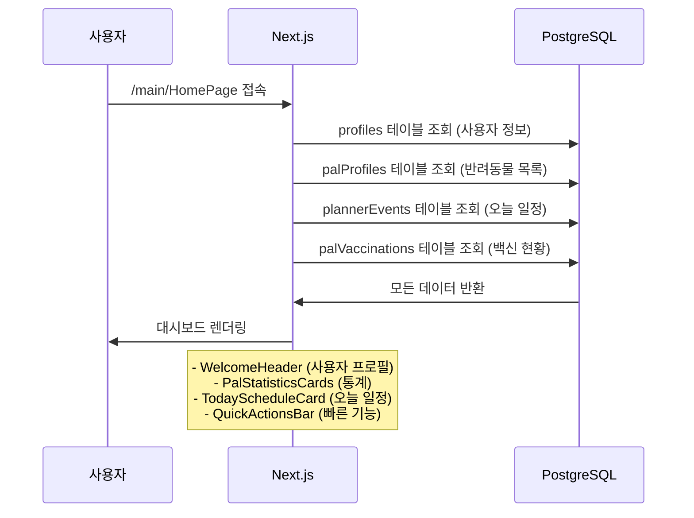
```mermaid
sequenceDiagram
    participant User as 사용자
    participant Frontend as Next.js
    participant DB as PostgreSQL

    User->>Frontend: /main/HomePage 접속
    Frontend->>DB: profiles 테이블 조회 (사용자 정보)
    Frontend->>DB: palProfiles 테이블 조회 (반려동물 목록)
    Frontend->>DB: plannerEvents 테이블 조회 (오늘 일정)
    Frontend->>DB: palVaccinations 테이블 조회 (백신 현황)
    DB->>Frontend: 모든 데이터 반환
    Frontend->>User: 대시보드 렌더링

    Note over Frontend: - WelcomeHeader (사용자 프로필)<br/>- PalStatisticsCards (통계)<br/>- TodayScheduleCard (오늘 일정)<br/>- QuickActionsBar (빠른 기능)
```

---

## 🩺 3. AI 임시진단 플로우

### 3.1. YOLO 이미지 분석 프로세스

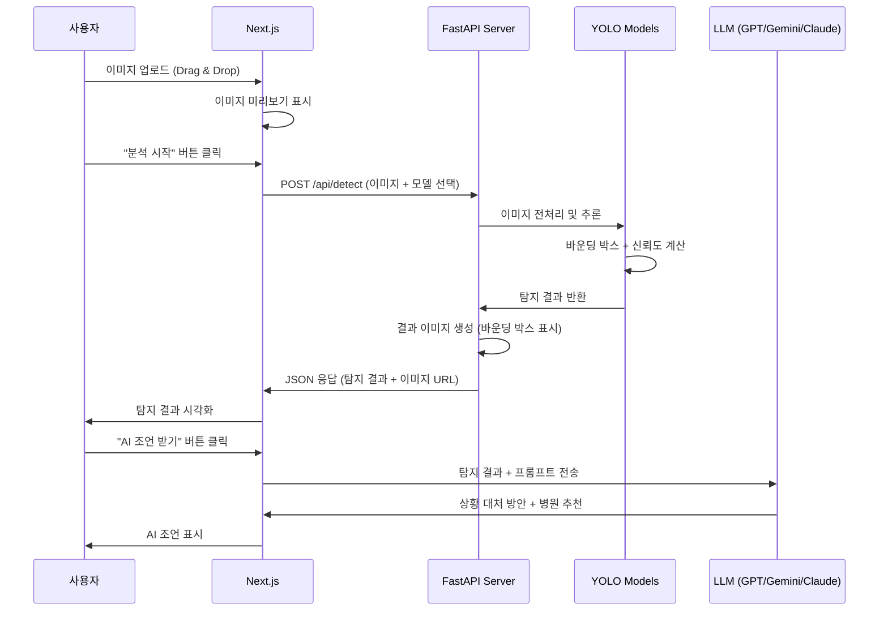
```mermaid
sequenceDiagram
    participant User as 사용자
    participant Frontend as Next.js
    participant FastAPI as FastAPI Server
    participant YOLO as YOLO Models
    participant LLM as LLM (GPT/Gemini/Claude)

    User->>Frontend: 이미지 업로드 (Drag & Drop)
    Frontend->>Frontend: 이미지 미리보기 표시
    User->>Frontend: "분석 시작" 버튼 클릭
    Frontend->>FastAPI: POST /api/detect (이미지 + 모델 선택)
    FastAPI->>YOLO: 이미지 전처리 및 추론
    YOLO->>YOLO: 바운딩 박스 + 신뢰도 계산
    YOLO->>FastAPI: 탐지 결과 반환
    FastAPI->>FastAPI: 결과 이미지 생성 (바운딩 박스 표시)
    FastAPI->>Frontend: JSON 응답 (탐지 결과 + 이미지 URL)
    Frontend->>User: 탐지 결과 시각화

    User->>Frontend: "AI 조언 받기" 버튼 클릭
    Frontend->>LLM: 탐지 결과 + 프롬프트 전송
    LLM->>Frontend: 상황 대처 방안 + 병원 추천
    Frontend->>User: AI 조언 표시
```

**지원 모델**:

- **Health 모델**: 전신 건강 체크 (3개 클래스)
- **Eyes 모델**: 안구질환 감지 (30개 클래스)
- **Skin 모델**: 피부질환 감지 (6개 클래스)

### 3.2. RAG 기반 지식 검색 플로우 ⭐

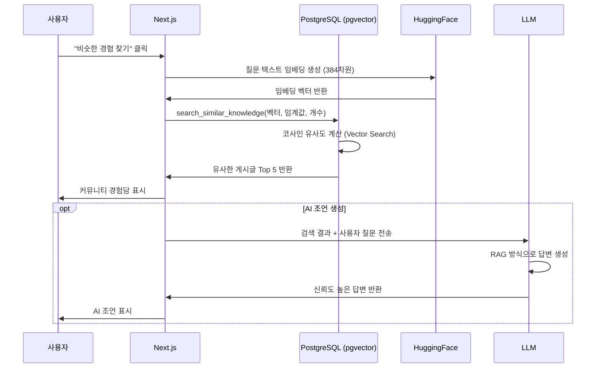
```mermaid
sequenceDiagram
    participant User as 사용자
    participant Frontend as Next.js
    participant DB as PostgreSQL (pgvector)
    participant HF as HuggingFace
    participant LLM as LLM

    User->>Frontend: "비슷한 경험 찾기" 클릭
    Frontend->>HF: 질문 텍스트 임베딩 생성 (384차원)
    HF->>Frontend: 임베딩 벡터 반환
    Frontend->>DB: search_similar_knowledge(벡터, 임계값, 개수)
    DB->>DB: 코사인 유사도 계산 (Vector Search)
    DB->>Frontend: 유사한 게시글 Top 5 반환
    Frontend->>User: 커뮤니티 경험담 표시

    opt AI 조언 생성
        Frontend->>LLM: 검색 결과 + 사용자 질문 전송
        LLM->>LLM: RAG 방식으로 답변 생성
        LLM->>Frontend: 신뢰도 높은 답변 반환
        Frontend->>User: AI 조언 표시
    end
```

**RAG 시스템 특징**:

- **자동 임베딩**: 커뮤니티 게시글 작성 시 트리거 기반 자동 생성
- **품질 관리**: quality_score (0.00-1.00) + is_verified 플래그
- **출처 추적**: source (community, faq, youtube, manual)

---

## 📅 4. 커스텀 플래너 플로우

### 4.1. 일정 생성 프로세스

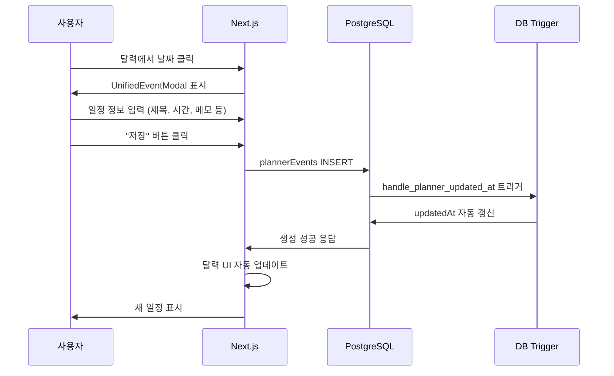
```mermaid
sequenceDiagram
    participant User as 사용자
    participant Frontend as Next.js
    participant DB as PostgreSQL
    participant Trigger as DB Trigger

    User->>Frontend: 달력에서 날짜 클릭
    Frontend->>User: UnifiedEventModal 표시
    User->>Frontend: 일정 정보 입력 (제목, 시간, 메모 등)
    User->>Frontend: "저장" 버튼 클릭
    Frontend->>DB: plannerEvents INSERT
    DB->>Trigger: handle_planner_updated_at 트리거
    Trigger->>DB: updatedAt 자동 갱신
    DB->>Frontend: 생성 성공 응답
    Frontend->>Frontend: 달력 UI 자동 업데이트
    Frontend->>User: 새 일정 표시
```

### 4.2. 연속 일정 드래그 생성 (Range Event)

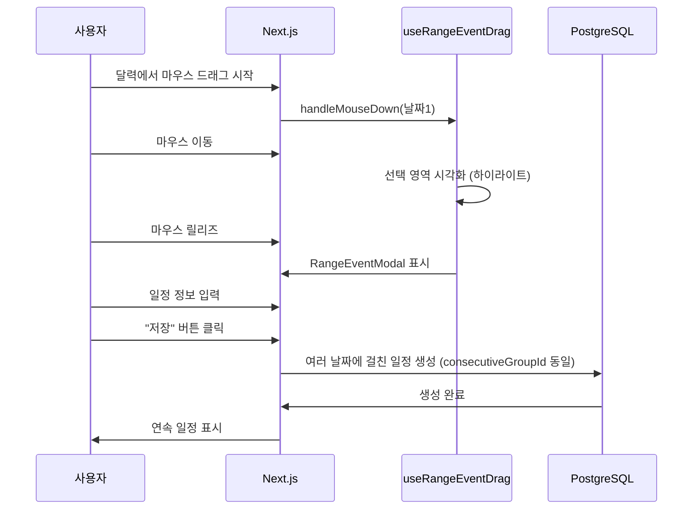
```mermaid
sequenceDiagram
    participant User as 사용자
    participant Frontend as Next.js
    participant Hook as useRangeEventDrag
    participant DB as PostgreSQL

    User->>Frontend: 달력에서 마우스 드래그 시작
    Frontend->>Hook: handleMouseDown(날짜1)
    User->>Frontend: 마우스 이동
    Hook->>Hook: 선택 영역 시각화 (하이라이트)
    User->>Frontend: 마우스 릴리즈
    Hook->>Frontend: RangeEventModal 표시
    User->>Frontend: 일정 정보 입력
    User->>Frontend: "저장" 버튼 클릭
    Frontend->>DB: 여러 날짜에 걸친 일정 생성 (consecutiveGroupId 동일)
    DB->>Frontend: 생성 완료
    Frontend->>User: 연속 일정 표시
```

### 4.3. 백신-플래너 실시간 동기화 ⭐

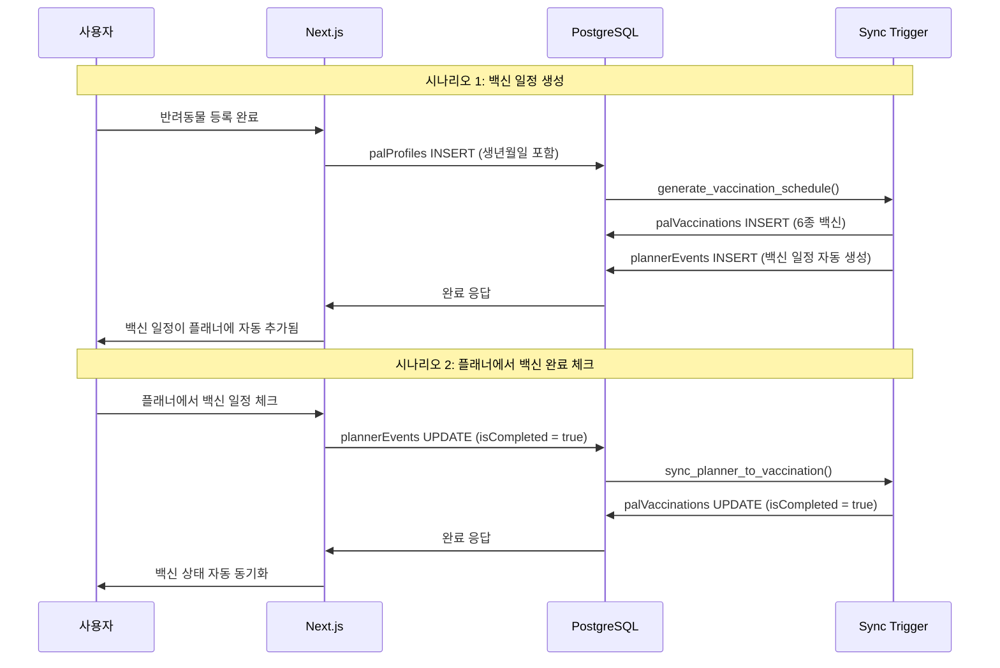
```mermaid
sequenceDiagram
    participant User as 사용자
    participant Frontend as Next.js
    participant DB as PostgreSQL
    participant Trigger as Sync Trigger

    Note over User,Trigger: 시나리오 1: 백신 일정 생성
    User->>Frontend: 반려동물 등록 완료
    Frontend->>DB: palProfiles INSERT (생년월일 포함)
    DB->>Trigger: generate_vaccination_schedule()
    Trigger->>DB: palVaccinations INSERT (6종 백신)
    Trigger->>DB: plannerEvents INSERT (백신 일정 자동 생성)
    DB->>Frontend: 완료 응답
    Frontend->>User: 백신 일정이 플래너에 자동 추가됨

    Note over User,Trigger: 시나리오 2: 플래너에서 백신 완료 체크
    User->>Frontend: 플래너에서 백신 일정 체크
    Frontend->>DB: plannerEvents UPDATE (isCompleted = true)
    DB->>Trigger: sync_planner_to_vaccination()
    Trigger->>DB: palVaccinations UPDATE (isCompleted = true)
    DB->>Frontend: 완료 응답
    Frontend->>User: 백신 상태 자동 동기화
```

**동기화 특징**:

- **양방향 실시간 동기화**: 플래너 ↔ 백신
- **자동 일정 생성**: 생년월일 기반 6종 백신 일정
- **긴급도 계산**: 지연/긴급/곧예정/정상 (색상 분류)

---

## 💬 5. 커뮤니티 플로우

### 5.1. 게시글 작성 및 해시태그 자동 추출

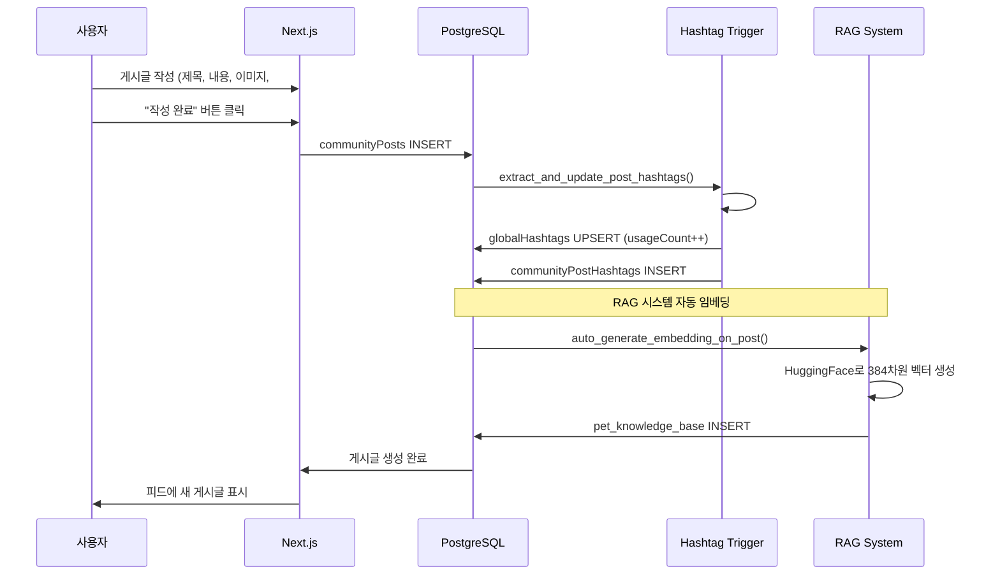
```mermaid
sequenceDiagram
    participant User as 사용자
    participant Frontend as Next.js
    participant DB as PostgreSQL
    participant Trigger as Hashtag Trigger
    participant RAG as RAG System

    User->>Frontend: 게시글 작성 (제목, 내용, 이미지, #해시태그)
    User->>Frontend: "작성 완료" 버튼 클릭
    Frontend->>DB: communityPosts INSERT
    DB->>Trigger: extract_and_update_post_hashtags()
    Trigger->>Trigger: #{텍스트} 정규식 추출
    Trigger->>DB: globalHashtags UPSERT (usageCount++)
    Trigger->>DB: communityPostHashtags INSERT

    Note over DB,RAG: RAG 시스템 자동 임베딩
    DB->>RAG: auto_generate_embedding_on_post()
    RAG->>RAG: HuggingFace로 384차원 벡터 생성
    RAG->>DB: pet_knowledge_base INSERT

    DB->>Frontend: 게시글 생성 완료
    Frontend->>User: 피드에 새 게시글 표시
```

### 5.2. 실시간 댓글 시스템 (2025-11-07 완성) ⭐

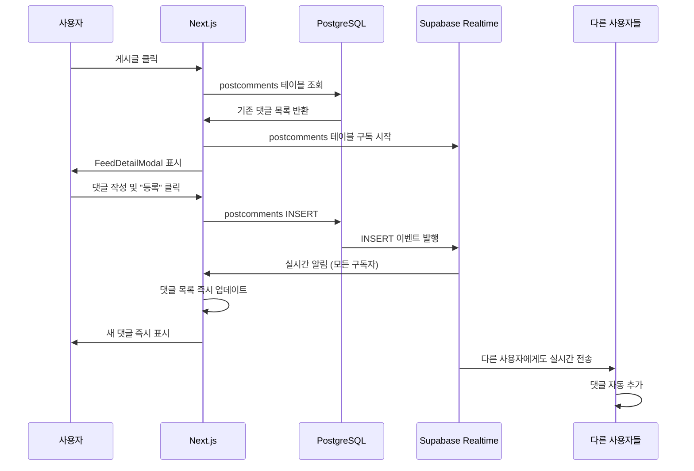
```mermaid
sequenceDiagram
    participant User as 사용자
    participant Frontend as Next.js
    participant DB as PostgreSQL
    participant Realtime as Supabase Realtime
    participant OtherUsers as 다른 사용자들

    User->>Frontend: 게시글 클릭
    Frontend->>DB: postcomments 테이블 조회
    DB->>Frontend: 기존 댓글 목록 반환
    Frontend->>Realtime: postcomments 테이블 구독 시작
    Frontend->>User: FeedDetailModal 표시

    User->>Frontend: 댓글 작성 및 "등록" 클릭
    Frontend->>DB: postcomments INSERT
    DB->>Realtime: INSERT 이벤트 발행
    Realtime->>Frontend: 실시간 알림 (모든 구독자)
    Frontend->>Frontend: 댓글 목록 즉시 업데이트
    Frontend->>User: 새 댓글 즉시 표시

    Realtime->>OtherUsers: 다른 사용자에게도 실시간 전송
    OtherUsers->>OtherUsers: 댓글 자동 추가
```

**실시간 댓글 특징**:

- **모달 내 즉시 반영**: 댓글 작성 후 새로고침 없이 즉시 업데이트
- **커뮤니티 페이지 동기화**: postcomments 테이블 실시간 구독
- **완전한 양방향 동기화**: 모달 ↔ 피드 카드 실시간 데이터 일치

### 5.3. 좋아요 자동 카운팅 시스템 ⭐

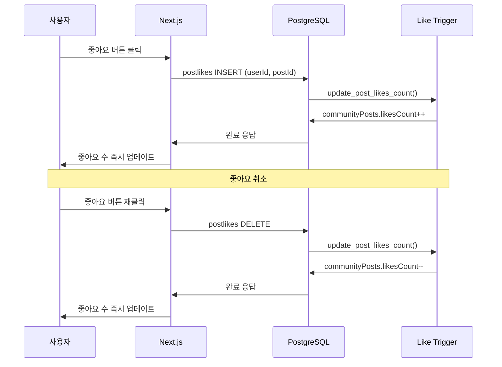
```mermaid
sequenceDiagram
    participant User as 사용자
    participant Frontend as Next.js
    participant DB as PostgreSQL
    participant Trigger as Like Trigger

    User->>Frontend: 좋아요 버튼 클릭
    Frontend->>DB: postlikes INSERT (userId, postId)
    DB->>Trigger: update_post_likes_count()
    Trigger->>DB: communityPosts.likesCount++
    DB->>Frontend: 완료 응답
    Frontend->>User: 좋아요 수 즉시 업데이트

    Note over User,Trigger: 좋아요 취소
    User->>Frontend: 좋아요 버튼 재클릭
    Frontend->>DB: postlikes DELETE
    DB->>Trigger: update_post_likes_count()
    Trigger->>DB: communityPosts.likesCount--
    DB->>Frontend: 완료 응답
    Frontend->>User: 좋아요 수 즉시 업데이트
```

---

## 🌟 6. 라이프스타일 실시간 채팅 플로우 ⭐⭐⭐

### 6.1. 채팅방 입장 및 실시간 구독

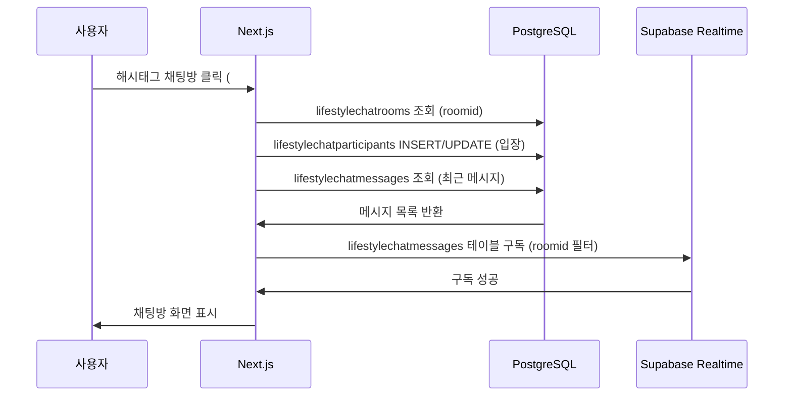
```mermaid
sequenceDiagram
    participant User as 사용자
    participant Frontend as Next.js
    participant DB as PostgreSQL
    participant Realtime as Supabase Realtime

    User->>Frontend: 해시태그 채팅방 클릭 (#산책)
    Frontend->>DB: lifestylechatrooms 조회 (roomid)
    Frontend->>DB: lifestylechatparticipants INSERT/UPDATE (입장)
    Frontend->>DB: lifestylechatmessages 조회 (최근 메시지)
    DB->>Frontend: 메시지 목록 반환

    Frontend->>Realtime: lifestylechatmessages 테이블 구독 (roomid 필터)
    Realtime->>Frontend: 구독 성공
    Frontend->>User: 채팅방 화면 표시
```

### 6.2. 채팅 메시지 전송 및 해시태그 자동 추출

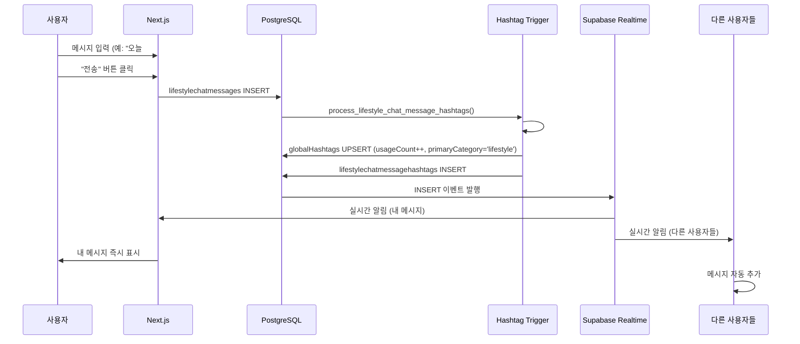
```mermaid
sequenceDiagram
    participant User as 사용자
    participant Frontend as Next.js
    participant DB as PostgreSQL
    participant Trigger as Hashtag Trigger
    participant Realtime as Supabase Realtime
    participant OtherUsers as 다른 사용자들

    User->>Frontend: 메시지 입력 (예: "오늘 #산책 갔어요! #날씨좋음")
    User->>Frontend: "전송" 버튼 클릭
    Frontend->>DB: lifestylechatmessages INSERT

    DB->>Trigger: process_lifestyle_chat_message_hashtags()
    Trigger->>Trigger: #{텍스트} 정규식 추출 (#산책, #날씨좋음)
    Trigger->>DB: globalHashtags UPSERT (usageCount++, primaryCategory='lifestyle')
    Trigger->>DB: lifestylechatmessagehashtags INSERT

    DB->>Realtime: INSERT 이벤트 발행
    Realtime->>Frontend: 실시간 알림 (내 메시지)
    Realtime->>OtherUsers: 실시간 알림 (다른 사용자들)
    Frontend->>User: 내 메시지 즉시 표시
    OtherUsers->>OtherUsers: 메시지 자동 추가
```

### 6.3. 실시간 인기 해시태그 조회

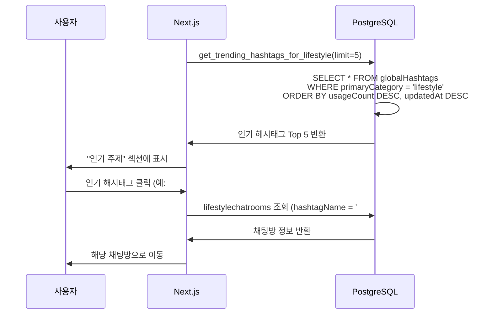
```mermaid
sequenceDiagram
    participant User as 사용자
    participant Frontend as Next.js
    participant DB as PostgreSQL

    Frontend->>DB: get_trending_hashtags_for_lifestyle(limit=5)
    DB->>DB: SELECT * FROM globalHashtags<br/>WHERE primaryCategory = 'lifestyle'<br/>ORDER BY usageCount DESC, updatedAt DESC
    DB->>Frontend: 인기 해시태그 Top 5 반환
    Frontend->>User: "인기 주제" 섹션에 표시

    User->>Frontend: 인기 해시태그 클릭 (예: #산책)
    Frontend->>DB: lifestylechatrooms 조회 (hashtagName = '#산책')
    DB->>Frontend: 채팅방 정보 반환
    Frontend->>User: 해당 채팅방으로 이동
```

---

## 🗺️ 7. 병원 찾기 플로우 (Kakao Map API)

### 7.1. 주변 병원 검색

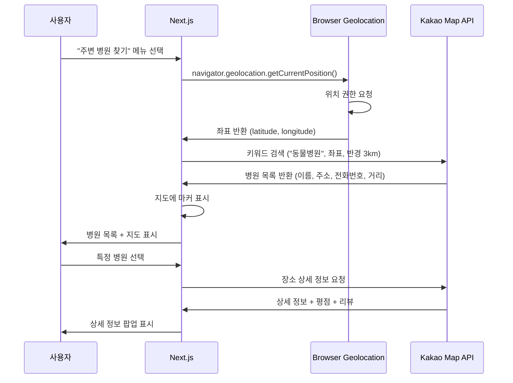
```mermaid
sequenceDiagram
    participant User as 사용자
    participant Frontend as Next.js
    participant Browser as Browser Geolocation
    participant KakaoAPI as Kakao Map API

    User->>Frontend: "주변 병원 찾기" 메뉴 선택
    Frontend->>Browser: navigator.geolocation.getCurrentPosition()
    Browser->>Browser: 위치 권한 요청
    Browser->>Frontend: 좌표 반환 (latitude, longitude)

    Frontend->>KakaoAPI: 키워드 검색 ("동물병원", 좌표, 반경 3km)
    KakaoAPI->>Frontend: 병원 목록 반환 (이름, 주소, 전화번호, 거리)
    Frontend->>Frontend: 지도에 마커 표시
    Frontend->>User: 병원 목록 + 지도 표시

    User->>Frontend: 특정 병원 선택
    Frontend->>KakaoAPI: 장소 상세 정보 요청
    KakaoAPI->>Frontend: 상세 정보 + 평점 + 리뷰
    Frontend->>User: 상세 정보 팝업 표시
```

---

## 🔐 8. 회원탈퇴 플로우

### 8.1. 완전한 데이터 삭제 프로세스

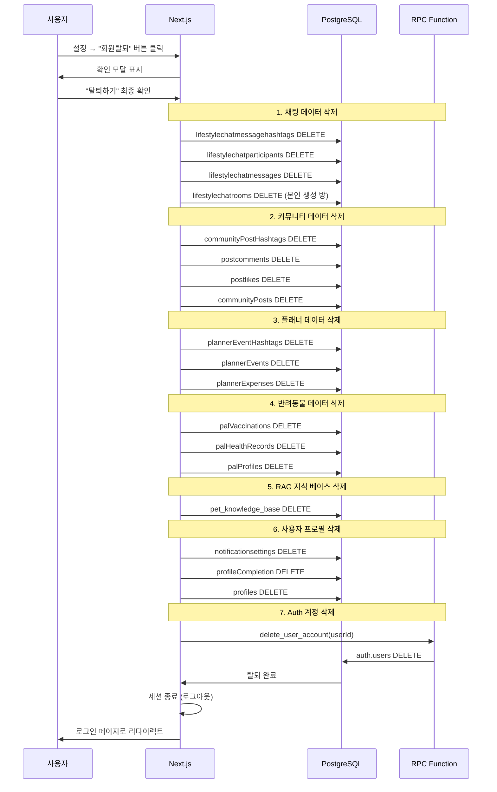
```mermaid
sequenceDiagram
    participant User as 사용자
    participant Frontend as Next.js
    participant DB as PostgreSQL
    participant RPC as RPC Function

    User->>Frontend: 설정 → "회원탈퇴" 버튼 클릭
    Frontend->>User: 확인 모달 표시
    User->>Frontend: "탈퇴하기" 최종 확인

    Note over Frontend,RPC: 1. 채팅 데이터 삭제
    Frontend->>DB: lifestylechatmessagehashtags DELETE
    Frontend->>DB: lifestylechatparticipants DELETE
    Frontend->>DB: lifestylechatmessages DELETE
    Frontend->>DB: lifestylechatrooms DELETE (본인 생성 방)

    Note over Frontend,RPC: 2. 커뮤니티 데이터 삭제
    Frontend->>DB: communityPostHashtags DELETE
    Frontend->>DB: postcomments DELETE
    Frontend->>DB: postlikes DELETE
    Frontend->>DB: communityPosts DELETE

    Note over Frontend,RPC: 3. 플래너 데이터 삭제
    Frontend->>DB: plannerEventHashtags DELETE
    Frontend->>DB: plannerEvents DELETE
    Frontend->>DB: plannerExpenses DELETE

    Note over Frontend,RPC: 4. 반려동물 데이터 삭제
    Frontend->>DB: palVaccinations DELETE
    Frontend->>DB: palHealthRecords DELETE
    Frontend->>DB: palProfiles DELETE

    Note over Frontend,RPC: 5. RAG 지식 베이스 삭제
    Frontend->>DB: pet_knowledge_base DELETE

    Note over Frontend,RPC: 6. 사용자 프로필 삭제
    Frontend->>DB: notificationsettings DELETE
    Frontend->>DB: profileCompletion DELETE
    Frontend->>DB: profiles DELETE

    Note over Frontend,RPC: 7. Auth 계정 삭제
    Frontend->>RPC: delete_user_account(userId)
    RPC->>DB: auth.users DELETE

    DB->>Frontend: 탈퇴 완료
    Frontend->>Frontend: 세션 종료 (로그아웃)
    Frontend->>User: 로그인 페이지로 리다이렉트
```

**탈퇴 로직 특징**:

- **완전한 데이터 삭제**: 라이프스타일 채팅, RAG 지식 베이스 포함
- **관리자용 함수**: `admin_delete_user_completely(userId)` 생성
- **테이블명 정확 구분**: CamelCase vs 소문자 네이밍 정확히 처리

---

## 📱 9. 반응형 디자인 적용 플로우

### 9.1. 4단계 브레이크포인트 시스템

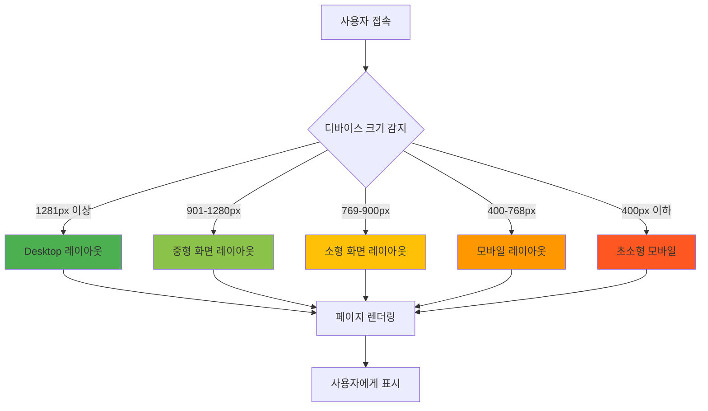
```mermaid
graph TB
    User[사용자 접속] --> Device{디바이스 크기 감지}

    Device -->|1281px 이상| Desktop[Desktop 레이아웃]
    Device -->|901-1280px| Medium[중형 화면 레이아웃]
    Device -->|769-900px| Small[소형 화면 레이아웃]
    Device -->|400-768px| Mobile[모바일 레이아웃]
    Device -->|400px 이하| Tiny[초소형 모바일]

    Desktop --> Render[페이지 렌더링]
    Medium --> Render
    Small --> Render
    Mobile --> Render
    Tiny --> Render

    Render --> Display[사용자에게 표시]

    style Desktop fill:#4CAF50
    style Medium fill:#8BC34A
    style Small fill:#FFC107
    style Mobile fill:#FF9800
    style Tiny fill:#FF5722
```

**반응형 적용 원칙**:

- **Desktop (1281px+)**: 기본 스타일
- **중형 (901-1280px)**: 간격/폰트 -10%
- **소형 (769-900px)**: 간격/폰트 -20%, 그리드 축소
- **모바일 (400-768px)**: 세로 배치, 전체 너비
- **초소형 (400px-)**: 최소 패딩, 초소형 폰트

---

## 🎯 주요 기술적 특징 요약

### 1. Supabase Realtime 활용

- **실시간 댓글**: postcomments 테이블 구독
- **실시간 채팅**: lifestylechatmessages 테이블 구독
- **좋아요 자동 업데이트**: postlikes 트리거

### 2. 트리거 기반 자동화

- **해시태그 자동 추출**: #{텍스트} 정규식
- **백신-플래너 동기화**: 양방향 실시간 연동
- **좋아요 카운팅**: likesCount 자동 집계
- **RAG 임베딩**: 게시글 작성 시 자동 생성

### 3. Hook Composition 아키텍처

- **전문화된 훅**: 기능별 독립적 훅
- **Co-location**: 기능에 필요한 모든 파일을 하나의 폴더에
- **재사용성**: 평균 60% 코드 축소

### 4. 반응형 디자인

- **4단계 브레이크포인트**: 400px~1280px+
- **Flexbox 높이 통제**: `align-items: stretch` + `min-height: 0`
- **Sticky + Tooltip 공존**: `overflow: visible` + Z-Index 레이어링

---

**📝 문서 정보**

- **작성일**: 2025-11-14
- **작성자**: 석이 + Claude
- **버전**: v4.0 (4차 스프린트)
- **이전 문서**: [251114*02_WBS*최신화.md](./251114_02_WBS_최신화.md)
- **다음 문서**: [251114*04*시스템\_아키텍처.md](./251114_04_시스템_아키텍처.md)
