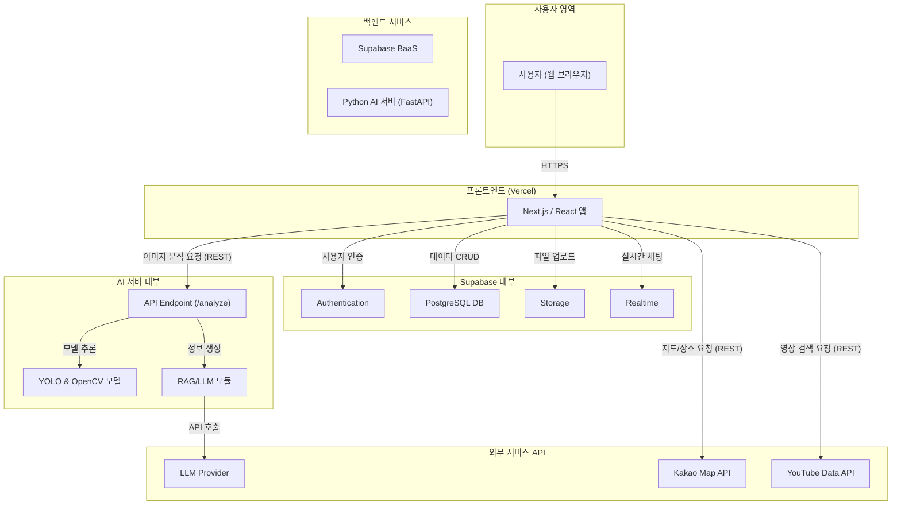
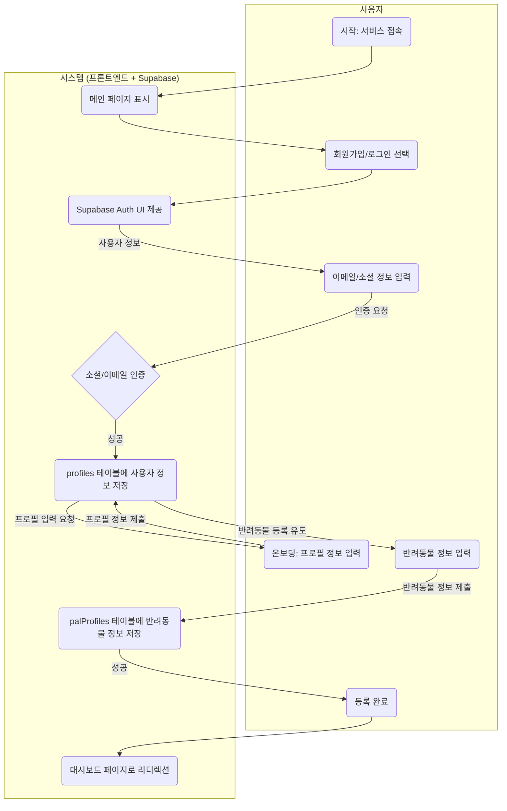
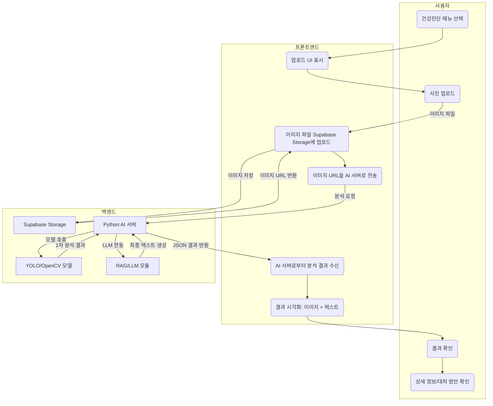
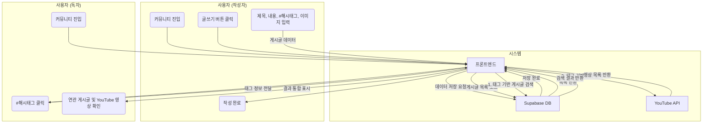
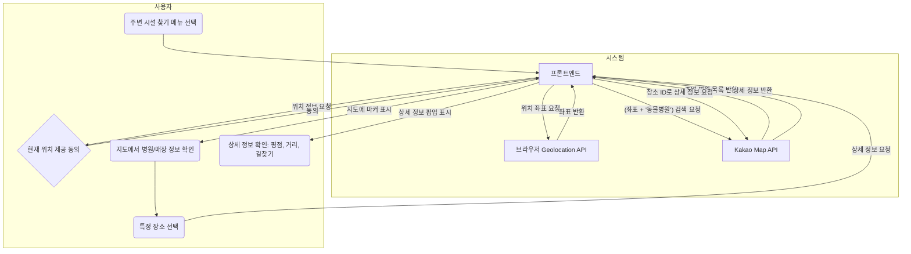
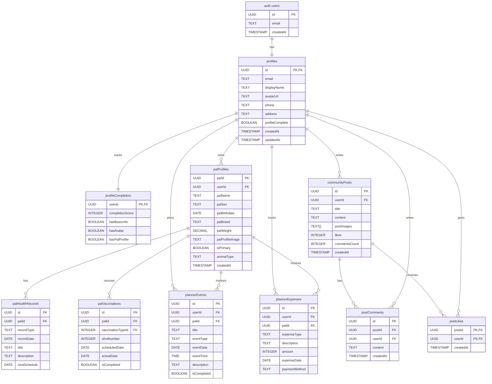

# Fetpal: AI 기반 반려동물 통합 케어 플랫폼

**🔗 [프로젝트 바로가기 (Vercel 배포 링크)](https://your-project-url.vercel.app/)**

## 📋 프로젝트 문서

> **📁 [docs](./docs/) 폴더**에서 상세한 프로젝트 문서를 확인할 수 있습니다.

- **[02_WBS.md](./docs/02_WBS.md)** - 작업 분해 구조 및 일정 계획
- **[03*시스템*흐름도.md](./docs/03_시스템_흐름도.md)** - 시스템 프로세스 및 데이터 흐름
- **[04*시스템*아키텍처.md](./docs/04_시스템_아키텍처.md)** - 기술 스택 및 시스템 구조
- **[05_ERD.md](./docs/05_ERD.md)** - 데이터베이스 설계 및 관계도
- **[06*요구사항*정의서.md](./docs/06_요구사항_정의서.md)** - 기능적/비기능적 요구사항

## 🐾 프로젝트 팀원 소개

|                               **프로필**                                | **정보**                                                                                                                                                                                                                                                                                                                                                                                                                                                                                                                                                                                                                                                                                               |
| :---------------------------------------------------------------------: | :----------------------------------------------------------------------------------------------------------------------------------------------------------------------------------------------------------------------------------------------------------------------------------------------------------------------------------------------------------------------------------------------------------------------------------------------------------------------------------------------------------------------------------------------------------------------------------------------------------------------------------------------------------------------------------------------------- |
|  | **이름**: 이유석 **역할**: 1인 개발자 **_"하나씩 배워가며 만드는 첫 작품, 혼자여도 포기하지 않는 마음!"_**  **Contact Me:**    |

**👨‍💻담당 업무**

|   **영역**   |         **기술 스택**         | **세부 내용**                            |
| :----------: | :---------------------------: | :--------------------------------------- |
|   **기획**   |      프로젝트 매니지먼트      | 요구사항 분석, WBS 작성, 시스템 설계     |
| **Frontend** |  Next.js, React, TypeScript   | 사용자 인터페이스, 반응형 웹, 상태 관리  |
| **Backend**  | Supabase, FastAPI, PostgreSQL | 데이터베이스 설계, API 개발, 인증 시스템 |
|  **AI/ML**   |    YOLOv8, OpenCV, PyTorch    | 이미지 분석, 객체 탐지, 모델 학습        |
|   **기타**   |        UI/UX, 아키텍처        | 디자인 시스템, 시스템 아키텍처 설계      |

---

## 1. 🐾 프로젝트 소개

### **프로젝트 개요**

**Fetpal (펫팔)**은 AI 기술을 활용하여 반려동물의 건강 이상 징후를 초기에 파악하고, 상황별 대처 방안을 제시하여 보호자의 불안감을 해소하는 것을 목표로 하는 **AI 기반 반려동물 통합 케어 플랫폼**입니다.

> **💡 명칭의 의미**: **Family**(가족) + **Vet**(수의사) + **Pet**(반려동물) + **Pal**(친구)의 합성어로, 가족과 반려동물이 함께하는 건강한 일상을 수의학적 지식과 친구 같은 AI가 도와준다는 의미를 담고 있습니다.

---

### 🚨 **해결하고자 하는 문제**

#### **🏥 응급 상황 대처의 어려움**

> _"새벽 2시, 강아지 눈이 갑자기 빨개졌는데 병원은 문을 닫았고, 응급실은 너무 멀어요. 지금 당장 가야 할까요?"_
>
> _"피부에 뾰루지 같은 게 났는데, 병원 가기엔 애매하고 그냥 두기엔 불안해요."_

#### **🐶 초보 반려인의 일상 케어 고민**

> _"타지에서 처음 강아지를 키우는데, 하루에 몇 번 밥을 줘야 하는지, 언제 산책을 시켜야 하는지, 기본적인 훈련은 어떻게 시켜야 하는지 아무것도 모르겠어요. 주변에 물어볼 사람도 없고..."_
>
> _"혼자 살면서 반려동물을 키우는데, 갑자기 아픈 것 같을 때 어떻게 대처해야 할지 막막해요. 온라인 정보는 너무 많아서 뭘 믿어야 할지 모르겠어요."_

**반려동물 1500만 시대, 수많은 보호자들이 위와 같은 고민을 매일 겪고 있습니다.**

---

### 🎯 **솔루션**

Fetpal은 이러한 **불안감과 정보 비대칭 문제**를 해결하고자 합니다:

#### **🐾 응급 상황 지원**

- **AI 기술**로 시공간 제약 없이 반려동물의 상태를 객관적으로 확인
- **검증된 정보**를 바탕으로 침착하게 다음 행동을 결정할 수 있도록 지원
- **응급 상황의 골든타임**을 놓치지 않도록 즉시 대처 방안 제공

#### **🐾 초보 반려인 가이드**

- **일상 케어 가이드**: 급식 시간, 산책 방법, 기본 훈련법 등 체계적 정보 제공
- **커뮤니티 연결**: 경험 있는 반려인들과의 소통을 통한 실질적 조언
- **단계별 가이드**: 반려동물 성장 단계별 맞춤 케어 정보 제공

#### **🐾 경제적 부담 완화**

- **불필요한 의료비 지출**을 줄이고 적절한 시기의 병원 방문 유도
- 보호자와 반려동물 모두의 **삶의 질 향상**을 목표

---

### 💝 **프로젝트 미션**

> **"내 선택으로 내게 온 사랑스러운 반려동물, Fetpal이 함께 지켜드립니다."**

## 2. 🐾 주요 기능

| 구분                 | 기능                        | 상세 설명                                                                                                                                       |
| :------------------- | :-------------------------- | :---------------------------------------------------------------------------------------------------------------------------------------------- |
| **🩺 AI 임의진단**   | 이미지 기반 건강 분석       | 스마트폰으로 촬영한 피부/안구 사진을 **YOLOv8 & OpenCV** 모델로 분석하여 이상 징후를 탐지하고, 신뢰도/심각도와 함께 시각적으로 보여줍니다.      |
| **💬 AI 어드바이저** | RAG/LLM 기반 대처 방안 제시 | 분석 결과에 따라, 검증된 지식 기반의 **RAG/LLM**이 비진단적 소견과 응급 상황 대처법, 주변 병원/약국 추천 등 신뢰도 높은 정보를 제공합니다.      |
| **🗺️ 지도 연동**     | 주변 시설 검색 (LBS)        | **Kakao Map API**와 연동하여 내 위치 기반으로 24시 동물병원, 약국, 펫샵 등의 위치, 평점, 영업시간 등 상세 정보를 즉시 확인할 수 있습니다.       |
| **🐾 커뮤니티**      | 지식 공유 및 소셜 네트워킹  | `#해시태그`를 통해 관련 게시글과 **YouTube 케어 영상**을 한번에 보고, 위치 기반 모임과 **실시간 채팅**으로 동네 펫 친구들과 교류할 수 있습니다. |
| **🗓️ 스마트 플래너** | 일정 및 지출 통합 관리      | 예방접종 자동 스케줄링, 병원/미용 예약, 사료 구매까지. 캘린더와 가계부를 통합하여 모든 케어 활동을 체계적으로 기록하고 관리합니다.              |

## 3. 🐾 기술 스택 및 아키텍처

Fetpal은 **MSA(Microservice Architecture)** 기반의 클라이언트-서버 아키텍처를 채택하여 각 기능의 독립적인 확장과 업데이트가 용이하도록 설계되었습니다.

### 🐾기술 스택

#### 💻 **사용 언어**

    

#### 📊 **데이터 분석 및 처리**

  

#### 🤖 **AI / ML**

- **모델**: 
- **프레임워크**: 
- **AI 플랫폼**: 
- **LLM**:   

#### 🌐 **인프라 & 배포 & 서버**

- **클라우드**:  
- **데이터베이스**:   
- **서버**:   

### 3-1. 🐾아키텍처 다이어그램

## 4. 🐾 시스템 흐름도

> 주요 사용자 시나리오에 따른 데이터 및 제어 흐름을 나타냅니다.

### 4.1. 사용자 온보딩 (회원가입 및 반려동물 등록)

### 4.2. AI 건강진단 (핵심 기능)

### 4.3. 커뮤니티 게시글 작성 및 정보 얻기

### 4.4. 주변 병원/매장 찾기 (지도 API 연동)

## 5. 🐾 데이터베이스 설계 (ERD)

> Supabase PostgreSQL 스키마를 기반으로 설계되었습니다. 상세한 ERD는 **[05_ERD.md](./docs/05_ERD.md)**에서 확인할 수 있습니다.

## 6. 🐾 프로젝트 진행 계획 (WBS)

프로젝트는 총 7개의 Phase로 구성되어 있으며, 기획부터 개발, 배포, 유지보수까지 체계적으로 관리됩니다.

- **Phase 1: 프로젝트 기획 및 설계** (진행중)
- **Phase 2: 백엔드 개발 (Supabase)** (진행중)
- **Phase 3: AI 서버 개발** (진행 중)
- **Phase 4: 프론트엔드 개발 (Next.js)** (진행중)
- **Phase 5: 통합 및 테스트**
- **Phase 6: 배포 및 런칭**
- **Phase 7: 유지보수 및 고도화**

현재 3차 프로젝트에서는 **AI 서버 개발 및 실제 서비스 연동**과 **실시간 커뮤니티 기능 완성**에 집중하고 있습니다.

## 7. 🐾 기대 효과

- **보호자**: 반려동물 양육에 대한 불안감을 줄이고, 객관적 데이터를 통해 수의사와 원활하게 소통할 수 있습니다.
- **반려동물**: 이상 징후를 조기에 발견하여 질병을 예방하고 건강한 삶의 질을 향상시킬 수 있습니다.
- **산업**: 축적된 비식별 건강 데이터를 통해 펫 보험, 펫 푸드 등 연관 산업 발전에 기여할 수 있습니다.
