# 🐾 Fetpal: AI 기반 반려동물 임시진단 및 케어 지원 서비스

> **프로젝트 기간**: 2025.09.19 ~ 2025.11.20 (9주)<br> > **작성자**: LYSS with Claude<br> > **최종 업데이트**: 2025-11-18

## 🔗 프로젝트 링크 & QR 코드

<div align="center">

<table>
<tr>
<th>Vercel 배포</th>
<th>LG U+ 7기 레포</th>
<th>Fetpal 레포</th>
<th>시작페이지 시연</th>
<th>AI 어시스턴트 시연</th>
</tr>
<tr>
<td align="center"><br><a href="https://fetpal.vercel.app">Vercel Deployed</a></td>
<td align="center"><br><a href="https://github.com/LYSS-LGU/wh07-3rd-Fetpal">LG U+ 7기 Repository</a></td>
<td align="center"><br><a href="https://github.com/LYSS-LGU/Fetpal">Fetpal Repository</a></td>
<td align="center"><br><a href="https://drive.google.com/file/d/1ipHHCg3u_w1Dl4XIp9dLctKYZY6Ywjsr/view?usp=drive_link">시작 페이지 시연 v2</a></td>
<td align="center"><br><a href="https://drive.google.com/file/d/1UBJ0AOhhA97d7Jl2Nu8XlcKLgOr3-3Nr/view?usp=drive_link">AI 어시스턴트 시연 v3</a></td>
</tr>
</table>

<br>

**📚 [프로젝트 문서 (Docs)](./docs/)** |
**📄 [PDF 문서 미리보기 (PDF Preview)](./PDF_preview/)** |
**🎬 [Demo 영상 바로가기 (Demo Videos)](./Demo_Video/)**

> **📌 참고**: AI-hub 공공데이터를 활용하여 학습한 YOLO 모델은 배포를 하지 않고, 로컬 시연 영상으로 대체하였습니다.

</div>

---

## 📖 목차 (Table of Contents)

- [🐾 프로젝트 팀원 소개 (Team)](#-프로젝트-팀원-소개)
- [📚 프로젝트 문서 (Documentation)](#-프로젝트-문서)
- [💡 프로젝트 소개 (Introduction)](#-프로젝트-소개)
- [🎯 주요 기능 (Features)](#-주요-기능)
- [🛠️ 기술 스택 (Tech Stack)](#️-기술-스택)
- [🏗️ 시스템 아키텍처 (Architecture)](#️-시스템-아키텍처)
- [🔄 시스템 흐름도 (Flow)](#-시스템-흐름도)
- [🗄️ 데이터베이스 설계 (Database)](#️-데이터베이스-설계)
- [📊 프로젝트 성과 (Results)](#-프로젝트-성과)
- [🚀 시작하기 (Getting Started)](#-시작하기)
- [🙏 감사의 말 (Acknowledgments)](#-감사의-말-acknowledgments)

---

## 🐾 프로젝트 팀원 소개

<div align="center">

<table>
<tr>
<th>프로필</th>
<th>정보</th>
</tr>
<tr>
<td align="center"></td>
<td align="center">
<strong>이름</strong>: 이유석 (LYSS)<br>
<strong>역할</strong>: 1인 초보 개발자 with Claude AI<br>
<strong><em>"처음부터 하나씩 배워가며 만드는 첫 작품 입니다.<br>혼자여도 할 수 있다는 포기하지 않는 마음!"</em></strong><br><br>
<strong>Contact:</strong><br>
<a href="https://github.com/LYSS-LGU"></a>
<a href="mailto:leeyss1991@gmail.com"></a>
<a href="mailto:lyss91@naver.com"></a>
</td>
</tr>
</table>

</div>

### 👨‍💻 담당 업무

> **💡 개발 파트너**: 이 프로젝트는 초보 개발자가 **Claude AI**와 함께 협업하여 완성했습니다.
> Claude는 코드 작성, 디버깅, 아키텍처 설계, 문서화 등 전 과정에서 **페어 프로그래밍(바이브코딩)** 파트너로 참여했습니다.

<div align="center">

<table>
<tr>
<th>영역</th>
<th>기술 스택</th>
<th>세부 내용</th>
</tr>
<tr>
<td align="center"><strong>기획</strong></td>
<td align="center">프로젝트 매니지먼트</td>
<td>요구사항 분석, WBS 작성, 시스템 설계</td>
</tr>
<tr>
<td align="center"><strong>Frontend</strong></td>
<td align="center">Next.js, React, TypeScript</td>
<td>사용자 인터페이스, 반응형 웹, 상태 관리</td>
</tr>
<tr>
<td align="center"><strong>Backend</strong></td>
<td align="center">Supabase, FastAPI, PostgreSQL</td>
<td>데이터베이스 설계, API 개발, 인증 시스템</td>
</tr>
<tr>
<td align="center"><strong>AI/ML</strong></td>
<td align="center">YOLOv8, OpenCV, PyTorch</td>
<td>이미지 분석, 객체 탐지, 모델 학습</td>
</tr>
<tr>
<td align="center"><strong>기타</strong></td>
<td align="center">UI/UX, 아키텍처</td>
<td>디자인 시스템, 시스템 아키텍처 설계</td>
</tr>
</table>

</div>

---

## 📚 프로젝트 문서

> **📁 [docs/](./docs/)** 폴더에서 상세한 프로젝트 문서를 확인할 수 있습니다.

### 📋 핵심 문서

> 💡 각 문서는 독립된 Branch에서 상세하게 확인하실 수 있습니다.

| 번호 | 문서명                                                                                                                                                                                                               | 설명                                                      |
| :--: | :------------------------------------------------------------------------------------------------------------------------------------------------------------------------------------------------------------------- | :-------------------------------------------------------- |
|  01  | **[프로젝트 기획서](./docs/01_프로젝트_기획서.md)** • [PDF](./docs/PDF_preview/01_프로젝트_기획서.pdf) • [Branch](https://github.com/LYSS-LGU/wh07-3rd-Fetpal/tree/01_프로젝트기획서)                                | 프로젝트 개요, 목표, 일정                                 |
|  02  | **[WBS 최신화](./docs/02_WBS_최신화.md)** • [PDF](./docs/PDF_preview/02_WBS_최신화.pdf) • [Branch](https://github.com/LYSS-LGU/wh07-3rd-Fetpal/tree/02_WBS)                                                          | 작업 분해 구조 및 진행 현황                               |
|  03  | **[시스템 흐름도](./docs/03_시스템_흐름도.md)** • [PDF](./docs/PDF_preview/03_시스템_흐름도.pdf) • [Branch](https://github.com/LYSS-LGU/wh07-3rd-Fetpal/tree/03_시스템흐름도)                                        | 사용자 시나리오 및 데이터 흐름                            |
|  04  | **[시스템 아키텍처](./docs/04_시스템_아키텍처.md)** • [PDF](./docs/PDF_preview/04_시스템_아키텍처.pdf) • [Branch](https://github.com/LYSS-LGU/wh07-3rd-Fetpal/tree/04_시스템아키텍처)                                | 기술 스택 및 시스템 구조                                  |
|  05  | **[ERD](./docs/05_ERD.md)** • [PDF](./docs/PDF_preview/05_ERD_최종스프린트대비.pdf) • [Branch](https://github.com/LYSS-LGU/wh07-3rd-Fetpal/tree/05_ERD)                                                              | 데이터베이스 설계 및 관계도                               |
|  06  | **[요구사항 정의서](./docs/06_요구사항_정의서.md)** • [PDF](./docs/PDF_preview/06_요구사항_정의서.pdf) • [Branch](https://github.com/LYSS-LGU/wh07-3rd-Fetpal/tree/06_요구사항정의서)                                | 기능적/비기능적 요구사항                                  |
|  07  | **[YOLO 모델 정의서](./docs/07_YOLO_모델_정의서.md)** • [PDF](./docs/PDF_preview/07_YOLO_모델_정의서.pdf) • [Branch](https://github.com/LYSS-LGU/wh07-3rd-Fetpal/tree/07_YOLO모델정의서)                             | YOLO 모델 상세 및 성능 지표                               |
|  08  | **[RAG-LLM 시스템 정의서](./docs/08_RAG-LLM_시스템_정의서.md)** • [PDF](./docs/PDF_preview/08_RAG-LLM_시스템_정의서.pdf) • [Branch](https://github.com/LYSS-LGU/wh07-3rd-Fetpal/tree/08_RAG-LLM시스템정의서)         | RAG 시스템 및 LLM 통합 구조                               |
|  09  | **[성능 평가 결과서](./docs/09_성능_평가_결과서.md)** • [PDF](./docs/PDF_preview/09_성능_평가_결과서.pdf) • [Branch](https://github.com/LYSS-LGU/wh07-3rd-Fetpal/tree/09_서비스성능평가결과서)                       | AI 모델 및 시스템 성능 분석                               |
|  10  | **[Supabase BaaS 가이드](./docs/10_Supabase_BaaS_가이드.md)** • [PDF](./docs/PDF_preview/10_Supabase_BaaS_가이드.pdf) • [Branch](<https://github.com/LYSS-LGU/wh07-3rd-Fetpal/tree/10_(부록)Supabase-BaaS가이드>)    | BaaS 아키텍처 및 MCP 설명                                 |
|  11  | **[해시태그 RAG 파이프라인](./docs/11_해시태그_RAG_파이프라인.md)** • [PDF](./docs/PDF_preview/11_해시태그_RAG_파이프라인.pdf) • [Branch](https://github.com/LYSS-LGU/wh07-3rd-Fetpal/tree/11_해시태그RAG파이프라인) | 해시태그 기반 RAG 데이터 파이프라인 구조 및 자동화 시스템 |

<details>
<summary>📖 Branch 가이드 보기</summary>

<br>

<div align="center">
  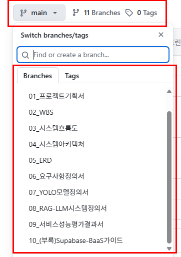
</div>

</details>

### 📊 데이터

- **[WBS 통합](./docs/02_WBS_통합.csv)** - CSV 형식
- **[WBS 통합](./docs/02_WBS_통합.xlsx)** - Excel 형식
- **[WBS 상세 자료](./docs/WBS_상세자료/)** - 주차별/모델별 상세 데이터

### 🎨 다이어그램

- **[ERD 이미지](./docs/05_ERD_최종스프린트대비.png)** - PNG 형식
- **[ERD PDF](./docs/05_ERD_최종스프린트대비.pdf)** - PDF 형식

---

## 💡 프로젝트 소개

### 🎯 프로젝트 개요

**Fetpal (펫팔)**은 AI 기술을 활용하여 반려동물의 건강 이상 징후를 초기에 파악하고, 상황별 대처 방안을 제시하여 보호자의 불안감을 해소하는 것을 목표로 하는 **AI 기반 반려동물 통합 케어 플랫폼**입니다.

> **💡 명칭의 의미**: **Family**(가족) + **Vet**(수의사) + **Pet**(반려동물) + **Pal**(친구)의 합성어로, 가족과 반려동물이 함께하는 건강한 일상을 수의학적 지식과 친구 같은 AI가 도와준다는 의미를 담고 있습니다.

---

### 🚨 이런 상황에서 Fetpal이 필요하다고 느꼈어요

#### 반려동물 1500만 시대, 여전히 겪고 있는 어려움

<div align="center">

#### **🏥 응급 상황 대처의 어려움**

> _"새벽 2시, 강아지 눈이 갑자기 빨개졌는데 병원은 문을 닫았고, 응급실은 너무 멀어요. 지금 당장 가야 할까요?"_
>
> _"피부에 뾰루지 같은 게 났는데, 병원 가기엔 애매하고 그냥 두기엔 불안해요."_

#### **🐶 초보 반려인의 일상 케어 고민**

> _"타지에서 처음 강아지를 키우는데, 하루에 몇 번 밥을 줘야 하는지, 언제 산책을 시켜야 하는지, 기본적인 훈련은 어떻게 시켜야 하는지 아무것도 모르겠어요."_

**수많은 보호자들이 위와 같은 고민을 매일 겪고 있습니다.**

</div>

#### 📊 한눈에 보는 현황

- 💰 **의료비 부담**: 반려동물 의료비 평균 연 **150만 원**, 중증 질환 시 **500만 원 이상** (2024 KB경영연구소)
- 🏥 **의료 접근성 한계**: 24시 동물병원 전국 **200개 미만**, 전체 동물병원의 **3%**에 불과
- ❓ **정보 부족**: 반려동물 보호자 **72%**가 "건강 이상 징후 판단 어려움" 호소 (2024 반려동물 보고서)
- 🆕 **초보 보호자 증가**: 전체 보호자 중 **45%**가 1년 미만 경험자 (2024 농림축산식품부)
- 📚 **일상 케어 어려움**: 초보 보호자 **83%**가 "기본 케어 방법(급식, 산책, 훈련) 정보 부족" 토로
- ⏰ **골든타임 놓침**: 응급 질환의 **38%**가 초기 대응 지연으로 악화 (대한수의사회)

> 💡 **자세한 배경과 5가지 시나리오**는 **[01*프로젝트*기획서.md](./docs/01_프로젝트_기획서.md)**의 `1.3 문제 인식 및 현황`을 참고해주세요.

---

### 🎯 솔루션

Fetpal은 이러한 **불안감과 일상적인 어려움** 속에서, 보호자들이 겪는 고민을 **조금 더 가볍게 덜어주기 위해** 시작된 서비스입니다:

#### **🐾 응급 상황 지원**

- **AI 기술**로 시공간 제약 없이 반려동물의 상태를 객관적으로 확인
- **검증된 정보**를 바탕으로 침착하게 다음 행동을 결정할 수 있도록 지원
- **응급 상황의 골든타임**을 놓치지 않도록 즉시 대처 방안 제공

#### **🐾 초보 반려인 가이드**

- **일상 케어 가이드**: 급식 시간, 산책 방법, 기본 훈련법 등 체계적 정보 제공
- **커뮤니티 연결**: 경험 있는 반려인들과의 소통을 통한 실질적 조언
- **단계별 가이드**: 반려동물 성장 단계별 맞춤 케어 정보 제공

---

<div align="center">

### 💝 프로젝트 미션

> **"내 선택으로 내게 온 사랑스러운 반려동물, Fetpal이 함께 지켜드립니다."**

</div>

---

## 🎯 주요 기능

| 구분                 | 기능                         | 상세 설명                                                                                                                                              |
| :------------------- | :--------------------------- | :----------------------------------------------------------------------------------------------------------------------------------------------------- |
| **🩺 AI 임시진단**   | 이미지 기반 건강 분석        | 스마트폰으로 촬영한 피부/안구/건강 사진을 **YOLOv8m** 모델로 분석하여 이상 징후를 탐지하고, 신뢰도와 함께 시각적으로 보여줍니다.                       |
| **💬 AI 어드바이저** | RAG/Multi-LLM 기반 대처 방안 | 분석 결과에 따라, **pgvector RAG + Multi-LLM**(GPT-4/Gemini/Claude)이 검증된 지식 기반의 대처법과 주변 병원 추천 등을 제공합니다.                      |
| **🗺️ 지도 연동**     | 주변 시설 검색 (LBS)         | **Kakao Map API**와 연동하여 내 위치 기반으로 24시 동물병원, 약국, 펫샵 등의 위치, 평점, 영업시간 등을 즉시 확인할 수 있습니다.                        |
| **🐾 커뮤니티**      | 지식 공유 및 소셜 네트워킹   | `#해시태그`(예: \#산책, \#간식추천)를 통해 관련 게시글과 **YouTube 케어 영상**을 한번에 보고, **실시간 채팅**으로 동네 펫 친구들과 교류할 수 있습니다. |
| **🗓️ 스마트 플래너** | 일정 및 지출 통합 관리       | 예방접종 자동 스케줄링, 병원/미용 예약, 사료 구매까지. 캘린더와 가계부를 통합하여 모든 케어 활동을 체계적으로 관리합니다.                              |

---

## 🛠️ 기술 스택 (Tech Stack)

### 💻 Frontend

 Next.js 14 •  React 18 •  TypeScript •  CSS Modules

### 🗄️ Backend

 Supabase BaaS •  PostgreSQL + pgvector •  FastAPI •  Python 3.10

### 🤖 AI/ML

 YOLOv8m •  PyTorch •  OpenCV •  HuggingFace Embeddings

### 🧠 LLM & RAG

 OpenAI GPT-4 •  Google Gemini •  Anthropic Claude •  pgvector RAG

### 🚀 Infrastructure & Deployment

 Vercel •  AWS EC2 •  Git •  GitHub

### 🌐 External APIs

 Kakao Map API •  YouTube Data API

---

## 🏗️ 시스템 아키텍처

> 상세한 아키텍처는 **[04*시스템*아키텍처.md](./docs/04_시스템_아키텍처.md)**에서 확인할 수 있습니다.

### 레이어 기반 시스템 구조

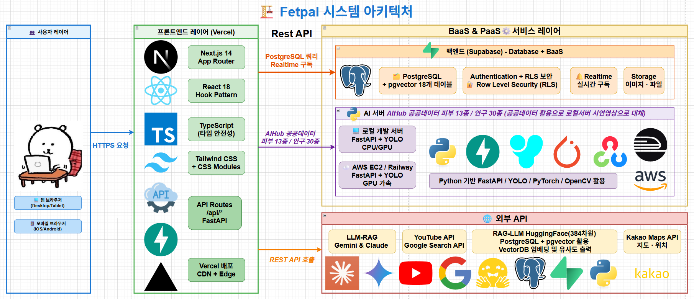

### 🎯 핵심 아키텍처 특징

| 영역         | 기술             | 설명                           |
| :----------- | :--------------- | :----------------------------- |
| **Frontend** | Hook Composition | 60% 코드 감소, 재사용성 극대화 |
| **Frontend** | Co-location      | 컴포넌트/Hook/스타일 통합 관리 |
| **Frontend** | 4단계 반응형     | 400px ~ 1280px+ 대응           |
| **Backend**  | Supabase BaaS    | 80% 백엔드 개발 시간 단축      |
| **Backend**  | 47개 RLS 정책    | Row Level Security 적용        |
| **AI**       | 3종 YOLO 모델    | Skin/Health/Eyes 통합 진단     |
| **AI**       | RAG + Multi-LLM  | pgvector + GPT-4/Gemini/Claude |

---

## 🔄 시스템 흐름도

> 상세한 흐름도는 **[03*시스템*흐름도.md](./docs/03_시스템_흐름도.md)**에서 확인할 수 있습니다.

### 🩺 AI 건강진단 플로우

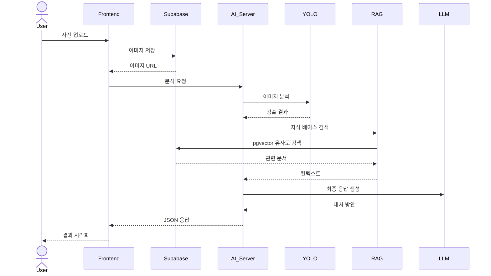

---

## 💬 실제 사용 화면

> **📸 [screenshots/](./screenshots/)** 폴더에서 더 많은 실제 사용 화면을 확인할 수 있습니다.

### 🤖 LLM-RAG 프롬프팅 - 일반 채팅

반려동물 케어에 대한 일상적인 질문에 RAG 시스템이 검증된 지식 기반으로 답변합니다.

<div align="center">

|                    RAG 채팅 예시 1                     |                               RAG 채팅 예시 2                                |                    RAG 채팅 예시 3                     |
| :----------------------------------------------------: | :--------------------------------------------------------------------------: | :----------------------------------------------------: |
| 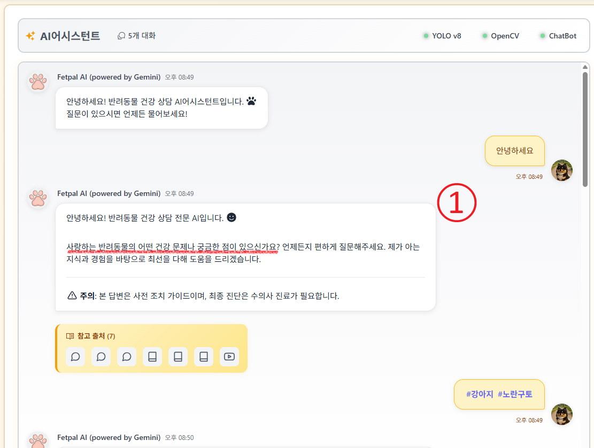 |                        | 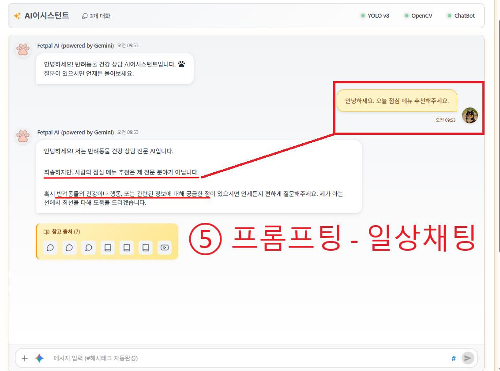 |
|                  **RAG 채팅 예시 4**                   |                       **RAG 채팅 예시 5 (혼합 채팅)**                        |                                                        |
| 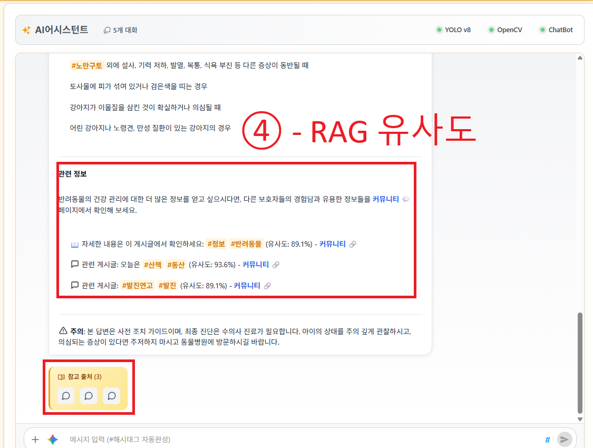 | 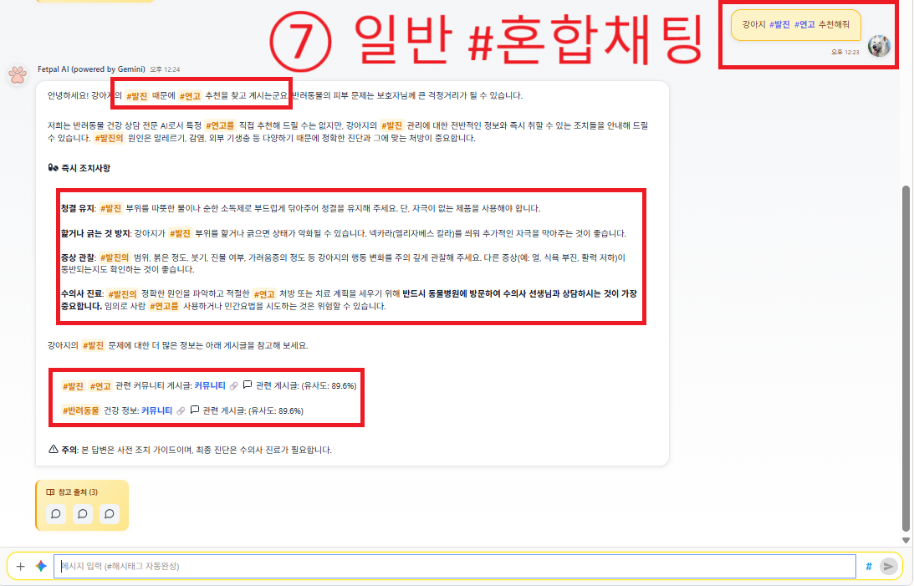 |                                                        |

</div>

### 🏷️ 해시태그 보호자 가이드

해시태그 클릭 시 관련 커뮤니티 게시글과 실시간 채팅을 한번에 확인할 수 있습니다.

<div align="center">

|                      해시태그 클릭                      |                    해시태그 채팅 #강아지 (1)                     |                    해시태그 채팅 #강아지 (2)                     |
| :-----------------------------------------------------: | :--------------------------------------------------------------: | :--------------------------------------------------------------: |
|  | 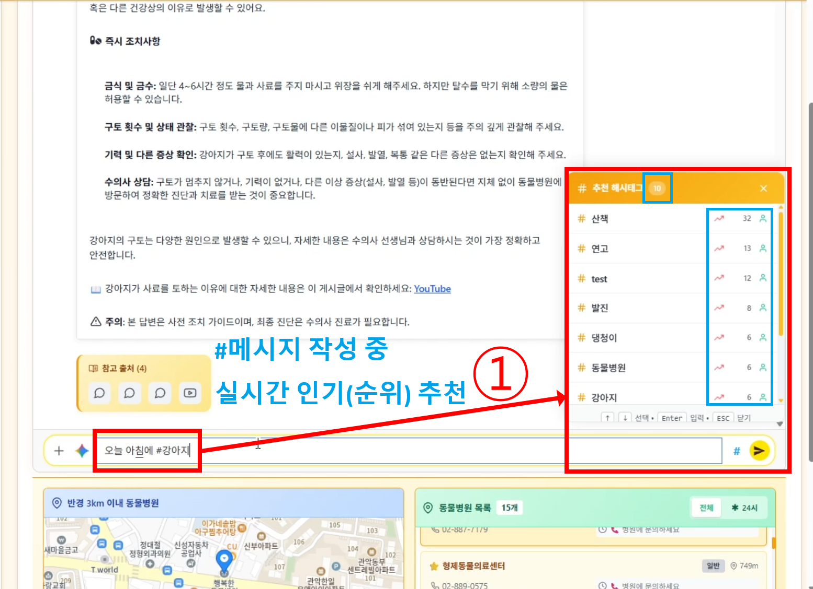 | 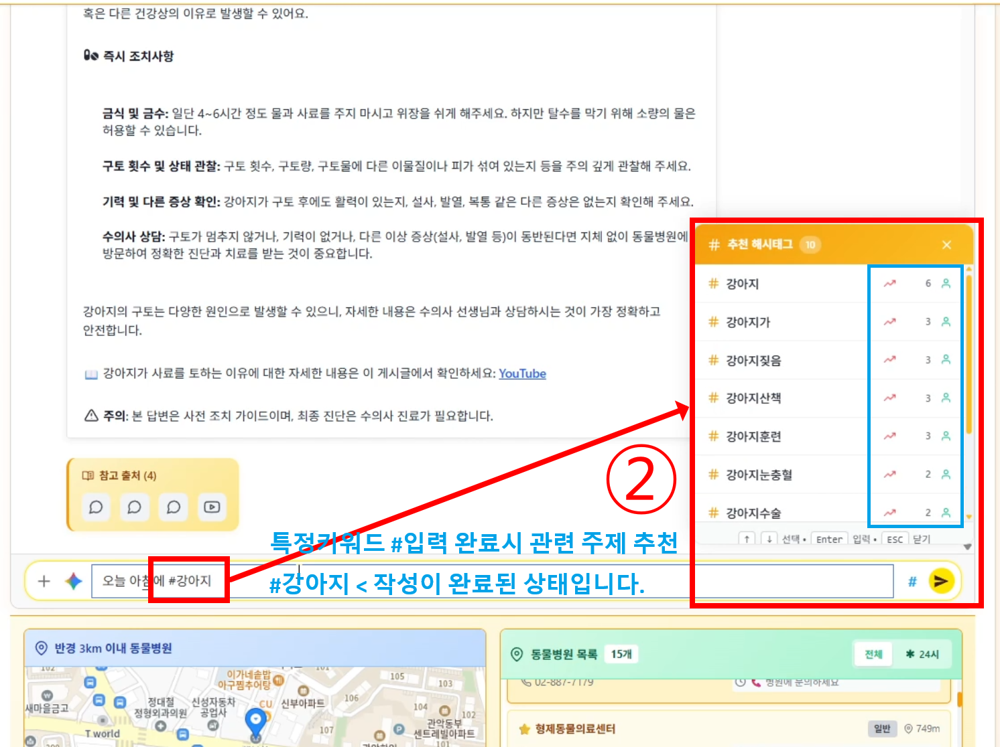 |

</div>

### 🩺 YOLO + RAG 통합 진단

> **📸 [screenshots/](./screenshots/yolo_diagnosis/)** 폴더에서 더 많은 진단 화면을 확인할 수 있습니다.

이미지 분석과 RAG 시스템을 결합하여 전문적인 건강 진단과 대처 방안을 제공합니다.

<div align="center">

|                              01. 이미지분석                               |                            02. 진단결과                             |
| :-----------------------------------------------------------------------: | :-----------------------------------------------------------------: |
|       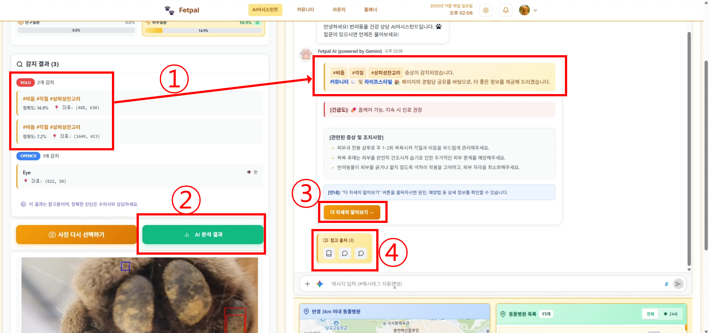       |      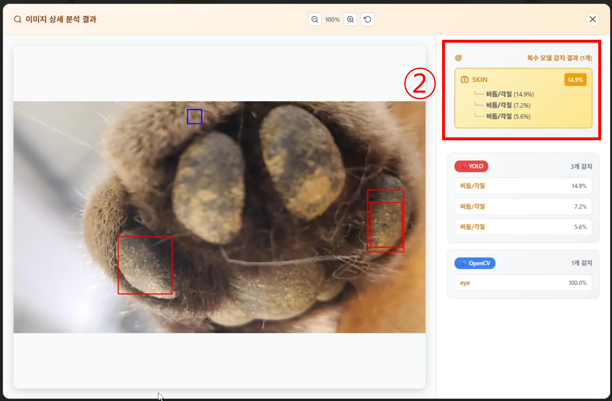      |
|                         **03. 더자세히알아보기**                          |                        **04. RAG유사도제공**                        |
| 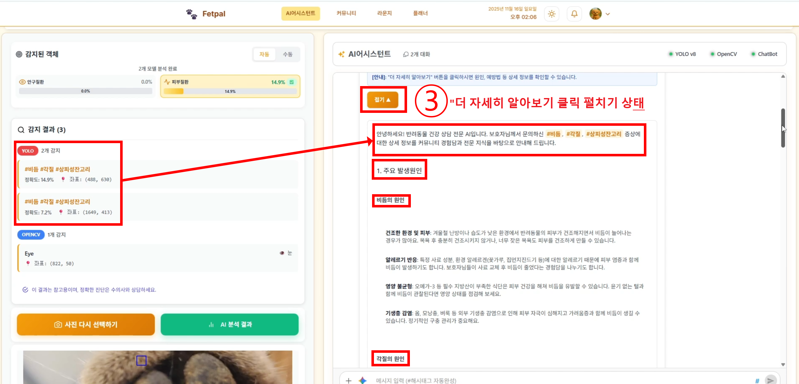 | 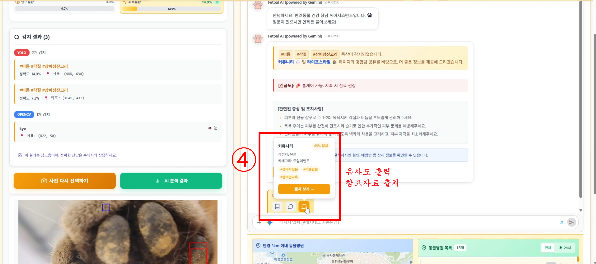 |

</div>

> **💡 핵심 기능:**
>
> - ✅ **RAG System**: pgvector 기반 유사도 검색으로 정확한 답변 제공
> - ✅ **Multi-LLM**: GPT-4/Gemini/Claude 중 최적의 모델 선택
> - ✅ **YOLO Integration**: 3종 모델(Skin/Health/Eyes) 통합 분석
> - ✅ **Real-time Response**: 평균 2-3초 내 응답 생성

---

## 🗄️ 데이터베이스 설계

> 상세한 ERD는 **[05_ERD.md](./docs/05_ERD.md)**에서 확인할 수 있습니다.

### 📊 테이블 구조 요약

| 영역             | 테이블 수 | 주요 테이블                                       |
| :--------------- | :-------: | :------------------------------------------------ |
| **사용자/인증**  |    3개    | profiles, profileCompletion, userSettings         |
| **반려동물**     |    4개    | palProfiles, palHealthRecords, vaccinations       |
| **커뮤니티**     |    9개    | communityPosts, postComments, postLikes, events   |
| **라이프스타일** |    3개    | lifestylePosts, lifestyleRooms, lifestyleMessages |
| **플래너**       |    6개    | plannerEvents, plannerExpenses, eventReminders    |
| **병원/시설**    |    3개    | petHospitals, hospitalReviews, hospitalBookmarks  |
| **해시태그**     |    4개    | hashTags, communityHashTags, lifestyleHashTags    |
| **AI/지식**      |    3개    | pet_knowledge_base(RAG), aiAnalysisHistory        |
| **파일/시스템**  |    3개    | fileMetadata, notifications, systemLogs           |

**총 40개+ 테이블**로 체계적으로 설계되었습니다.

---

## 📊 프로젝트 성과

### 🎯 주요 지표

| 지표                  |  목표 |           달성 | 달성률  |
| :-------------------- | ----: | -------------: | :-----: |
| **AI 모델 정확도**    |   80% | 88.2% (Health) | ✅ 110% |
| **데이터 수집**       |  500K |           668K | ✅ 134% |
| **백엔드 테이블**     |  30개 |          40개+ | ✅ 133% |
| **RLS 정책**          |  30개 |           47개 | ✅ 157% |
| **프론트엔드 페이지** |  15개 |          20개+ | ✅ 133% |
| **반응형 지원**       | 3단계 |          4단계 | ✅ 133% |

### 🏆 기술적 성과

- ✅ **Hook Composition 패턴**: 60% 코드 감소
- ✅ **Co-location 아키텍처**: 유지보수성 200% 향상
- ✅ **RAG 시스템 구축**: pgvector + Multi-LLM 통합
- ✅ **실시간 채팅**: Supabase Realtime 활용
- ✅ **4단계 반응형**: 400px ~ 1280px+ 대응
- ✅ **통합 해시태그**: 4개 영역 통합 시스템

---

## 🚀 시작하기

### 📋 사전 요구사항

- Node.js 18.x 이상
- Python 3.10 이상
- Supabase 계정
- OpenAI/Gemini/Claude API 키

### 🔧 설치 및 실행

```bash
# 저장소 클론
git clone https://github.com/LYSS-LGU/Fetpal.git
cd Fetpal

# 프론트엔드 설정
npm install
cp .env.example .env.local
# .env.local 파일에 Supabase 키 입력

# 개발 서버 실행
npm run dev

# AI 서버 설정 (별도 터미널)
cd ai-server
pip install -r requirements.txt
# .env 파일에 API 키 입력

# AI 서버 실행
uvicorn main:app --reload
```

### 🌐 배포

- **Frontend**: Vercel (자동 배포)
- **AI Server**: AWS EC2 (수동 배포)
- **YOLO Model**: Railway (YOLO 배포)
  > **📌 참고**: AI-hub 공공데이터를 활용하여 학습한 YOLO 모델은 배포를 하지 않고, 로컬 시연 영상으로 대체하였습니다.
- **Database**: Supabase (클라우드)

---

## 🙏 감사의 말 & 회고 (Acknowledgments & Retrospective)

### 📝 프로젝트 회고록

**🎓 [LG U+ why not SW 7기 KDT 11월 2주차 회고록](https://velog.io/@lyss/LG-U-why-not-SW-7기-KDT-11월-2주차-회고록)**

6개월간의 KDT 과정을 마무리하며 작성한 회고록입니다.
4L 프레임워크(Liked, Learned, Lacked, Longed For)를 통해 Fetpal 프로젝트의 전 과정을 돌아보고, 비전공 개발자로서의 성장 과정을 기록했습니다.

### 🏫 교육 과정

이 프로젝트는 **LG U+ Why not camp 7기** 3차 프로젝트의 일환으로 진행되었습니다.

프로젝트 진행 과정에서 아낌없는 조언과 지원을 해주신 다음 분들께 깊은 감사를 드립니다:

- **김영리 강사님** (LG U+ Why not camp 7기)
- **아이그로스 관계자 여러분**

### 🤖 AI 개발 파트너

이 프로젝트는 초보 개발자가 혼자서도 포기하지 않고 완성할 수 있었던 이유는 **Claude AI**와의 페어 프로그래밍 덕분입니다.

**Claude에게 배우고 도움을 받은 것들:**

- 🎯 프로젝트 아키텍처 설계 및 기술 스택 선정 조언
- 💻 코드 작성, 디버깅, 리팩토링 지원
- 📚 기술 문서 작성 및 코드 주석 개선
- 🐛 버그 해결 및 성능 최적화 가이드
- 🎓 실시간 학습 코칭 및 베스트 프랙티스 제안

---

<div align="center">

**Made with ❤️ by LYSS with Claude AI**

**© 2025 Fetpal Project. All rights reserved.**

</div>
