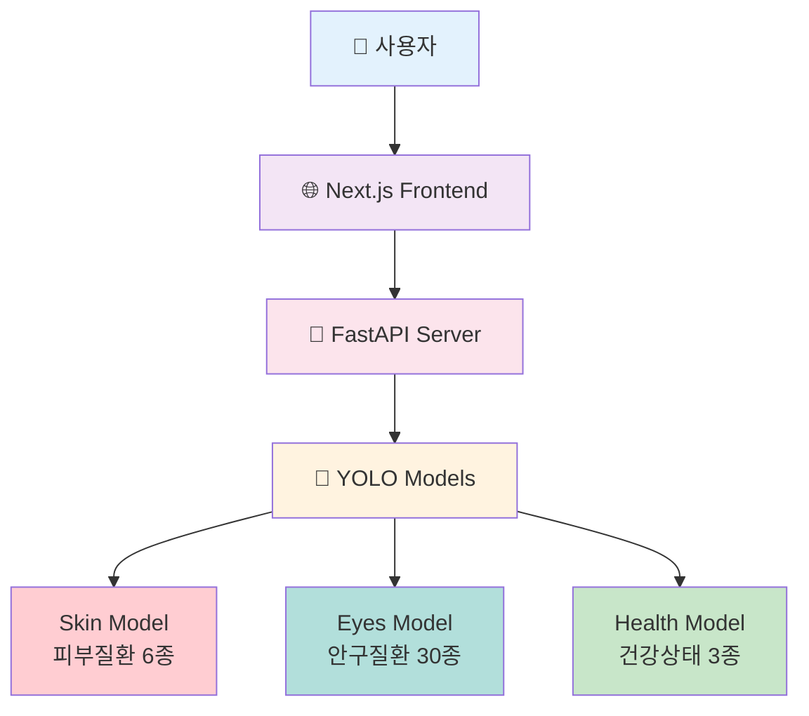
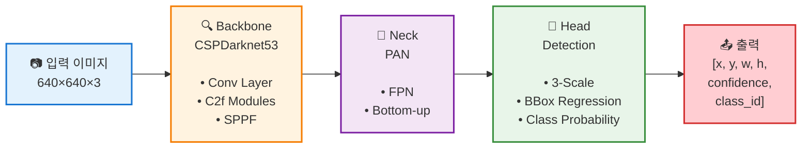
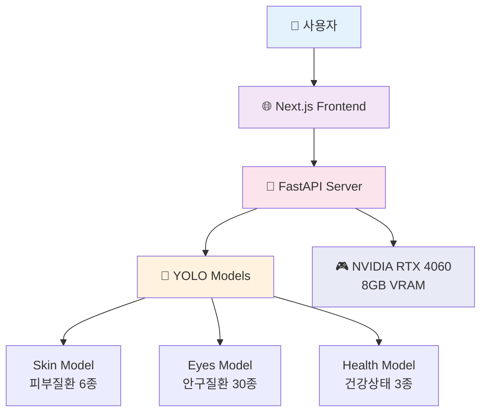
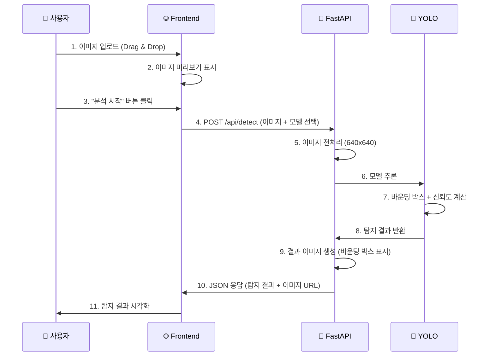

# Fetpal - YOLO 모델 정의서

> **4차 스프린트 발표** (2025.11.14)  
> **최종 발표**: 2025-11-21

---

## 📋 문서 개요

이 문서는 Fetpal 프로젝트의 **YOLO 기반 객체 탐지** 시스템을 설명합니다.  
반려동물의 피부질환, 안구질환, 건강상태를 이미지로 분석하는 AI 모델에 대한 기술 명세입니다.

---

## 🎯 프로젝트 개요

### 핵심 기능

**🔍 YOLO 기반 객체 탐지**

- 3개 독립 모델로 다양한 질환 감지
- FastAPI 서버를 통한 추론 서비스
- 이미지에서 바운딩 박스 + 신뢰도 반환

### 시스템 구성



### 모델 성능 요약

| 모델명           | 탐지 대상 | 클래스 수 | 데이터셋 규모 | 성능 (mAP50) |
| ---------------- | --------- | --------- | ------------- | ------------ |
| **Skin Model**   | 피부질환  | 6개       | 232,253개     | 18.3%        |
| **Eyes Model**   | 안구질환  | 30개      | 217,547개     | 25.4%        |
| **Health Model** | 건강상태  | 3개       | 108,000개+    | 88.2% ⭐     |

> **💡 용어 설명**
>
> - **mAP50**: IoU(Intersection over Union) 임계값이 50%일 때의 평균 정밀도(Mean Average Precision)
>   - 쉽게 말하면: AI가 그린 박스와 정답 박스가 50% 이상 겹칠 때를 맞다고 판단하는 정확도
>   - 0~100% 범위이며, 높을수록 좋음
> - **클래스**: 모델이 구분할 수 있는 질환의 종류 개수

---

## 📌 목차

1. [모델 공통 사양](#1-모델-공통-사양)
2. [Skin Model - 피부질환](#2-skin-model---피부질환)
3. [Eyes Model - 안구질환](#3-eyes-model---안구질환)
4. [Health Model - 건강상태](#4-health-model---건강상태)
5. [데이터셋 구조](#5-데이터셋-구조)
6. [YOLO 모델 시스템 아키텍처](#6-yolo-모델-시스템-아키텍처)
7. [성능 분석](#7-성능-분석)

---

## 1. 모델 공통 사양

### 1.1. YOLOv8m 아키텍처

| 항목              | 내용                                                                  |
| ----------------- | --------------------------------------------------------------------- |
| **모델 아키텍처** | YOLOv8m (You Only Look Once v8 Medium)                                |
| **모델 유형**     | 객체 탐지 (Object Detection) - 이미지에서 물체를 찾아내고 위치를 표시 |
| **프레임워크**    | Ultralytics YOLO - YOLO 모델을 쉽게 사용할 수 있게 만든 라이브러리    |
| **입력 크기**     | 640 × 640 pixels - 모델에 넣기 전 이미지 크기 조정                    |
| **출력 형식**     | Bounding Box(박스 좌표) + 클래스 확률 + 신뢰도                        |
| **파라미터 수**   | 약 25.9M - 모델이 학습하는 변수 개수 (많을수록 성능 높지만 무거움)    |
| **학습 환경**     | NVIDIA RTX 4060 (8GB VRAM) - GPU 그래픽카드                           |

### 1.2. 모델 구조

> **💡 YOLOv8m의 3단계 구조**
>
> - **Backbone**: 이미지에서 특징을 추출 (눈, 코, 귀 같은 특징 찾기)
> - **Neck**: 다양한 크기의 특징을 결합 (작은 것~큰 것 모두 감지)
> - **Head**: 최종 예측 (여기가 질환이다! 박스 그리기)



**주요 레이어 구성:**

- **Backbone**: CSPDarknet53 (특징 추출)
- **Neck**: PANet (다중 스케일 특징 융합)
- **Head**: Decoupled Head (분류 + 위치 예측 분리)

### 1.3. 손실 함수 (Loss Function)

> **💡 손실 함수란?** AI 모델이 얼마나 틀렸는지 측정하는 지표입니다. 값이 작을수록 모델이 잘 학습되고 있다는 뜻입니다.

```python
# YOLO는 3가지 손실 함수를 결합하여 사용
Total_Loss = λ1·Box_Loss + λ2·Class_Loss + λ3·DFL_Loss
```

**1. Box Loss (Bounding Box Loss)** - 박스 위치 오차

- CIoU Loss (Complete Intersection over Union)
- 바운딩 박스 위치와 크기의 정확도 측정
- 쉽게 말하면: AI가 그린 박스가 정답 박스와 얼마나 잘 맞는지 계산

**2. Class Loss (Classification Loss)** - 분류 오차

- Binary Cross Entropy Loss
- 클래스 분류 정확도 측정
- 쉽게 말하면: "이게 구진인지 농포인지" 제대로 맞췄는지 계산

**3. DFL Loss (Distribution Focal Loss)** - 객체 탐지 오차

- 객체 존재 확률 측정
- 배경과 객체를 구분
- 쉽게 말하면: 여기에 진짜 질환이 있는지 없는지 판단하는 정확도

---

## 2. Skin Model - 피부질환

### 2.1. 모델 개요

| 항목           | 내용                          |
| -------------- | ----------------------------- |
| **모델 파일**  | `skin_yolov8m_best.pt` (52MB) |
| **학습 기간**  | 28 Epochs, 약 38시간          |
| **클래스 수**  | 6개                           |
| **데이터셋**   | 232,253개 이미지              |
| **최종 mAP50** | 18.3%                         |

### 2.2. 학습 클래스 정의 (6개)

```python
# 클래스 ID와 질환명 매핑
class_mapping = {
    0: 'A1_구진_플라크',              # Papule & Plaque
    1: 'A2_비듬_각질_상피성잔고리',    # Dandruff & Scale
    2: 'A3_태선화_과다색소침착',       # Lichenification & Hyperpigmentation
    3: 'A4_농포_여드름',              # Pustule & Acne
    4: 'A5_미란_궤양',                # Erosion & Ulcer
    5: 'A6_결절_종괴'                 # Nodule & Mass
}
```

### 2.3. 클래스별 특징

| 클래스 ID | 질환명                     | 주요 특징                          | 데이터 개수 |
| --------- | -------------------------- | ---------------------------------- | ----------- |
| **0**     | A1*구진*플라크             | 피부 위 돌출된 구진, 편평한 플라크 | 36,635개    |
| **1**     | A2*비듬*각질\_상피성잔고리 | 각질, 비듬, 하얀 상피성 잔고리     | 88,365개    |
| **2**     | A3*태선화*과다색소침착     | 피부 두꺼워짐, 색소 침착           | 60,911개    |
| **3**     | A4*농포*여드름             | 화농성 병변, 고름 형성             | 38,089개    |
| **4**     | A5*미란*궤양               | 표면 손상, 궤양, 상처              | 13,884개    |
| **5**     | A6*결절*종괴               | 깊은 결절, 종괴, 덩어리            | 21,573개    |

### 2.4. 데이터 분포

```
A2_비듬각질 ████████████████████████████ 88,365 (38.1%)
A3_태선화   ████████████████████ 60,911 (26.2%)
A4_농포     ████████████ 38,089 (16.4%)
A1_구진     ████████████ 36,635 (15.8%)
A6_결절     ██████ 21,573 (9.3%)
A5_미란     ████ 13,884 (6.0%)
```

### 2.5. 하이퍼파라미터 설정

> **💡 하이퍼파라미터란?** 모델 학습 전에 사람이 직접 설정해주는 값들입니다. 요리할 때 불 세기, 시간 조절하는 것과 비슷합니다.

```yaml
# Skin Model 학습 설정
epochs: 28 # 전체 데이터를 28번 반복 학습
batch_size: 8 # 한 번에 8장씩 이미지를 학습 (GPU 메모리에 따라 조정)
image_size: 640 # 이미지를 640×640 크기로 조정
optimizer: SGD # 최적화 알고리즘 (경사하강법)
lr0: 0.01 # 초기 학습률 (학습 속도, 너무 크면 불안정, 너무 작으면 느림)
momentum: 0.937 # 관성 (이전 학습 방향을 얼마나 유지할지)
weight_decay: 0.0005 # 가중치 감소 (과적합 방지)
```

### 2.6. 성능 지표

| 지표          | 수치  | 설명                                                            |
| ------------- | ----- | --------------------------------------------------------------- |
| **mAP50**     | 18.3% | IoU 50% 기준 평균 정밀도 (박스가 50% 이상 겹치면 맞다고 판단)   |
| **mAP50-95**  | 8.3%  | IoU 50%~95% 범위의 평균 정밀도 (더 엄격한 기준, 더 정확해야 함) |
| **Precision** | 31.8% | 정밀도: AI가 "질환이다"라고 한 것 중 실제로 맞은 비율           |
| **Recall**    | 23.1% | 재현율: 실제 질환 중 AI가 찾아낸 비율                           |

> **💡 성능 지표 이해하기**
>
> - **mAP50**: 관대한 기준 (박스가 50% 이상만 겹치면 OK)
> - **mAP50-95**: 엄격한 기준 (박스가 정확하게 겹쳐야 OK) → 보통 mAP50보다 낮음
> - **Precision vs Recall**:
>   - Precision 높음 = 거짓 경보가 적음 (AI가 말한 건 대부분 맞음)
>   - Recall 높음 = 놓친 게 적음 (실제 질환을 대부분 찾아냄)

### 2.7. 학습 손실 변화

| Epoch | Box Loss | Class Loss | DFL Loss | Total Loss |
| ----- | -------- | ---------- | -------- | ---------- |
| 1     | 2.500    | 3.772      | 1.942    | 8.214      |
| 14    | 2.297    | 3.135      | 1.774    | 7.206      |
| 28    | 2.073    | 2.531      | 1.650    | 6.254      |

**손실 감소율:**

- Box Loss: 17.1% 감소
- Class Loss: 32.9% 감소
- DFL Loss: 15.0% 감소

---

## 3. Eyes Model - 안구질환

### 3.1. 모델 개요

| 항목           | 내용                          |
| -------------- | ----------------------------- |
| **모델 파일**  | `eyes_yolov8m_best.pt` (50MB) |
| **학습 기간**  | 28 Epochs, 약 72시간 (3일)    |
| **클래스 수**  | 30개                          |
| **데이터셋**   | 217,547개 이미지              |
| **최종 mAP50** | 25.35%                        |

### 3.2. 학습 클래스 정의 (30개)

```python
# 안구질환 클래스 (개 24개 + 고양이 6개)
eyes_classes = {
    # 개 안구질환 (0-23)
    0: '결막염_무', 1: '결막염_유',
    2: '궤양성각막질환_무', 3: '궤양성각막질환_상', 4: '궤양성각막질환_하',
    5: '백내장_무', 6: '백내장_초기', 7: '백내장_비성숙', 8: '백내장_성숙',
    9: '비궤양성각막질환_무', 10: '비궤양성각막질환_상', 11: '비궤양성각막질환_하',
    12: '색소침착성각막염_무', 13: '색소침착성각막염_유',
    14: '안검내반증_무', 15: '안검내반증_유',
    16: '안검염_무', 17: '안검염_유',
    18: '안검종양_무', 19: '안검종양_유',
    20: '유루증_무', 21: '유루증_유',
    22: '핵경화_무', 23: '핵경화_유',

    # 고양이 안구질환 (24-29)
    24: '각막궤양_무', 25: '각막궤양_유',
    26: '각막부골편_무', 27: '각막부골편_유',
    28: '비궤양성각막염_무', 29: '비궤양성각막염_유'
}
```

### 3.3. 클래스 명명 규칙

- **무(無)**: 질병 없음 (정상)
- **유(有)**: 질병 있음
- **상(上)**: 심각도 높음
- **하(下)**: 심각도 낮음
- **초기/비성숙/성숙**: 백내장 진행 단계

### 3.4. 데이터 구성

- 개(Dog) 안구질환: 24개 클래스 (193,134개 이미지)
- 고양이(Cat) 안구질환: 6개 클래스 (24,413개 이미지)

### 3.5. 하이퍼파라미터 설정

```yaml
# Eyes Model 학습 설정
epochs: 28
batch_size: 16
image_size: 640
optimizer: SGD
lr0: 0.01
momentum: 0.937
weight_decay: 0.0005
workers: 4
```

### 3.6. 성능 지표

| 지표         | 수치   | 설명                                            |
| ------------ | ------ | ----------------------------------------------- |
| **mAP50**    | 25.35% | IoU 50% 기준 평균 정밀도                        |
| **mAP50-95** | 21.48% | IoU 50%~95% 범위의 평균 정밀도 (더 엄격한 평가) |

### 3.7. 우수 클래스 성능

| 클래스             | mAP50 | mAP50-95 | 특징                  |
| ------------------ | ----- | -------- | --------------------- |
| 백내장\_무         | 49.3% | 48.8%    | 가장 높은 정확도      |
| 궤양성각막질환\_상 | 53.4% | 53.3%    | 심각도 높은 질환 검출 |
| 백내장\_초기       | 37.4% | 36.0%    | 초기 단계 검출 가능   |
| 결막염\_유         | 27.9% | 25.1%    | 일반적 질환 검출      |

---

## 4. Health Model - 건강상태

### 4.1. 모델 개요

| 항목           | 내용                            |
| -------------- | ------------------------------- |
| **모델 파일**  | `health_yolov8m_best.pt` (52MB) |
| **학습 기간**  | 28 Epochs, 약 21.5시간          |
| **클래스 수**  | 3개                             |
| **데이터셋**   | 108,000개+ 이미지               |
| **최종 mAP50** | 88.2% ⭐ (가장 높은 성능!)      |

### 4.2. 학습 클래스 정의 (3개)

```python
# 건강상태 클래스
health_classes = {
    0: 'full_body',  # 전신 (Body-Part 01-13)
    1: 'head',       # 두상 (Body-Part 14-19)
    2: 'nose'        # 코/비문 (Body-Part 20)
}
```

### 4.3. 클래스별 특징

| 클래스 ID | 부위명    | 설명          | AI Hub 매핑     |
| --------- | --------- | ------------- | --------------- |
| **0**     | full_body | 반려동물 전신 | Body-Part 01-13 |
| **1**     | head      | 머리/두상     | Body-Part 14-19 |
| **2**     | nose      | 코/비문       | Body-Part 20    |

### 4.4. 데이터 출처

- **AI Hub** 반려견, 반려묘 건강정보 데이터
- 반려견: 개체식별, 건강관리용
- 반려묘: 개체식별, 건강관리용

### 4.5. 데이터 구성

- 훈련 데이터: 약 96,000개
- 검증 데이터: 약 12,000개
- 반려견(Dog): 94%, 반려묘(Cat): 6%

### 4.6. 하이퍼파라미터 설정

```yaml
# Health Model 학습 설정
epochs: 28
batch_size: 16
image_size: 640
optimizer: SGD
lr0: 0.01
momentum: 0.937
weight_decay: 0.0005
workers: 4
```

### 4.7. 성능 지표 (우수!)

| 지표         | 수치     | 평가                                        |
| ------------ | -------- | ------------------------------------------- |
| **mAP50**    | 88.2% ⭐ | 매우 우수! (일반적으로 70% 이상이면 실용적) |
| **mAP50-95** | 77.1%    | 엄격한 기준에서도 높은 성능 유지            |

> **💡 Health Model이 왜 이렇게 높을까?**
>
> - 클래스가 3개로 단순 (전신, 머리, 코만 구분)
> - 데이터 품질이 우수 (AI Hub 공공 데이터)
> - 객체가 명확 (피부 질환처럼 애매한 것이 아님)

### 4.8. 클래스별 성능

| 클래스    | mAP50    | mAP50-95 | Precision | Recall |
| --------- | -------- | -------- | --------- | ------ |
| full_body | 98.8% ⭐ | 95.9%    | 높음      | 높음   |
| head      | 86.8%    | 71.9%    | 중간      | 중간   |
| nose      | 78.9%    | 63.5%    | 보통      | 보통   |

---

## 5. 데이터셋 구조

### 5.1. 통합 데이터셋 통계

| 모델       | 전체 이미지    | 훈련 데이터     | 검증 데이터     | 클래스 수 |
| ---------- | -------------- | --------------- | --------------- | --------- |
| **Skin**   | 232,253개      | 185,802개 (80%) | 46,451개 (20%)  | 6개       |
| **Eyes**   | 217,547개      | 193,134개 (89%) | 24,413개 (11%)  | 30개      |
| **Health** | 108,000+개     | ~96,000개 (89%) | ~12,000개 (11%) | 3개       |
| **총합**   | **557,800+개** | ~474,936개      | ~82,864개       | **39개**  |

### 5.2. YOLO 라벨 형식

> **💡 라벨이란?** AI에게 "여기에 이런 질환이 있어요"라고 알려주는 정답 파일입니다.

각 이미지마다 `.txt` 파일로 라벨링되어 있습니다:

```txt
# 파일명: img_0001.txt
# 형식: <class_id> <x_center> <y_center> <width> <height>
# 좌표는 정규화됨 (0.0 ~ 1.0)

0 0.512 0.345 0.123 0.089
2 0.678 0.567 0.145 0.234
```

**각 필드 설명:**

- `class_id`: 클래스 ID (Skin: 0~5, Eyes: 0~29, Health: 0~2)
  - 예: 0 = A1*구진*플라크, 2 = A3*태선화*과다색소침착
- `x_center`: 바운딩 박스 중심 X 좌표 (정규화, 0.0~1.0)
  - 정규화: 이미지 너비를 1로 봤을 때의 비율
- `y_center`: 바운딩 박스 중심 Y 좌표 (정규화, 0.0~1.0)
- `width`: 바운딩 박스 너비 (정규화, 0.0~1.0)
- `height`: 바운딩 박스 높이 (정규화, 0.0~1.0)

**예시 해석:**

```
0 0.512 0.345 0.123 0.089
→ "A1_구진_플라크가 이미지 중앙(0.512, 0.345) 부근에 작은 크기(0.123×0.089)로 있음"
```

### 5.3. 데이터셋 폴더 구조

```
📁 YOLO_DATASETS/
├── 📁 SKIN_YOLO_DATASET/
│   ├── images/
│   │   ├── train/              # 훈련 이미지 (185,802개)
│   │   └── val/                # 검증 이미지 (46,451개)
│   └── labels/
│       ├── train/              # 훈련 라벨 (YOLO 형식)
│       └── val/                # 검증 라벨
│
├── 📁 EYES_YOLO_DATASET/
│   ├── images/
│   │   ├── train/              # 훈련 이미지 (193,134개 - 개)
│   │   └── val/                # 검증 이미지 (24,413개 - 고양이)
│   └── labels/
│       ├── train/              # 훈련 라벨
│       └── val/                # 검증 라벨
│
└── 📁 HEALTH_YOLO_DATASET/
    ├── images/
    │   ├── train/              # 훈련 이미지 (~96,000개)
    │   └── valid/              # 검증 이미지 (~12,000개)
    └── labels/
        ├── train/              # 훈련 라벨
        └── valid/              # 검증 라벨
```

---

## 6. YOLO 모델 시스템 아키텍처

### 6.1. YOLO 이미지 분석 시스템 구조



### 6.2. 처리 흐름 (AI 진단 Pipeline)



### 6.3. API 엔드포인트

```python
# FastAPI 엔드포인트 정의
@app.post("/api/detect-health")   # Health Model 추론
@app.post("/api/detect-eyes")     # Eyes Model 추론
@app.post("/api/detect-skin")     # Skin Model 추론
```

### 6.4. 응답 형식

```json
{
  "detections": [
    {
      "class": "A1_구진_플라크",
      "confidence": 0.82,
      "bbox": [x, y, w, h]
    },
    {
      "class": "full_body",
      "confidence": 0.95,
      "bbox": [x, y, w, h]
    }
  ],
  "annotated_image": "data:image/jpeg;base64,..."
}
```

---

## 7. 성능 분석

### 7.1. 통합 모델 성능 비교

| 모델       | mAP50        | mAP50-95     | Precision | Recall | 학습시간  | 클래스 수 | 평가      |
| ---------- | ------------ | ------------ | --------- | ------ | --------- | --------- | --------- |
| **Skin**   | 18.3%        | 8.3%         | 31.8%     | 23.1%  | 38시간    | 6개       | 개선 필요 |
| **Eyes**   | 25.4%        | 21.5%        | -         | -      | 72시간    | 30개      | 개선 필요 |
| **Health** | **88.2%** ⭐ | **77.1%** ⭐ | -         | -      | 21.5시간  | 3개       | **우수**  |
| **평균**   | 44.0%        | 35.6%        | -         | -      | 131.5시간 | 39개      | -         |

> **💡 성능 차이가 큰 이유**
>
> - **Health 모델이 높은 이유**: 클래스가 3개로 단순, 객체가 명확 (전신, 머리, 코)
> - **Skin 모델이 낮은 이유**: 피부 질환은 경계가 애매함, 데이터 불균형
> - **Eyes 모델이 중간인 이유**: 클래스가 30개로 많아서 학습이 어려움

### 7.2. 학습 시간 및 리소스

| 모델       | 총 학습시간 | 1 Epoch 시간 | GPU 사용률 | GPU 메모리 | 학습 이미지 수 |
| ---------- | ----------- | ------------ | ---------- | ---------- | -------------- |
| **Skin**   | 38시간      | ~82분        | 95%        | 7.2GB/8GB  | 185,802개      |
| **Eyes**   | 72시간      | ~154분       | 90%        | 6.8GB/8GB  | 193,134개      |
| **Health** | 21.5시간    | ~46분        | 85%        | 5.5GB/8GB  | ~96,000개      |
| **총합**   | 131.5시간   | -            | -          | -          | 474,936개      |

### 7.3. 장점 분석

**1. Health Model의 높은 성능 (88.2% mAP50)**

- 클래스가 3개로 단순하여 학습이 효율적
- 데이터 품질이 우수 (AI Hub 공공 데이터)
- full_body 검출 98.8%로 매우 높은 정확도

**2. Eyes Model의 광범위한 질환 커버 (30개 클래스)**

- 개 24개 + 고양이 6개 안구질환 통합
- 주요 질환(백내장, 궤양성각막질환) 검출 정확도 50% 이상
- 심각도 단계별 분류 가능

**3. Skin Model의 대규모 데이터셋 (232,253개)**

- 가장 많은 이미지 데이터 활용
- 6개 피부질환 클래스 분포

### 7.4. 개선이 필요한 부분

**1. Skin Model의 낮은 mAP (18.3%)**

- 원인: 하이퍼파라미터 자동 최적화 설정 문제
- 학습 중반에 성능 급락 발생
- 데이터 불균형 (A5: 13,884개 vs A2: 88,365개)

**2. Eyes Model의 클래스 복잡도**

- 30개 클래스로 인한 학습 난이도 증가
- 일부 클래스(핵경화, 각막부골편) 낮은 정확도
- 개와 고양이 데이터 불균형 (9:1 비율)

**3. 전체적인 학습 시간**

- 총 131.5시간 (약 5.5일) 소요
- GPU 연속 가동에 따른 부담

### 7.5. 개선 방안

#### Skin Model 개선

**1. 하이퍼파라미터 재조정**

- `optimizer: auto` → `optimizer: SGD` (수동 설정)
- Learning Rate 감소: 0.01 → 0.001
- Batch Size 증가: 8 → 16

**2. 데이터 증강 강화**

- Mixup, CutMix 추가
- Class-balanced Sampling 적용
- 데이터 재샘플링으로 A5 클래스 증강

**3. 학습 전략 변경**

- Epoch 수 증가: 28 → 100
- Early Stopping 적극 활용
- Warmup Epoch 증가: 3 → 5

#### Eyes Model 개선

**1. 클래스 통합**

- 유사 클래스 통합 (무/유만 남기고 상/하 제거)
- 30개 → 15개 클래스로 단순화

**2. 데이터 밸런싱**

- 고양이 데이터 증강 (24,413개 → 50,000개)
- 저빈도 클래스 오버샘플링
- Focal Loss 적용

---

## 🔗 참고 자료

### 기술 문서

1. **YOLOv8 공식 문서**: https://docs.ultralytics.com/
2. **논문**: Jocher, G. et al. (2023). Ultralytics YOLOv8
3. **PyTorch 공식 문서**: https://pytorch.org/docs/
4. **Ultralytics GitHub**: https://github.com/ultralytics/ultralytics

### 데이터셋 출처 - 출처: https://aihub.or.kr/

1. **Skin Model**: AI Hub 반려동물 피부질환
2. **Eyes Model**: AI Hub 반려동물 안구질환
3. **Health Model**: AI Hub 반려견/반려묘 건강정보 데이터

---

## ⚖️ 법적 고지사항

⚠️ **중요 안내**

1. **진단 목적 제한**

   - 본 AI 시스템은 **참고용**이며, 실제 진단은 반드시 자격을 갖춘 수의사가 수행해야 합니다.
   - 수의사법 준수: 본 시스템은 진단이 아닌 "정보 제공" 목적입니다.

2. **책임의 한계**
   - AI 예측 결과의 정확성을 100% 보장하지 않습니다.
   - 치료 결정은 반드시 전문 수의사와 상담 후 진행하세요.

---

## 🏆 YOLO 트레이닝 요약

**3개 YOLOv8m 모델 학습 완료**

✅ **총 557,800+개 이미지 학습**

- 131.5시간 GPU 학습 완주
- 39개 클래스 통합 진단 가능

✅ **3개 독립 모델 구축**

- Skin: 232,253개 데이터, 6개 클래스
- Eyes: 217,547개 데이터, 30개 클래스
- Health: 108,000+개 데이터, 3개 클래스 (가장 높은 성능)

✅ **FastAPI 서버 통합**

- Next.js 14 프론트엔드 연동
- GPU 가속 추론 지원

---

**📝 문서 정보**

- **작성일**: 2025-11-14
- **작성자**: LYSS with Claude
- **버전**: v2.0 (4차 스프린트 최종)
- **관련 문서**: [10*RAG-LLM*시스템\_정의서.md](./10_RAG-LLM_시스템_정의서.md)
