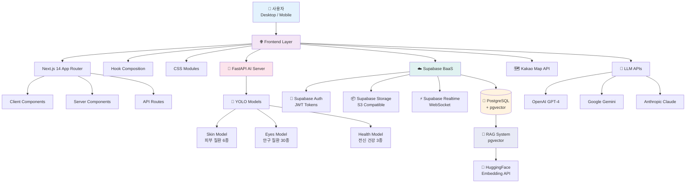
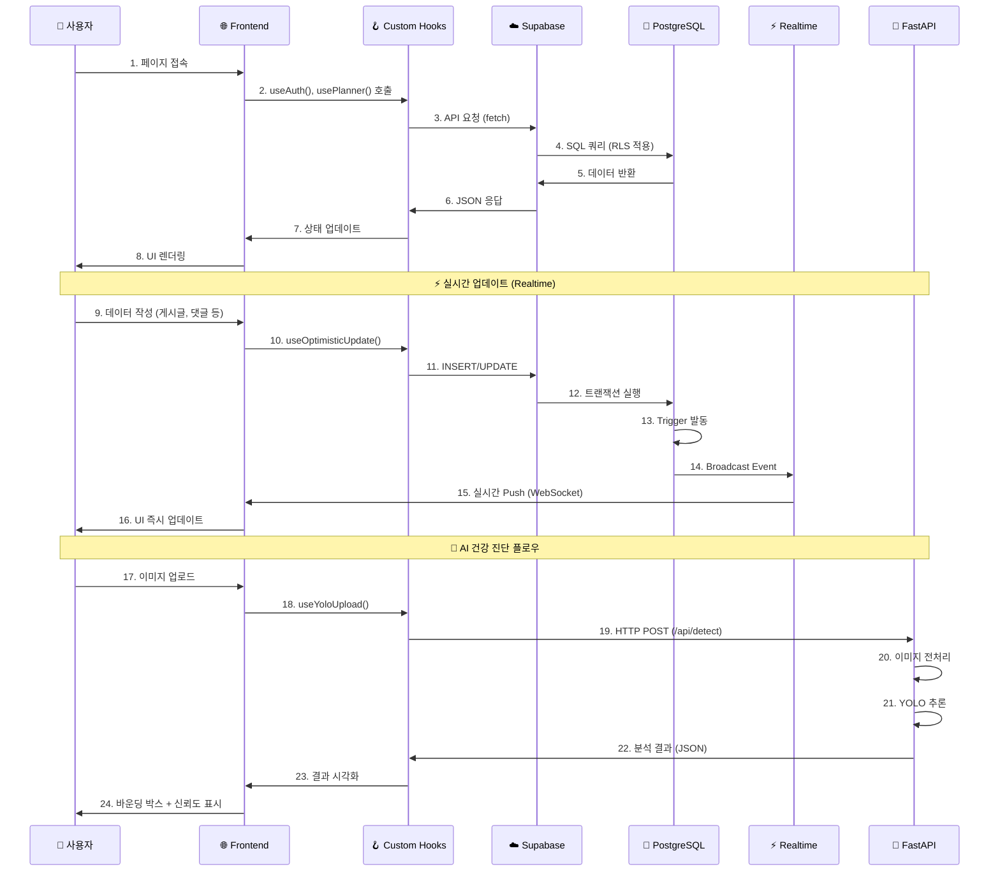

# Fetpal 시스템 아키텍처

> **4차 스프린트 발표** (2025.11.14)  
> **최종 발표**: 2025-11-21

---

## 📋 문서 개요

이 문서는 Fetpal 프로젝트의 전체 시스템 아키텍처, 기술 스택, Hook Composition 패턴, Co-location 구조를 상세히 설명합니다.

---

## 🏗️ 1. 전체 시스템 아키텍처

### 1.1. 전체 시스템 구조



### 1.2. 데이터 흐름 (Data Flow)



---

## 🔧 2. 기술 스택 (Tech Stack)

### 2.1. Frontend Stack

| **Category** | **Technology** | **Version** | **Purpose** |
|:---|:---|:---:|:---|
| **Framework** | Next.js | 14.2.x | App Router 기반 풀스택 React 프레임워크 |
| **Language** | TypeScript | 5.x | 타입 안전성 확보 |
| **Language** | JavaScript | ES6+ | 동적 로직 및 빠른 프로토타이핑 |
| **Styling** | CSS Modules | - | Co-location 기반 스타일 관리 |
| **Styling** | Tailwind CSS | 3.x | 유틸리티 우선 CSS 프레임워크 |
| **State** | React Hooks | - | Hook Composition 패턴 |
| **HTTP Client** | fetch API | - | 네이티브 브라우저 API |

### 2.2. Backend Stack (BaaS)

| **Category** | **Technology** | **Version** | **Purpose** |
|:---|:---|:---:|:---|
| **BaaS** | Supabase | 2.x | PostgreSQL + Auth + Storage + Realtime |
| **Database** | PostgreSQL | 15.x | 관계형 데이터베이스 |
| **Auth** | Supabase Auth | - | JWT 기반 인증 시스템 |
| **Storage** | Supabase Storage | - | 이미지/파일 스토리지 (S3 호환) |
| **Realtime** | Supabase Realtime | - | WebSocket 기반 실시간 구독 |
| **Vector DB** | pgvector | 0.5.x | 벡터 검색 (RAG 시스템) |

### 2.3. AI Server Stack

| **Category** | **Technology** | **Version** | **Purpose** |
|:---|:---|:---:|:---|
| **Framework** | FastAPI | 0.104.x | 고성능 Python API 프레임워크 |
| **Language** | Python | 3.10.x | AI/ML 개발 언어 |
| **AI Model** | YOLOv8 | 8.0.x | 객체 탐지 (Ultralytics) |
| **CV Library** | OpenCV | 4.8.x | 이미지 처리 |
| **GPU** | CUDA | 12.1 | NVIDIA GPU 가속 (RTX 4060) |
| **Embedding** | HuggingFace | 4.x | sentence-transformers |

### 2.4. External APIs

| **Service** | **Purpose** | **사용 위치** |
|:---|:---|:---|
| **Kakao Map API** | 주변 동물병원/약국 검색 | AI Assistant, Hospital |
| **OpenAI GPT-4** | AI 챗봇 (멀티 LLM 지원) | AI Assistant |
| **Google Gemini** | AI 챗봇 (멀티 LLM 지원) | AI Assistant |
| **Anthropic Claude** | AI 챗봇 (멀티 LLM 지원) | AI Assistant |

---

## 🏛️ 3. Hook Composition 아키텍처 ⭐⭐⭐

### 3.1. Hook Composition 개념


**전통적 방식 (❌ 나쁜 예)**:
```
📁 Planner/
├── page.tsx (700줄)  ❌ 하나의 거대한 컴포넌트
└── planner.css
```

**Hook Composition 방식 (✅ 좋은 예)**:
```
📁 Planner/
├── page.tsx (165줄)  ✅ 마스터 컴포넌트 (작고 명확)
├── hooks/
│   ├── usePlanner.js  ✅ 플래너 전문 훅
│   ├── useCalendar.js  ✅ 달력 전문 훅
│   ├── useEvents.js  ✅ 이벤트 전문 훅
│   └── useExpenses.js  ✅ 지출 전문 훅
└── _components/
    ├── Calendar/
    ├── EventListSection/
    └── Wallet/
```

### 3.2. Hook 전문화 폴더 구조 (최종 완성)

```
📦 frontend/src/hooks/
├── 📂 auth/                      # 인증 관련 전문 훅들
│   ├── useAuth.js                # 로그인/로그아웃 전문가
│   ├── useSignup.js              # 회원가입 전문가
│   └── usePasswordReset.js       # 비밀번호 재설정 전문가
│
├── 📂 aiassistant/               # AI 어시스턴트 전문 훅들
│   ├── useYoloDetection.js       # YOLO 분석 전문가
│   ├── useImageUpload.js         # 이미지 업로드 전문가
│   ├── useAIChat.js              # AI 챗봇 전문가
│   └── useRAGSearch.js           # RAG 검색 전문가 ⭐
│
├── 📂 planner/                   # 플래너 전문 훅들
│   ├── usePlanner.js             # 마스터 플래너 훅
│   ├── useCalendar.js            # 달력 전문가
│   ├── useEvents.js              # 이벤트 CRUD 전문가
│   ├── useExpenses.js            # 지출 CRUD 전문가
│   └── vaccination/
│       ├── useVaccinationManager.js         # 백신 관리 전문가
│       └── useVaccinationModeManager.js     # 백신 모드 전환 전문가
│
├── 📂 community/                 # 커뮤니티 전문 훅들
│   ├── useCommunityPosts.js      # 게시글 CRUD 전문가
│   ├── useRealtimeComments.js    # 실시간 댓글 전문가 ⭐
│   ├── useLikes.js               # 좋아요 전문가
│   └── useHashtagInput.js        # 해시태그 입력 전문가
│
├── 📂 lifestyle/                 # 라이프스타일 전문 훅들
│   └── realtime/
│       ├── useLifestyleChat.js          # 채팅 메시지 관리 ⭐⭐⭐
│       ├── useLifestyleChatRooms.js     # 채팅방 관리 ⭐⭐⭐
│       ├── useRealtimeChat.js           # 실시간 구독 ⭐⭐⭐
│       ├── useParticipants.js           # 참여자 관리 ⭐⭐⭐
│       └── useImageUpload.js            # 이미지 업로드 ⭐⭐⭐
│
├── 📂 profile/                   # 프로필 관리 전문 훅들
│   ├── useProfile.js             # 사용자 프로필 전문가
│   ├── usePalProfile.js          # 반려동물 프로필 전문가
│   └── useGallery.js             # 갤러리 전문가
│
├── 📂 pet-registration/          # 반려동물 등록 전문 훅들 ⭐⭐
│   ├── usePetAPI.js              # API 통신 전문가
│   ├── usePetFormState.js        # 폼 상태 관리 전문가
│   ├── usePetValidation.js       # 유효성 검사 전문가
│   └── usePetRegistration.js     # 마스터 통합 Hook
│
├── 📂 hashtag/                   # 해시태그 자동완성
│   └── useHashtagAutocomplete.js # 실시간 인기 해시태그 조회 ⭐
│
├── 📂 maps/                      # Kakao Maps 통합
│   └── useHospitalSearch.ts      # 병원 검색 전문가
│
└── 📂 shared/                    # 공용 재사용 훅들
    ├── useGlobalHashtags.js      # 통합 해시태그 시스템 ⭐⭐
    ├── useSupabase.js            # Supabase 클라이언트
    └── useFileUpload.js          # 파일 업로드 공통
```

### 3.3. Hook Composition 성과

| **파일명** | **Before** | **After** | **감소율** |
|:---|---:|---:|---:|
| **FeedDetailModal** | 528줄 | 231줄 | **56%** |
| **useCommunityPosts** | 386줄 | 128줄 | **67%** |
| **EventListSection** | 303줄 | 117줄 | **61%** |
| **useRealtimeComments** | 310줄 | 238줄 | **23%** |
| **FeedCard** | 561줄 | 160줄 | **71%** |
| **usePlanner** | 676줄 | 165줄 | **75%** |

**평균 코드 축소율**: **60%** ✅

---

## 📁 4. Co-location 아키텍처 (App Router 기반)

### 4.1. Co-location 개념

> **"기능에 필요한 모든 파일을 하나의 폴더에 모아 완전한 독립성을 확보"**


**전통적 방식 (❌ 나쁜 예)**:
```
📁 src/
├── components/
│   ├── Calendar.tsx
│   ├── EventList.tsx
│   └── Wallet.tsx
├── hooks/
│   ├── useCalendar.js
│   ├── useEvents.js
│   └── useExpenses.js
└── styles/
    ├── calendar.css
    ├── eventList.css
    └── wallet.css
```

**Co-location 방식 (✅ 좋은 예)**:
```
📁 Planner/
├── page.tsx
├── hooks/
│   ├── usePlanner.js
│   └── useCalendar.js
├── _components/
│   ├── Calendar/
│   │   ├── index.jsx
│   │   ├── CalendarView.jsx
│   │   └── calendarview.module.css  ✅ 같은 폴더!
│   ├── EventListSection/
│   │   ├── index.jsx
│   │   └── eventlistsection.module.css  ✅ 같은 폴더!
│   └── Wallet/
│       ├── index.jsx
│       └── wallet.module.css  ✅ 같은 폴더!
└── planner.module.css
```

### 4.2. 전체 폴더 구조 (2025-11-13 기준)

```
📁 frontend/src/app/
├── 📁 main/                              # 인증 후 메인 기능들
│   ├── 📁 HomePage/                      # 메인 대시보드
│   │   ├── homepage.module.css
│   │   ├── leftPanel/
│   │   ├── quickActionsBar/
│   │   └── rightPanel/
│   │
│   ├── 📁 aiassistant/                   # AI 진단 + RAG 챗봇 ⭐⭐⭐
│   │   ├── page.tsx
│   │   ├── aiassistant.module.css
│   │   └── _components/
│   │       ├── LeftPanel/               # 이미지 업로드 + 결과
│   │       ├── RightPanel/              # AI 챗봇 + RAG 검색
│   │       ├── PetHospital/             # 병원 찾기 (Kakao Map)
│   │       └── HashtagSuggestions/      # 해시태그 자동완성
│   │
│   ├── 📁 planner/                       # 일정 + 가계부 관리 ⭐⭐
│   │   ├── page.tsx
│   │   ├── planner.module.css
│   │   ├── hooks/
│   │   │   └── vaccination/
│   │   ├── lib/
│   │   │   └── vaccination/
│   │   └── _components/
│   │       ├── Calendar/                # 커스텀 달력 (드래그앤드롭)
│   │       ├── EventListSection/        # 일정 목록
│   │       ├── Wallet/                  # 가계부
│   │       ├── palVaccination/          # 백신 관리
│   │       └── PlannerSmartPanel/       # 스마트 패널
│   │
│   ├── 📁 community/                     # 소셜 커뮤니티 ⭐⭐
│   │   ├── page.tsx
│   │   ├── community.module.css
│   │   └── _components/
│   │       ├── PostTab/                 # 게시글 피드
│   │       └── shared/                  # 공유 컴포넌트
│   │
│   ├── 📁 lifestyle/                     # 실시간 채팅 ⭐⭐⭐
│   │   ├── page.tsx
│   │   ├── lifestyle.module.css
│   │   └── _components/
│   │       ├── lifestyle.module.css
│   │       └── RealtimeChat/            # 채팅 시스템
│   │           ├── index.tsx
│   │           ├── realtimechat.module.css
│   │           └── components/
│   │               ├── BookmarkTabs/    # 북마크 탭
│   │               ├── ChatRoom/        # 채팅룸
│   │               ├── HashtagRooms/    # 해시태그 방 목록
│   │               ├── ParticipantsDropdown/
│   │               └── MoreMenu/
│   │
│   └── page.tsx                          # 메인 라우트
│
├── 📁 mypage/                            # 프로필 + 반려동물 관리
│   ├── page.tsx
│   └── _components/
│
├── 📁 settings/                          # 설정 페이지
│   ├── page.tsx
│   └── _components/
│       └── hooks/
│           └── useAppActions.js          # 회원탈퇴 로직 포함 ⭐
│
├── 📁 login/                             # 로그인 페이지
├── 📁 signup/                            # 회원가입 페이지
├── 📁 forgotpass/                        # 비밀번호 찾기
│
└── 📁 api/                               # 서버사이드 API 엔드포인트
    ├── ai/                               # RAG + 임베딩 + 지식 검색
    ├── community/                        # 게시글 + 좋아요 + 댓글
    ├── health/                           # YOLO 질환 감지
    ├── planner/                          # 일정 + 백신 동기화
    ├── profile/                          # 사용자 + 반려동물 관리
    ├── vaccinations/                     # 백신 생성 + 관리
    ├── hashtags/                         # 해시태그 자동완성
    └── cron/                             # 자동 임베딩 생성
```

---

## 🎨 5. CSS 아키텍처 & BEM 네이밍

### 5.1. CSS 모듈 Co-location 패턴

```
📁 ComponentName/
├── index.jsx                    # 컴포넌트 로직
├── componentname.module.css     # 전용 스타일 ⭐ (소문자 + camelCase)
├── hooks/                       # 컴포넌트 전용 훅 (선택)
├── utils/                       # 유틸리티 함수 (선택)
└── components/                  # 하위 컴포넌트 (선택)
```

**예시**:
```
📁 ChatRoom/
├── index.tsx
├── chatroom.module.css          # ⭐ 컴포넌트명.module.css
├── hooks/
│   └── useChatRoom.js
└── components/
    ├── MessageBubble.tsx
    └── InputArea.tsx
```

### 5.2. BEM 네이밍 패턴

```css
/* Block (블록) */
.LifestyleChat_ChatRoom_Container {
  display: flex;
  flex-direction: column;
}

/* Element (요소) */
.LifestyleChat_ChatRoom_MessagesContainer {
  flex: 1;
  overflow-y: auto;
}

/* Modifier (수정자) */
.LifestyleChat_ChatRoom_MessageBubble--mine {
  background: #dcf8c6;
  align-self: flex-end;
}

.LifestyleChat_ChatRoom_MessageBubble--other {
  background: #ffffff;
  align-self: flex-start;
}
```

**네이밍 규칙**:
- **Block**: `.기능_블록명`
- **Element**: `.기능_블록명_요소명`
- **Modifier**: `.기능_블록명_요소명--수정자`

### 5.3. 반응형 CSS (4단계 브레이크포인트)

```css
/* 💻 Desktop (기본) - 1281px 이상 */
.element {
  font-size: 1rem;
  padding: 16px;
  gap: 12px;
}

/* 💻 중형 (1280px 이하) - 10% 축소 */
@media (max-width: 1280px) {
  .element {
    font-size: 0.9375rem;
    padding: 14px;
    gap: 10px;
  }
}

/* 📱 소형 (900px 이하) - 20% 축소 */
@media (max-width: 900px) {
  .element {
    font-size: 0.875rem;
    padding: 12px;
    gap: 8px;
  }
}

/* 📱 모바일 (768px 이하) - 세로 배치 */
@media (max-width: 768px) {
  .element {
    flex-direction: column;
    width: 100%;
    font-size: 0.8125rem;
    padding: 10px;
    gap: 6px;
  }
}

/* 📱 초소형 (400px 이하) - 최소화 */
@media (max-width: 400px) {
  .element {
    font-size: 0.75rem;
    padding: 8px;
    gap: 4px;
  }
}
```

---

## 🗄️ 6. 데이터베이스 아키텍처 (PostgreSQL + pgvector)

### 6.1. 주요 테이블 구조


### 6.2. 커뮤니티 & 해시태그 시스템


### 6.3. RAG 시스템 (pgvector) ⭐⭐⭐

```sql
CREATE TABLE pet_knowledge_base (
  id UUID PRIMARY KEY DEFAULT uuid_generate_v4(),
  content TEXT NOT NULL,
  embedding VECTOR(384),  -- HuggingFace 384차원 벡터
  source TEXT CHECK (source IN ('community', 'faq', 'youtube', 'manual')),
  source_url TEXT,
  quality_score NUMERIC(3,2) CHECK (quality_score >= 0 AND quality_score <= 1),
  is_verified BOOLEAN DEFAULT FALSE,
  metadata JSONB,
  created_at TIMESTAMP WITH TIME ZONE DEFAULT TIMEZONE('utc', NOW()),
  updated_at TIMESTAMP WITH TIME ZONE DEFAULT TIMEZONE('utc', NOW())
);

-- Vector Similarity Search Index
CREATE INDEX ON pet_knowledge_base USING ivfflat (embedding vector_cosine_ops);
```

---

## 🔐 7. 보안 아키텍처 (Supabase 보안 정책 기반)

### 7.1. Row Level Security (RLS) 정책

```sql
-- ✅ 올바른 RLS 정책 (Function Search Path 공격 차단)
CREATE POLICY "policy_user_profiles_select"
ON profiles FOR SELECT
USING (id = (select auth.uid()));  -- ⭐ 서브쿼리로 보안 강화

-- ❌ 취약한 RLS 정책 (Function Search Path 공격 가능)
CREATE POLICY "policy_user_profiles_select"
ON profiles FOR SELECT
USING (id = auth.uid());  -- ❌ 직접 호출 시 공격 가능
```

### 7.2. Storage 보안 정책


---

## 🚀 8. 성능 최적화

### 8.1. 데이터베이스 최적화

- **인덱스 적용**: userId, palId, roomid 등 FK에 인덱스
- **트리거 최적화**: 필요한 경우에만 실행
- **RLS 성능**: 서브쿼리 방식으로 보안 + 성능 확보

### 8.2. 프론트엔드 최적화

- **Hook Composition**: 평균 60% 코드 축소
- **Co-location**: 기능별 독립성 확보
- **CSS Modules**: 런타임 최적화

### 8.3. AI 서버 최적화

- **GPU 가속**: NVIDIA RTX 4060 활용
- **멀티모델 관리**: 동시 처리 지원
- **평균 응답 시간**: 3~5초

---

## 📊 9. 시스템 메트릭스

| **항목** | **수치** | **비고** |
|:---|---:|:---|
| **평균 응답 시간** | 3-5초 | YOLO 분석 포함 |
| **실시간 지연** | 100ms 이하 | Supabase Realtime |
| **데이터베이스 RLS 정책** | 47개 | 보안 강화 |
| **Hook Composition 성과** | 60% 축소 | 코드 감소율 |
| **지원 브레이크포인트** | 4단계 | 400px ~ 1280px+ |
| **AI 모델 훈련 데이터** | 668,547개 | 이미지 |
| **RAG 지식 베이스** | 384차원 | HuggingFace 임베딩 |

---

**📝 문서 정보**
- **작성일**: 2025-11-13
- **작성자**: LYSS with Claude
- **버전**: v4.0 (4차 스프린트)
- **이전 문서**: [03_시스템_흐름도.md](./03_시스템_흐름도.md)
- **다음 문서**: [05_ERD.md](./05_ERD.md)

