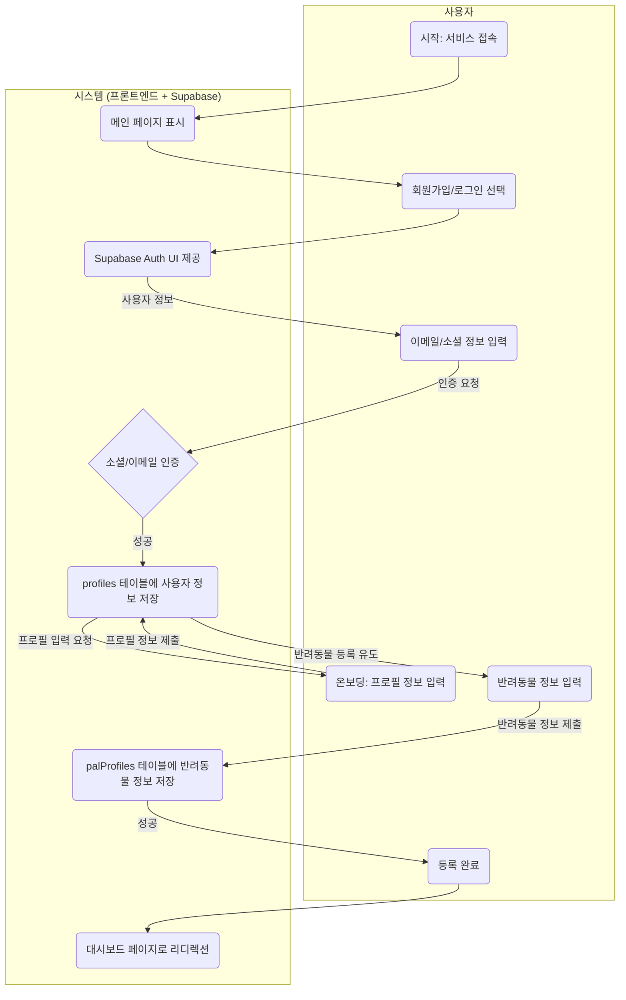
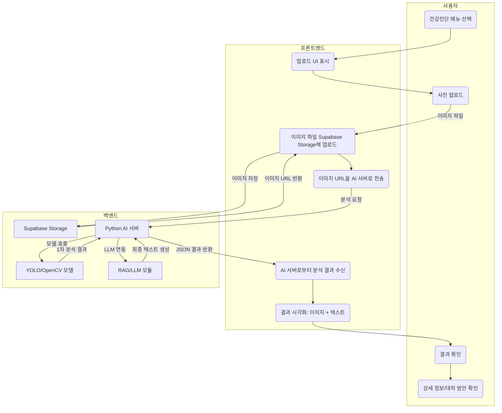
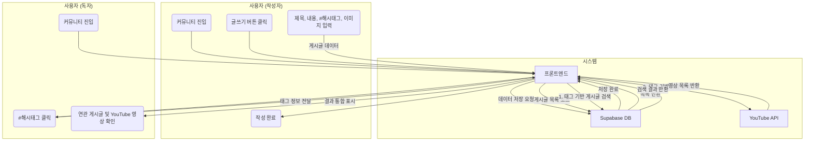
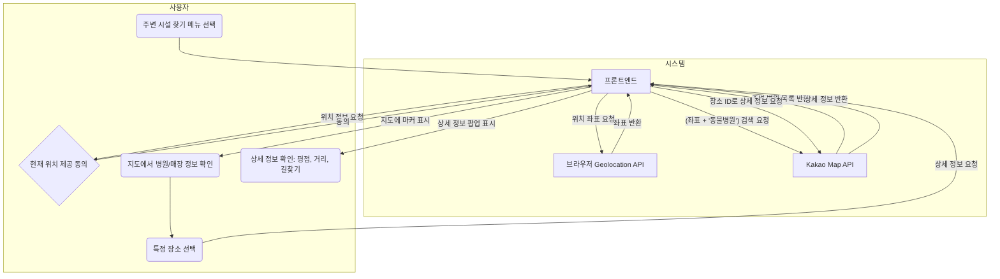

# Fetpal 시스템 흐름도

> 주요 사용자 시나리오에 따른 데이터 및 제어 흐름을 나타냅니다.

## 1. 사용자 온보딩 (회원가입 및 반려동물 등록)

```mermaid
graph TD
    subgraph "사용자"
        A1(시작: 서비스 접속)
        A2(회원가입/로그인 선택)
        A3(이메일/소셜 정보 입력)
        A4(온보딩: 프로필 정보 입력)
        A5(반려동물 정보 입력)
        A6(등록 완료)
    end

    subgraph "시스템 (프론트엔드 + Supabase)"
        B1(메인 페이지 표시)
        B2(Supabase Auth UI 제공)
        B3{소셜/이메일 인증}
        B4(profiles 테이블에 사용자 정보 저장)
        B5(palProfiles 테이블에 반려동물 정보 저장)
        B6(대시보드 페이지로 리디렉션)
    end

    A1 --> B1
    B1 --> A2
    A2 --> B2
    B2 -- "사용자 정보" --> A3
    A3 -- "인증 요청" --> B3
    B3 -- "성공" --> B4
    B4 -- "프로필 입력 요청" --> A4
    A4 -- "프로필 정보 제출" --> B4
    B4 -- "반려동물 등록 유도" --> A5
    A5 -- "반려동물 정보 제출" --> B5
    B5 -- "성공" --> A6
    A6 --> B6
```

## 2. AI 건강진단 (핵심 기능)

```mermaid
graph TD
    subgraph "사용자"
        C1(건강진단 메뉴 선택)
        C2(사진 업로드)
        C3(결과 확인)
        C4(상세 정보/대처 방안 확인)
    end

    subgraph "프론트엔드"
        D1(업로드 UI 표시)
        D2(이미지 파일 Supabase Storage에 업로드)
        D3(이미지 URL을 AI 서버로 전송)
        D4(AI 서버로부터 분석 결과 수신)
        D5(결과 시각화: 이미지 + 텍스트)
    end

    subgraph "백엔드"
        E1[Supabase Storage]
        E2[Python AI 서버]
        E3[YOLO/OpenCV 모델]
        E4[RAG/LLM 모듈]
    end

    C1 --> D1
    D1 --> C2
    C2 -- "이미지 파일" --> D2
    D2 -- "이미지 저장" --> E1
    E1 -- "이미지 URL 반환" --> D2
    D2 --> D3
    D3 -- "분석 요청" --> E2
    E2 -- "모델 호출" --> E3
    E3 -- "1차 분석 결과" --> E2
    E2 -- "LLM 연동" --> E4
    E4 -- "최종 텍스트 생성" --> E2
    E2 -- "JSON 결과 반환" --> D4
    D4 --> D5
    D5 --> C3
    C3 --> C4
```

## 3. 커뮤니티 게시글 작성 및 정보 얻기

```mermaid
graph TD
    subgraph "사용자 (작성자)"
        F1(커뮤니티 진입)
        F2(글쓰기 버튼 클릭)
        F3(제목, 내용, #해시태그, 이미지 입력)
        F4(작성 완료)
    end

    subgraph "사용자 (독자)"
        G1(커뮤니티 진입)
        G2(#해시태그 클릭)
        G3(연관 게시글 및 YouTube 영상 확인)
    end

    subgraph "시스템"
        H1[프론트엔드]
        H2[Supabase DB]
        H3[YouTube API]
    end

    F1 --> H1
    F2 --> H1
    F3 -- "게시글 데이터" --> H1
    H1 -- "데이터 저장 요청" --> H2
    H2 -- "저장 완료" --> H1
    H1 --> F4

    G1 --> H1
    H1 -- "게시글 목록 로드" --> H2
    H2 -- "목록 반환" --> H1
    H1 --> G2
    G2 -- "태그 정보 전달" --> H1
    H1 -- "1. 태그 기반 게시글 검색" --> H2
    H1 -- "2. 태그 기반 영상 검색" --> H3
    H2 -- "검색 결과 반환" --> H1
    H3 -- "영상 목록 반환" --> H1
    H1 -- "결과 통합 표시" --> G3
```

## 4. 주변 병원/매장 찾기 (지도 API 연동)

```mermaid
graph TD
    subgraph "사용자"
        I1(주변 시설 찾기 메뉴 선택)
        I2{현재 위치 제공 동의}
        I3(지도에서 병원/매장 정보 확인)
        I4(특정 장소 선택)
        I5(상세 정보 확인: 평점, 거리, 길찾기)
    end

    subgraph "시스템"
        J1[프론트엔드]
        J2[브라우저 Geolocation API]
        J3[Kakao Map API]
    end

    I1 --> J1
    J1 -- "위치 정보 요청" --> I2
    I2 -- "동의" --> J1
    J1 -- "위치 좌표 요청" --> J2
    J2 -- "좌표 반환" --> J1
    J1 -- "(좌표 + '동물병원') 검색 요청" --> J3
    J3 -- "주변 병원 목록 반환" --> J1
    J1 -- "지도에 마커 표시" --> I3
    I3 --> I4
    I4 -- "상세 정보 요청" --> J1
    J1 -- "장소 ID로 상세 정보 요청" --> J3
    J3 -- "상세 정보 반환" --> J1
    J1 -- "상세 정보 팝업 표시" --> I5
```
