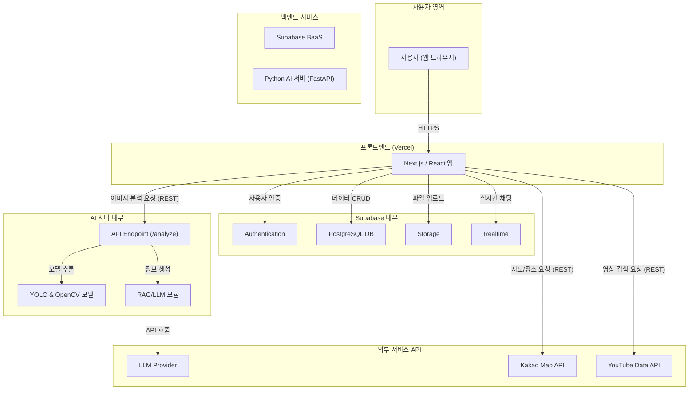

# Fetpal 시스템 아키텍처

## 1. 시스템 개요

Fetpal 플랫폼은 최신 웹 기술과 AI 모델, 그리고 강력한 백엔드 서비스를 결합한 **MSA(Microservice Architecture) 기반의 클라이언트-서버 아키텍처**를 채택합니다. 사용자는 Next.js로 구축된 웹 애플리케이션과 상호작용하며, 데이터와 비즈니스 로직은 Supabase BaaS와 별도의 Python AI 서버에서 처리됩니다.

## 2. 아키텍처 다이어그램

## 3. 구성 요소별 역할

### 3.1. 프론트엔드 (Client)

- **기술 스택**: Next.js (React)
- **배포 환경**: Vercel
- **역할**:
  - 사용자 인터페이스(UI) 및 사용자 경험(UX) 제공.
  - 상태 관리, 라우팅 등 클라이언트 사이드 로직 처리.
  - Supabase 및 AI 서버와 API 통신을 통해 데이터를 송수신.
  - 지도, 영상 등 외부 API 연동 결과를 사용자에게 시각화.

### 3.2. 백엔드 (Backend)

#### 3.2.1. Supabase (BaaS - Backend as a Service)

- **역할**: 핵심 백엔드 인프라 제공.
  - **PostgreSQL DB**: 사용자, 반려동물, 커뮤니티, 플래너 등 모든 정형 데이터를 저장 및 관리.
  - **Authentication**: 이메일/소셜 로그인을 통한 사용자 인증 및 세션 관리.
  - **Storage**: 사용자가 업로드하는 모든 이미지 파일(프로필, 분석용 사진, 게시글 이미지)을 저장하고 CDN을 통해 제공.
  - **Realtime**: 커뮤니티 이벤트의 실시간 채팅 기능을 위한 WebSocket 기반 메시지 브로드캐스팅.

#### 3.2.2. Python AI 서버

- **기술 스택**: FastAPI, PyTorch, YOLOv8, OpenCV
- **역할**: AI 기반 임의진단 기능을 독립된 마이크로서비스로 제공.
  - **API Endpoint**: 프론트엔드로부터 이미지 분석 요청을 받는 REST API 인터페이스.
  - **AI 모델**: YOLOv8과 OpenCV를 사용하여 이미지 내 객체(병변)를 탐지하고 분석.
  - **RAG/LLM 연동**: 분석 결과를 바탕으로 LLM Provider API를 호출하고, 검증된 정보를 조합하여 사용자에게 제공할 대처 방안 및 추천 정보를 생성.

### 3.3. 외부 서비스 (3rd Party APIs)

- **LLM Provider**: OpenAI(GPT) 또는 Google(Gemini) 등의 대규모 언어 모델 API. RAG 모듈의 핵심 지능.
- **Kakao Map API**: 위치 기반 서비스(병원/매장 추천, 거리 계산)를 위한 지도 및 장소 데이터 제공.
- **YouTube Data API**: 커뮤니티의 #해시태그와 연관된 동영상을 검색하고 임베드하기 위해 사용.

## 4. 데이터 흐름 예시 (AI 임의진단)

1.  **사용자**가 프론트엔드 앱에서 반려동물 사진을 업로드.
2.  **프론트엔드**는 먼저 이미지를 Supabase **Storage**에 업로드하고, 반환된 이미지 URL을 확보.
3.  프론트엔드는 해당 이미지 URL을 포함하여 Python **AI 서버**의 `/analyze` 엔드포인트로 API 요청.
4.  **AI 서버**는 URL의 이미지를 다운로드하여 **YOLO/OpenCV 모델**로 분석.
5.  분석 결과를 바탕으로 **RAG 모듈**이 **LLM Provider** API를 호출하여 상황 대처 방안 텍스트를 생성.
6.  AI 서버는 최종 분석 결과(바운딩 박스 좌표, 신뢰도, LLM 생성 텍스트 등)를 프론트엔드에 반환.
7.  **프론트엔드**는 결과를 사용자에게 시각적으로 표시.
8.  분석 기록은 Supabase **PostgreSQL DB**에 저장.
