# Fetpal ERD (Entity-Relationship Diagram)

> **4차 스프린트 발표** (2025.11.14)  
> **기준 스키마**: Supabase PostgreSQL (2025-11-14)  
> **총 테이블 수**: 40개+ (라이프스타일 채팅 4개 + RAG 1개 추가)

---

## 📊 전체 ERD 다이어그램

```mermaid
erDiagram
    %% =================================
    %% 1. 사용자 및 인증 (User & Auth)
    %% =================================
    "auth.users" {
        UUID id PK
        TEXT email
        TEXT encrypted_password
        TIMESTAMP created_at
        TIMESTAMP updated_at
    }

    "profiles" {
        UUID id PK
        TEXT email
        TEXT displayName
        TEXT avatarUrl
        TEXT phone
        TEXT address
        TEXT detailAddress
        TEXT zipCode
        BOOLEAN profileComplete
        JSONB uploadedImages
        TIMESTAMP createdAt
        TIMESTAMP updatedAt
    }

    "profileCompletion" {
        UUID userId PK
        INTEGER completionScore
        BOOLEAN hasBasicInfo
        BOOLEAN hasDisplayName
        BOOLEAN hasPhone
        BOOLEAN hasAddress
        BOOLEAN hasAvatar
        BOOLEAN hasPalProfile
        TIMESTAMP lastCalculated
        TIMESTAMP createdAt
        TIMESTAMP updatedAt
    }

    "notificationsettings" {
        UUID userid PK
        BOOLEAN pushnotifications
        BOOLEAN eventnotifications
        BOOLEAN communitynotifications
        BOOLEAN lifestylenotifications
        TIMESTAMP createdat
        TIMESTAMP updatedat
    }

    %% =================================
    %% 2. 반려동물 (Pal)
    %% =================================
    "palProfiles" {
        UUID palId PK
        UUID userId FK
        TEXT palName
        TEXT palUniqueName UK
        TEXT palSex
        DATE palBirthdate
        DATE palAdoptionDate
        TEXT palBreed
        NUMERIC palWeight
        TEXT palProfileImage
        BOOLEAN isPrimary
        TEXT animalType
        TEXT profileType
        TEXT profileImageUrl
        JSONB uploadedImages
        TIMESTAMP createdAt
        TIMESTAMP updatedAt
    }

    "userPals" {
        UUID id PK
        UUID userId FK
        UUID palId FK
        TEXT relationship
        TIMESTAMP createdAt
    }

    "palHealthRecords" {
        UUID id PK
        UUID palId FK
        TEXT recordType
        DATE recordDate
        TEXT title
        TEXT description
        TEXT vetName
        DATE nextSchedule
        TIMESTAMP createdAt
        TIMESTAMP updatedAt
    }

    %% =================================
    %% 3. 백신 시스템 (Vaccination)
    %% =================================
    "vaccinationTypes" {
        INTEGER id PK
        TEXT animalType
        TEXT vaccineNameKor
        TEXT vaccineCode UK
        TEXT category
        BOOLEAN isLegalRequired
        BOOLEAN isRequired
        TEXT simpleSchedule
        INTEGER totalDoses
        INTEGER firstDoseWeeks
        INTEGER intervalWeeks
        BOOLEAN isBoosterRequired
        TEXT boosterInterval
        TEXT preventsDiseases
        TEXT description
        TEXT rescueCaseMessage
        TIMESTAMP createdAt
        TIMESTAMP updatedAt
    }

    "palVaccinations" {
        UUID id PK
        UUID palId FK
        INTEGER vaccinationTypeId FK
        INTEGER shotNumber
        DATE scheduledDate
        DATE actualDate
        DATE userCompletedDate
        UUID completedBy
        TEXT completionSource
        BOOLEAN isCompleted
        TEXT hospitalName
        TEXT veterinarianName
        TEXT notes
        TEXT status
        DATE nextDueDate
        BOOLEAN reminderSent
        BOOLEAN isAutoGenerated
        BOOLEAN generatedFromBirthdate
        BOOLEAN isManualInput
        BOOLEAN isRequired
        TIME scheduleTime
        UUID plannerEventId FK
        TIMESTAMP createdAt
        TIMESTAMP updatedAt
    }

    "palVaccinationSummary" {
        UUID id PK
        UUID palId UK
        BOOLEAN coreVaccinesCompleted
        BOOLEAN legalVaccinesCompleted
        BOOLEAN isAdultClassified
        TIMESTAMP adultClassifiedAt
        BOOLEAN isRescueCase
        BOOLEAN needsManualScheduling
        TIMESTAMP schedulingModeChangedAt
        TEXT lastSchedulingMode
        INTEGER totalScheduled
        INTEGER totalCompleted
        INTEGER totalOverdue
        NUMERIC completionRate
        DATE firstVaccinationDate
        DATE lastVaccinationDate
        DATE nextDueDate
        TIMESTAMP createdAt
        TIMESTAMP updatedAt
    }

    %% =================================
    %% 4. 플래너 (Planner)
    %% =================================
    "plannerEvents" {
        UUID id PK
        UUID userId FK
        UUID palId FK
        TEXT title
        DATE eventDate
        TIME eventTime
        TEXT location
        TEXT memo
        TEXT eventType
        TEXT priority
        BOOLEAN isConsecutive
        UUID consecutiveGroupId
        INTEGER consecutiveDays
        BOOLEAN isCompleted
        TIMESTAMP completedAt
        DATE userCompletedDate
        BOOLEAN hasAttachment
        INTEGER reminderMinutes
        TIMESTAMP createdAt
        TIMESTAMP updatedAt
    }

    "plannerExpenses" {
        UUID id PK
        UUID userId FK
        UUID palId FK
        TEXT title
        TEXT category
        INTEGER amount
        DATE expenseDate
        TEXT paymentMethod
        TEXT memo
        TEXT store
        BOOLEAN hasReceipt
        TIMESTAMP createdAt
        TIMESTAMP updatedAt
    }

    "plannerEventTags" {
        UUID id PK
        UUID eventId FK
        TEXT tagName
        TIMESTAMP createdAt
    }

    "plannerExpenseTags" {
        UUID id PK
        UUID expenseId FK
        TEXT tagName
        TIMESTAMP createdAt
    }

    "plannerEventHashtags" {
        UUID eventId PK
        INTEGER hashtagId PK
        TIMESTAMP createdAt
    }

    "plannerExpenseHashtags" {
        UUID expenseId PK
        INTEGER hashtagId PK
        TIMESTAMP createdAt
    }

    %% =================================
    %% 5. 커뮤니티 (Community)
    %% =================================
    "communityposts" {
        UUID id PK
        UUID userid FK
        TEXT authortype
        UUID authorid
        TEXT authorname
        TEXT authorimage
        TEXT category
        TEXT title
        TEXT content
        TEXT[] postimages
        INTEGER likes
        INTEGER likescount
        INTEGER commentscount
        BOOLEAN ispublic
        TIMESTAMP createdat
        TIMESTAMP updatedat
    }

    "postlikes" {
        UUID id PK
        UUID postid FK
        UUID userid FK
        TIMESTAMP createdat
    }

    "postcomments" {
        UUID id PK
        UUID postid FK
        UUID userid FK
        TEXT username
        TEXT usercommunityimage
        TEXT authortype
        TEXT authorname
        TEXT authorimage
        TEXT content
        UUID parentcommentid FK
        INTEGER likescount
        BOOLEAN isedited
        TIMESTAMP editedat
        TIMESTAMP createdat
        TIMESTAMP updatedat
    }

    "commentlikes" {
        UUID id PK
        UUID commentid FK
        UUID userid FK
        TIMESTAMP createdat
    }

    "communityPostHashtags" {
        UUID postId PK
        INTEGER hashtagId PK
        TIMESTAMP createdAt
    }

    %% =================================
    %% 6. 글로벌 해시태그 시스템 (Global Hashtags)
    %% =================================
    "globalHashtags" {
        INTEGER id PK
        TEXT tagName UK
        TEXT primaryCategory
        INTEGER usageCount
        TIMESTAMP createdAt
        TIMESTAMP updatedAt
    }

    %% =================================
    %% 7. 라이프스타일 실시간 채팅 (Lifestyle Chat) ⭐⭐⭐ NEW
    %% =================================
    "lifestylechatrooms" {
        UUID roomid PK
        TEXT roomname
        TEXT roomtype
        TEXT hashtagname
        TEXT description
        UUID createdby FK
        BOOLEAN isactive
        INTEGER participantcount
        TIMESTAMP createdat
        TIMESTAMP updatedat
    }

    "lifestylechatmessages" {
        UUID id PK
        UUID roomid FK
        UUID userid FK
        TEXT content
        TEXT[] imageurls
        TEXT messagetype
        JSONB metadata
        TIMESTAMP createdat
        TIMESTAMP updatedat
    }

    "lifestylechatparticipants" {
        UUID id PK
        UUID roomid FK
        UUID userid FK
        TEXT role
        BOOLEAN ismuted
        TIMESTAMP lastreadmessageat
        TIMESTAMP joinedat
        TIMESTAMP leftat
        JSONB gpslocation
        BOOLEAN isonline
    }

    "lifestylechatmessagehashtags" {
        UUID messageid PK
        INTEGER hashtagid PK
        TIMESTAMP createdat
    }

    %% =================================
    %% 8. RAG 지식 베이스 (RAG System) ⭐⭐⭐ NEW
    %% =================================
    "pet_knowledge_base" {
        UUID id PK
        TEXT content
        VECTOR_384 embedding
        TEXT source
        TEXT source_url
        NUMERIC quality_score
        BOOLEAN is_verified
        JSONB metadata
        TIMESTAMP created_at
        TIMESTAMP updated_at
    }

    %% =================================
    %% 관계 정의 (Relationships)
    %% =================================
    "auth.users" ||--|| "profiles" : has
    "profiles" ||--|| "profileCompletion" : tracks
    "profiles" ||--|| "notificationsettings" : has
    "profiles" ||--o{ "palProfiles" : owns
    "profiles" ||--o{ "userPals" : manages
    "palProfiles" ||--o{ "userPals" : belongs_to
    "palProfiles" ||--o{ "palHealthRecords" : has
    "palProfiles" ||--o{ "palVaccinations" : receives
    "palProfiles" ||--|| "palVaccinationSummary" : summarizes
    "vaccinationTypes" ||--o{ "palVaccinations" : defines
    "plannerEvents" ||--o| "palVaccinations" : syncs_with
    "profiles" ||--o{ "plannerEvents" : plans
    "profiles" ||--o{ "plannerExpenses" : tracks
    "palProfiles" ||--o{ "plannerEvents" : involves
    "palProfiles" ||--o{ "plannerExpenses" : involves
    "plannerEvents" ||--o{ "plannerEventTags" : has
    "plannerExpenses" ||--o{ "plannerExpenseTags" : has
    "plannerEvents" ||--o{ "plannerEventHashtags" : tagged_with
    "plannerExpenses" ||--o{ "plannerExpenseHashtags" : tagged_with
    "profiles" ||--o{ "communityposts" : writes
    "communityposts" ||--o{ "postcomments" : has
    "communityposts" ||--o{ "postlikes" : receives
    "communityposts" ||--o{ "communityPostHashtags" : tagged_with
    "profiles" ||--o{ "postcomments" : writes
    "postcomments" ||--o{ "commentlikes" : receives
    "profiles" ||--o{ "postlikes" : gives
    "profiles" ||--o{ "commentlikes" : gives
    "globalHashtags" ||--o{ "communityPostHashtags" : used_in
    "globalHashtags" ||--o{ "plannerEventHashtags" : used_in
    "globalHashtags" ||--o{ "plannerExpenseHashtags" : used_in
    "globalHashtags" ||--o{ "lifestylechatmessagehashtags" : used_in
    "profiles" ||--o{ "lifestylechatrooms" : creates
    "lifestylechatrooms" ||--o{ "lifestylechatmessages" : contains
    "lifestylechatrooms" ||--o{ "lifestylechatparticipants" : has
    "profiles" ||--o{ "lifestylechatmessages" : sends
    "profiles" ||--o{ "lifestylechatparticipants" : participates
    "lifestylechatmessages" ||--o{ "lifestylechatmessagehashtags" : tagged_with
```



---

## 📋 테이블 상세 설명

### 1. 사용자 & 인증 (4개 테이블)

#### 1.1. auth.users (Supabase Auth 기본 테이블)
- **설명**: Supabase 기본 인증 테이블
- **주요 필드**: `id`, `email`, `encrypted_password`
- **관계**: `profiles` 1:1

#### 1.2. profiles (사용자 프로필)
- **설명**: 사용자 상세 정보
- **주요 필드**: `displayName`, `avatarUrl`, `phone`, `address`
- **특징**: `uploadedImages` JSONB로 업로드 이미지 히스토리 관리
- **RLS**: 본인만 읽기/쓰기 가능

#### 1.3. profileCompletion (프로필 완성도)
- **설명**: 회원가입 진행도 추적
- **주요 필드**: `completionScore` (0~100), `hasBasicInfo`, `hasAvatar`
- **특징**: 트리거 기반 자동 계산

#### 1.4. notificationsettings (알림 설정)
- **설명**: 사용자별 알림 설정
- **주요 필드**: `pushnotifications`, `eventnotifications`, `communitynotifications`, `lifestylenotifications`
- **특징**: 2025-11-02 `lifestylenotifications` 추가

---

### 2. 반려동물 (3개 테이블)

#### 2.1. palProfiles (반려동물 프로필)
- **설명**: 반려동물 기본 정보
- **주요 필드**: `palName`, `palBirthdate`, `palBreed`, `animalType`, `isPrimary`
- **특징**: `palUniqueName` UNIQUE 제약 (중복 방지)
- **profileType**: `photo` (실제 사진) / `3d` (3D 아바타)

#### 2.2. userPals (사용자-반려동물 관계)
- **설명**: 다대다 관계 관리
- **주요 필드**: `userId`, `palId`, `relationship`
- **relationship**: `owner`, `co-owner`, `caretaker`

#### 2.3. palHealthRecords (건강 기록)
- **설명**: 진료/검진 기록
- **주요 필드**: `recordType`, `recordDate`, `title`, `vetName`
- **특징**: 다음 진료 예정일 (`nextSchedule`) 관리

---

### 3. 백신 시스템 (3개 테이블) ⭐⭐

#### 3.1. vaccinationTypes (백신 타입 마스터)
- **설명**: 6종 백신 정보 (DHPPL, 켄넬코프, 광견병 등)
- **주요 필드**: `vaccineNameKor`, `vaccineCode`, `totalDoses`, `firstDoseWeeks`
- **특징**: `isLegalRequired` (광견병 등), `isRequired` (필수 백신)

#### 3.2. palVaccinations (백신 접종 기록)
- **설명**: 반려동물별 백신 접종 기록
- **주요 필드**: `scheduledDate`, `actualDate`, `isCompleted`, `shotNumber`
- **특징**: 
  - `plannerEventId` FK로 플래너와 양방향 동기화 ⭐
  - `isAutoGenerated`: 생년월일 기반 자동 생성 여부
  - `userCompletedDate`: 사용자가 완료 등록한 날짜

#### 3.3. palVaccinationSummary (백신 접종 요약)
- **설명**: 반려동물별 백신 접종 현황 요약
- **주요 필드**: `totalScheduled`, `totalCompleted`, `completionRate`, `nextDueDate`
- **특징**: 트리거 기반 자동 업데이트

---

### 4. 플래너 (6개 테이블) ⭐⭐

#### 4.1. plannerEvents (일정 관리)
- **설명**: 병원/산책/훈련 등 일정 관리
- **주요 필드**: `title`, `eventDate`, `eventTime`, `eventType`, `priority`
- **eventType**: `general`, `medical`, `grooming`, `vaccination`, `exercise`, `training`, `social`
- **특징**: 
  - `isConsecutive`: 연속 일정 여부 (드래그앤드롭 생성)
  - `consecutiveGroupId`: 연속 일정 그룹 ID

#### 4.2. plannerExpenses (지출 관리)
- **설명**: 사료/간식/용품 지출 관리
- **주요 필드**: `category`, `amount`, `expenseDate`, `paymentMethod`
- **category**: `food`, `snack`, `toy`, `medical`, `grooming`, `training`, `other`

#### 4.3. plannerEventTags & plannerExpenseTags
- **설명**: 플래너 태그 시스템 (사용자 정의)
- **특징**: 해시태그와 별도로 관리

#### 4.4. plannerEventHashtags & plannerExpenseHashtags
- **설명**: 글로벌 해시태그 연결
- **특징**: `globalHashtags` 테이블과 연동

---

### 5. 커뮤니티 (4개 테이블) ⭐⭐

#### 5.1. communityposts (게시글)
- **설명**: 커뮤니티 게시글
- **주요 필드**: `title`, `content`, `postimages`, `likescount`, `commentscount`
- **authortype**: `user`, `pal` (사용자/반려동물 구분)
- **특징**: 
  - `likescount`: 트리거 기반 자동 집계 ⭐
  - `commentscount`: 트리거 기반 자동 집계 ⭐

#### 5.2. postcomments (댓글)
- **설명**: 게시글 댓글 (실시간 동기화) ⭐
- **주요 필드**: `content`, `authortype`, `authorname`, `authorimage`
- **특징**: 
  - `parentcommentid`: 대댓글 지원
  - Supabase Realtime 구독 (2025-11-07 완성)

#### 5.3. postlikes (좋아요)
- **설명**: 게시글 좋아요
- **특징**: INSERT/DELETE 시 트리거로 `communityposts.likescount` 자동 업데이트

#### 5.4. communityPostHashtags (게시글 해시태그)
- **설명**: 게시글-해시태그 연결
- **특징**: 트리거 기반 자동 추출 (#{텍스트} 정규식)

---

### 6. 글로벌 해시태그 시스템 (1개 테이블) ⭐⭐

#### 6.1. globalHashtags (통합 해시태그)
- **설명**: 모든 시스템에서 사용하는 통합 해시태그
- **주요 필드**: `tagName`, `primaryCategory`, `usageCount`
- **primaryCategory**: `community`, `planner`, `lifestyle`
- **특징**: 
  - `usageCount`: 자동 카운팅 (6개 테이블에서 사용)
  - `updatedAt`: 최신 사용 시간 기록

**연결된 테이블**:
1. `communityPostHashtags` (커뮤니티 게시글)
2. `plannerEventHashtags` (플래너 일정)
3. `plannerExpenseHashtags` (플래너 지출)
4. `lifestylechatmessagehashtags` (라이프스타일 채팅) ⭐ NEW

---

### 7. 라이프스타일 실시간 채팅 (4개 테이블) ⭐⭐⭐ NEW (2025-10-07~11-10)

#### 7.1. lifestylechatrooms (채팅방)
- **설명**: 실시간 채팅방 관리
- **주요 필드**: `roomtype`, `hashtagname`, `participantcount`
- **roomtype**: 
  - `global`: 글로벌 로비 (전체 사용자)
  - `hashtag`: 해시태그 주제별 채팅 (#산책, #병원 등)
- **특징**: `isactive`로 활성/비활성 관리

#### 7.2. lifestylechatmessages (채팅 메시지)
- **설명**: 채팅 메시지 (Supabase Realtime 구독)
- **주요 필드**: `content`, `imageurls`, `messagetype`
- **messagetype**: `text`, `image`, `system`
- **특징**: 
  - Supabase Realtime으로 실시간 전송 ⭐
  - `imageurls`: 채팅 이미지 배열 (lifestyle-chat-images 버킷)

#### 7.3. lifestylechatparticipants (채팅 참여자)
- **설명**: 채팅방 참여자 관리
- **주요 필드**: `role`, `isonline`, `lastreadmessageat`, `gpslocation`
- **role**: `member`, `admin`, `moderator`
- **특징**: 
  - `isonline`: 실시간 온라인 상태
  - `gpslocation`: JSONB로 GPS 위치 저장

#### 7.4. lifestylechatmessagehashtags (메시지 해시태그) ⭐ NEW (2025-10-08)
- **설명**: 채팅 메시지-해시태그 연결
- **특징**: 
  - 트리거 기반 자동 추출 (#{텍스트} 정규식)
  - `globalHashtags.usageCount` 자동 증가
  - `globalHashtags.primaryCategory = 'lifestyle'` 자동 설정

---

### 8. RAG 지식 베이스 (1개 테이블) ⭐⭐⭐ NEW (2025-10-14)

#### 8.1. pet_knowledge_base (반려동물 지식 베이스)
- **설명**: Vector 검색 기반 RAG 시스템
- **주요 필드**: 
  - `content`: 원본 텍스트 (커뮤니티 게시글, FAQ 등)
  - `embedding`: 384차원 벡터 (HuggingFace sentence-transformers)
  - `source`: `community`, `faq`, `youtube`, `manual`
  - `quality_score`: 품질 점수 (0.00~1.00)
  - `is_verified`: 검증 여부
  - `metadata`: JSONB (userId, postId 등 추가 정보)
- **특징**: 
  - **pgvector Extension** 사용 (벡터 검색) ⭐
  - 코사인 유사도 기반 검색 (`search_similar_knowledge()` 함수)
  - 트리거 기반 자동 임베딩 생성 (커뮤니티 게시글 작성 시)

---

## 🔗 주요 관계 (Relationships)

### 1. 사용자 중심 관계
```
auth.users (1) → (1) profiles
profiles (1) → (N) palProfiles
profiles (1) → (N) communityposts
profiles (1) → (N) plannerEvents
profiles (1) → (N) lifestylechatrooms
profiles (1) → (N) lifestylechatmessages
```

### 2. 백신-플래너 양방향 동기화 ⭐
```
palVaccinations (1) ↔ (0..1) plannerEvents
```
- **동기화 방향**:
  - 백신 생성 → 플래너 일정 자동 생성
  - 플래너 완료 체크 → 백신 `isCompleted` 자동 업데이트
  - 트리거 기반 실시간 동기화

### 3. 글로벌 해시태그 통합 ⭐⭐
```
globalHashtags (1) → (N) communityPostHashtags
globalHashtags (1) → (N) plannerEventHashtags
globalHashtags (1) → (N) plannerExpenseHashtags
globalHashtags (1) → (N) lifestylechatmessagehashtags
```
- **6개 테이블**에서 자동 #{텍스트} 추출
- `usageCount` 자동 카운팅
- `primaryCategory`로 출처 구분

### 4. 실시간 구독 관계 (Supabase Realtime) ⭐
```
communityposts (1) → (N) postcomments (실시간 댓글)
lifestylechatrooms (1) → (N) lifestylechatmessages (실시간 채팅)
```

---

## 📊 데이터베이스 통계 (2025-11-14 기준)

| **Category** | **테이블 수** | **비고** |
|:---|:---:|:---|
| **사용자 & 인증** | 4개 | auth.users, profiles, profileCompletion, notificationsettings |
| **반려동물** | 3개 | palProfiles, userPals, palHealthRecords |
| **백신 시스템** | 3개 | vaccinationTypes, palVaccinations, palVaccinationSummary |
| **플래너** | 6개 | Events, Expenses, Tags, Hashtags (각 2개) |
| **커뮤니티** | 4개 | posts, comments, likes, hashtags |
| **해시태그** | 1개 | globalHashtags (통합 시스템) |
| **라이프스타일 채팅** | 4개 | rooms, messages, participants, messagehashtags ⭐ NEW |
| **RAG 시스템** | 1개 | pet_knowledge_base ⭐ NEW |
| **총 테이블 수** | **40개+** | (Supabase 기본 테이블 제외) |

---

## 🔐 보안 (RLS 정책)

### 주요 RLS 정책
1. **사용자 프로필**: 본인만 읽기/쓰기
2. **반려동물**: 소유자만 읽기/쓰기
3. **플래너**: 본인 데이터만 접근
4. **커뮤니티**: 공개 게시글은 모두 읽기, 작성자만 수정/삭제
5. **라이프스타일 채팅**: 참여자만 메시지 읽기/쓰기
6. **RAG 지식 베이스**: 모두 읽기, 관리자만 쓰기

---

## 🎯 주요 트리거 (Triggers)

### 1. 자동 생성/업데이트 트리거
- `handle_user_signup`: 회원가입 시 프로필 자동 생성
- `generate_vaccination_schedule`: 반려동물 등록 시 백신 일정 자동 생성
- `update_post_likes_count`: 좋아요 추가/삭제 시 likesCount 자동 업데이트

### 2. 해시태그 자동 추출 트리거 ⭐
- `extract_and_update_post_hashtags`: 커뮤니티 게시글 #{텍스트} 추출
- `process_lifestyle_chat_message_hashtags`: 채팅 메시지 #{텍스트} 추출 ⭐ NEW

### 3. RAG 자동 임베딩 트리거 ⭐ NEW
- `auto_generate_embedding_on_post`: 커뮤니티 게시글 작성 시 자동 임베딩 생성

### 4. 백신-플래너 동기화 트리거 ⭐
- `sync_vaccination_to_planner`: 백신 → 플래너
- `sync_planner_to_vaccination`: 플래너 → 백신

---

## 📈 확장 가능성

### 단기 확장 (1개월)
- [ ] 이벤트 참가 시스템 (`communityevents` 활성화)
- [ ] GPS 기반 위치 채팅방 (`lifestylechatrooms.roomtype = 'location'`)

### 중기 확장 (3개월)
- [ ] 동물병원 예약 시스템 (`hospitalReservations` 테이블)
- [ ] 펫 보험 연동 시스템 (`petInsurances` 테이블)

### 장기 확장 (6개월+)
- [ ] IoT 기기 연동 (`iotDevices` 테이블)
- [ ] 수의사 원격 상담 (`vetConsultations` 테이블)

---

> **💡 Fetpal의 데이터베이스는 40개+ 테이블로 체계적으로 설계되었습니다!**

---

**📝 문서 정보**
- **작성일**: 2025-11-14
- **작성자**: LYSS + Claude
- **버전**: v4.0 (4차 스프린트)
- **이전 문서**: [04_시스템_아키텍처.md](./04_시스템_아키텍처.md)
- **다음 문서**: [06_요구사항_정의서.md](./06_요구사항_정의서.md)

