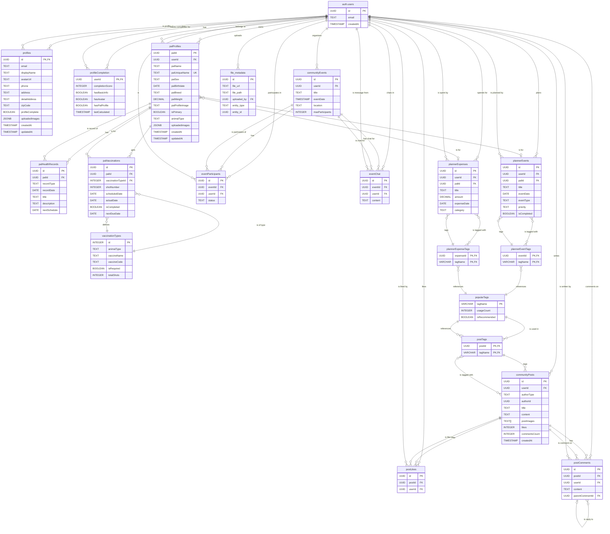

# Fetpal ERD (Entity-Relationship Diagram)

> Supabase SQL 스키마를 기반으로 작성된 ERD입니다.

```mermaid
erDiagram
    %% =================================
    %% 1. 사용자 및 인증 (User & Auth)
    %% =================================
    "auth.users" {
        UUID id PK
        TEXT email
        TIMESTAMP createdAt
    }
    "profiles" {
        UUID id PK, FK
        TEXT email
        TEXT displayName
        TEXT avatarUrl
        TEXT phone
        TEXT address
        TEXT detailAddress
        TEXT zipCode
        BOOLEAN profileComplete
        JSONB uploadedImages
        TIMESTAMP createdAt
        TIMESTAMP updatedAt
    }
    "profileCompletion" {
        UUID userId PK, FK
        INTEGER completionScore
        BOOLEAN hasBasicInfo
        BOOLEAN hasAvatar
        BOOLEAN hasPalProfile
        TIMESTAMP lastCalculated
    }

    %% =================================
    %% 2. 반려동물 (Pal)
    %% =================================
    "palProfiles" {
        UUID palId PK
        UUID userId FK
        TEXT palName
        TEXT palUniqueName UK
        TEXT palSex
        DATE palBirthdate
        TEXT palBreed
        DECIMAL palWeight
        TEXT palProfileImage
        BOOLEAN isPrimary
        TEXT animalType
        JSONB uploadedimages
        TIMESTAMP createdAt
        TIMESTAMP updatedAt
    }
    "palHealthRecords" {
        UUID id PK
        UUID palId FK
        TEXT recordType
        DATE recordDate
        TEXT title
        TEXT description
        DATE nextSchedule
    }
    "vaccinationTypes" {
        INTEGER id PK
        TEXT animalType
        TEXT vaccineName
        TEXT vaccineCode
        BOOLEAN isRequired
        INTEGER totalShots
    }
    "palVaccinations" {
        UUID id PK
        UUID palId FK
        INTEGER vaccinationTypeId FK
        INTEGER shotNumber
        DATE scheduledDate
        DATE actualDate
        BOOLEAN isCompleted
        DATE nextDueDate
    }

    %% =================================
    %% 3. 커뮤니티 (Community)
    %% =================================
    "communityPosts" {
        UUID id PK
        UUID userId FK
        TEXT authorType
        UUID authorId
        TEXT title
        TEXT content
        TEXT[] postImages
        INTEGER likes
        INTEGER commentsCount
        TIMESTAMP createdAt
    }
    "postTags" {
        UUID postId PK, FK
        VARCHAR tagName PK, FK
    }
    "popularTags" {
        VARCHAR tagName PK
        INTEGER usageCount
        BOOLEAN isRecommended
    }
    "postLikes" {
        UUID id PK
        UUID postId FK
        UUID userId FK
    }
    "postComments" {
        UUID id PK
        UUID postId FK
        UUID userId FK
        TEXT content
        UUID parentCommentId FK
    }
    "communityEvents" {
        UUID id PK
        UUID userId FK
        TEXT title
        TIMESTAMP eventDate
        TEXT location
        INTEGER maxParticipants
    }
    "eventParticipants" {
        UUID id PK
        UUID eventId FK
        UUID userId FK
        TEXT status
    }
    "eventChat" {
        UUID id PK
        UUID eventId FK
        UUID userId FK
        TEXT content
    }

    %% =================================
    %% 4. 플래너 (Planner)
    %% =================================
    "plannerEvents" {
        UUID id PK
        UUID userId FK
        UUID palId FK
        TEXT title
        DATE eventDate
        TEXT eventType
        TEXT priority
        BOOLEAN isCompleted
    }
    "plannerExpenses" {
        UUID id PK
        UUID userId FK
        UUID palId FK
        TEXT title
        DECIMAL amount
        DATE expenseDate
        TEXT category
    }
    "plannerEventTags" {
        UUID eventId PK, FK
        VARCHAR tagName PK, FK
    }
    "plannerExpenseTags" {
        UUID expenseId PK, FK
        VARCHAR tagName PK, FK
    }

    %% =================================
    %% 5. 파일 메타데이터 (File Metadata)
    %% =================================
    "file_metadata" {
        UUID id PK
        TEXT file_url
        TEXT file_path
        UUID uploaded_by FK
        TEXT entity_type
        UUID entity_id
    }

    %% =================================
    %% 관계 정의 (Relationships)
    %% =================================
    "auth.users" ||--o{ "profiles" : "has"
    "auth.users" ||--o{ "profileCompletion" : "has"
    "auth.users" ||--o{ "palProfiles" : "owns"
    "auth.users" ||--o{ "communityPosts" : "writes"
    "auth.users" ||--o{ "postLikes" : "likes"
    "auth.users" ||--o{ "postComments" : "comments on"
    "auth.users" ||--o{ "communityEvents" : "organizes"
    "auth.users" ||--o{ "eventParticipants" : "participates in"
    "auth.users" ||--o{ "eventChat" : "chats in"
    "auth.users" ||--o{ "plannerEvents" : "plans"
    "auth.users" ||--o{ "plannerExpenses" : "spends for"
    "auth.users" ||--o{ "file_metadata" : "uploads"

    "profiles" }o--|| "auth.users" : "is profile of"
    "profileCompletion" }o--|| "auth.users" : "tracks completion for"

    "palProfiles" }o--|| "auth.users" : "belongs to"
    "palProfiles" ||--o{ "palHealthRecords" : "has"
    "palProfiles" ||--o{ "palVaccinations" : "gets"
    "palProfiles" }o--o| "plannerEvents" : "is for"
    "palProfiles" }o--o| "plannerExpenses" : "is for"

    "palHealthRecords" }o--|| "palProfiles" : "is record of"
    "palVaccinations" }o--|| "palProfiles" : "is for"
    "palVaccinations" }o--|| "vaccinationTypes" : "is of type"
    "vaccinationTypes" ||--o{ "palVaccinations" : "defines"

    "communityPosts" ||--o{ "postComments" : "has"
    "communityPosts" ||--o{ "postLikes" : "has"
    "communityPosts" }o--o{ "postTags" : "is tagged with"

    "postComments" }o--|| "communityPosts" : "is comment on"
    "postComments" }o--|| "auth.users" : "is written by"
    "postComments" }o--o| "postComments" : "is reply to"

    "postLikes" }o--|| "communityPosts" : "is like on"
    "postLikes" }o--|| "auth.users" : "is liked by"

    "postTags" ||--o{ "communityPosts" : "tags"
    "postTags" }o--|| "popularTags" : "references"
    "popularTags" ||--o{ "postTags" : "is used in"

    "communityEvents" ||--o{ "eventParticipants" : "has"
    "communityEvents" ||--o{ "eventChat" : "has chat for"

    "eventParticipants" }o--|| "communityEvents" : "is participant of"
    "eventParticipants" }o--|| "auth.users" : "is"

    "eventChat" }o--|| "communityEvents" : "is chat for"
    "eventChat" }o--|| "auth.users" : "is message from"

    "plannerEvents" }o--|| "auth.users" : "is planned by"
    "plannerEvents" }o--o{ "plannerEventTags" : "is tagged with"
    "plannerEventTags" ||--o{ "plannerEvents" : "tags"
    "plannerEventTags" }o--|| "popularTags" : "references"

    "plannerExpenses" }o--|| "auth.users" : "is spent by"
    "plannerExpenses" }o--o{ "plannerExpenseTags" : "is tagged with"
    "plannerExpenseTags" ||--o{ "plannerExpenses" : "tags"
    "plannerExpenseTags" }o--|| "popularTags" : "references"
```
