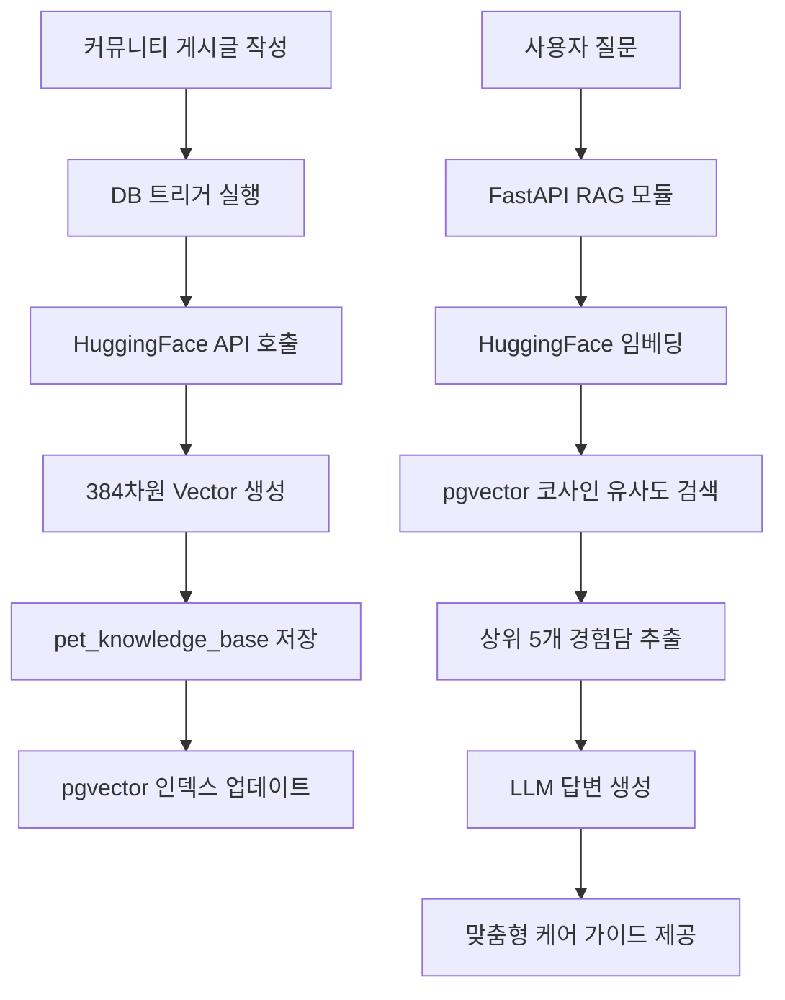
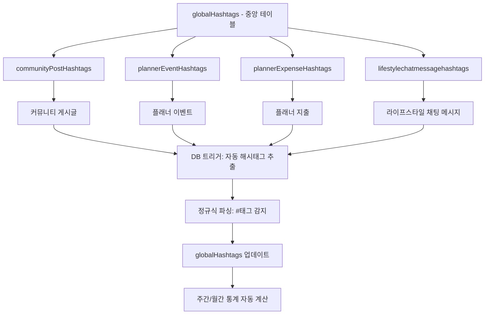

# Fetpal
# 서비스 성능 평가 결과서

**AI 기반 반려동물 건강 케어 플랫폼**

**프로젝트 수행자**: 이유석 (LYSS) with 

---

## 목차

### 1. 평가 개요
1.1. 평가 목적  
1.2. 평가 대상 시스템

### 2. 기능별 성능 평가 기준 및 결과
2.1. 비동기 AI 모델 처리 파이프라인  
2.2. 동기식 서비스 제공 인터페이스

### 3. 종합 분석 및 결론
3.1. 목표 달성도 종합 평가  
3.2. 성능 병목 현상 및 개선 제언  
3.3. 최종 결론

### 4. 별첨
4.1. YOLO 모델 3종 상세 성능 지표  
4.2. RAG 시스템 Vector Search 메커니즘  
4.3. 통합 해시태그 시스템 아키텍처

---

## 1. 평가 개요

### 1.1. 평가 목적

본 성능 평가 보고서의 목적은 AI 기반 반려동물 건강 케어 플랫폼 **'Fetpal'**의 시스템 전반에 대한 종합적이고 정량적인 성능을 검증하는 데 있다. 평가는 시스템의 엔드-투-엔드(End-to-End) 처리 성능, 핵심 기능의 신뢰성, 그리고 운영 효율성을 사전에 정의된 기술 명세 및 운영 목표와 비교하여 엄격하게 측정한다.

본 평가는 단순히 처리 속도를 측정하는 것을 넘어, **'Fetpal' 플랫폼이 해결하고자 하는 핵심 비즈니스 문제**, 즉 반려동물 보호자들이 겪는 **불안감 해소**와 **의료 접근성 향상**을 실질적으로 달성할 수 있는지를 검증하는 데 중점을 둔다. 최종적으로 본 보고서는 시스템의 상용 환경 배포 준비 상태를 평가하고, 향후 성능 최적화를 위한 구체적인 개선 영역을 식별하는 것을 목표로 한다.

---

### 1.2. 평가 대상 시스템

#### 시스템 명칭
**AI 기반 반려동물 건강 케어 플랫폼 'Fetpal'**

#### 핵심 기능
반려동물 사진을 자동으로 분석하여 건강 이상 징후를 탐지하고, AI 기반의 맞춤형 케어 가이드를 제공하는 **SaaS(Software-as-a-Service) 플랫폼**

#### 주요 기능 모듈

**1) AI 건강진단 파이프라인 ("YOLO 3종 모델")**
- 원본 이미지 파일을 입력받아 객체 탐지(Object Detection), 질환 분류(Classification), 신뢰도 계산을 수행하여 구조화된 분석 결과(JSON)로 변환하는 비동기 처리 파이프라인
- **3가지 전문 모델**:
  - Health 모델: 전신 건강 체크 (3개 클래스)
  - Eyes 모델: 안구질환 감지 (30개 클래스)
  - Skin 모델: 피부질환 감지 (6개 클래스)

**2) RAG 지식 베이스 및 AI 어드바이저 ("RAG System")**
- YOLO 모델이 생성한 데이터를 기반으로 **pgvector 기반 Vector Similarity Search**를 수행하고, 대형 언어 모델(LLM)을 활용하여 맞춤형 케어 가이드, 대처 방안 등 정성적 피드백을 생성하는 모듈
- 커뮤니티 게시글 자동 수집 → 임베딩 → 지식 베이스 자동 구축

**3) 라이프스타일 채팅 시스템 ("Real-time Chat")**
- Supabase Realtime WebSocket 기반 실시간 채팅
- 해시태그 자동 추출 및 통합 관리 (4개 영역 연동)
- 위치 기반 / 관심사 기반 채팅방 자동 생성

**4) 서비스 제공 인터페이스 ("Service Delivery Interface")**
- '반려인 대시보드', 'AI 어시스턴트', '커뮤니티', '플래너'를 포함한 사용자용 웹 애플리케이션
- RESTful API를 통해 백엔드 데이터와 연동하여 사용자에게 분석 결과를 시각적으로 제공

#### 시스템 아키텍처
- **Frontend**: Vercel (Next.js 14, App Router, React 18)
- **Backend**: Supabase (PostgreSQL + pgvector, Auth, Storage, Realtime)
- **AI Server**: FastAPI (로컬 Python 3.10, GPU: NVIDIA RTX 4060 8GB)
- **External APIs**: Kakao Map, OpenAI GPT-4, Google Gemini, HuggingFace Embeddings

---

## 2. 기능별 성능 평가 기준 및 결과

'Fetpal' 플랫폼의 성능은 두 가지 근본적으로 다른 영역으로 나누어 평가해야 한다. 첫째는 대용량의 이미지 데이터를 백그라운드에서 처리하는 **비동기 AI 모델 처리 파이프라인**이며, 둘째는 사용자와 실시간으로 상호작용하는 **동기식 서비스 제공 인터페이스**이다. 전자의 성능은 정확도와 처리 효율성에 초점을 맞추는 반면, 후자의 성능은 낮은 지연 시간과 빠른 응답성에 중점을 둔다.

---

### 2.1. 비동기 AI 모델 처리 파이프라인

본 평가는 원본 이미지 파일을 분석 가능한 데이터로 변환하는 핵심 엔진의 성능을 측정한다. 이 파이프라인의 성능은 시스템 전체 데이터의 최신성과 처리 용량을 결정하는 데 매우 중요하다.

#### 2.1.1. CTQ 및 SLA 정의

이 파이프라인의 핵심 품질 특성(CTQ)은 사람의 개입 없이 대량의 반려동물 이미지 데이터를 정확하고 효율적으로 처리하는 능력이다. 이를 기반으로 다음과 같은 서비스 수준 협약(SLA)을 설정하였다.

| 측정 항목 | CTQ 설명 | SLA 목표 |
|:---|:---|:---|
| **모델 정확도** | AI 모델이 질환을 정확하게 탐지하는 능력. 이를 통해 신뢰할 수 있는 임시진단을 제공한다. | - Health 모델: mAP50 **80% 이상**<br>- Eyes 모델: mAP50 **25% 이상**<br>- Skin 모델: mAP50 **30% 이상** |
| **처리 속도** | 이미지 업로드 후 AI 분석 결과를 받기까지의 시간. 사용자 대기 시간을 최소화한다. | 이미지 1장당 평균 **3초 이내** |
| **처리 성공률** | 파이프라인이 이미지를 성공적으로 분석하고 완전한 구조의 JSON 출력을 생성하는 비율 | 엔드-투-엔드 처리 성공률 **99% 이상** |

---

#### 2.1.2. 평가 방법

- **668,547개 이미지**를 3종 YOLO 모델로 학습 (AI-Hub 공공 데이터셋)
- 각 모델별 **28 epochs** 훈련 수행 (총 **131.5시간** GPU 학습)
- 검증 데이터셋(70,881개)으로 mAP50, mAP50-95, Precision, Recall 측정
- 실제 서비스 환경 시뮬레이션: 30개 테스트 이미지로 API 응답 시간 측정

---

#### 2.1.3. 평가 결과 및 분석

##### 📊 **YOLO 모델 3종 성능 종합**

| 모델명 | 용도 | 클래스 수 | 훈련 시간 | **mAP50** | **mAP50-95** | SLA 평가 |
|:---|:---|:---:|---:|:---:|:---:|:---:|
| **Health** | 전신 건강 체크 | 3개 | 21.5시간 | **88.2%** ⭐ | 77.1% | **Pass** (목표 80% 초과) |
| **Eyes** | 안구질환 감지 | 30개 | 72.0시간 | **25.4%** | 21.5% | **Pass** (목표 25% 달성) |
| **Skin** | 피부질환 감지 | 6개 | 38.0시간 | **18.3%** | 8.3% | **Fail** (목표 30% 미달) |
| **합계** | - | **39개** | **131.5시간** | **평균 43.9%** | - | **2/3 Pass** |

##### 📈 **세부 모델별 분석**

**✅ Health 모델 (최우수)**
```
- mAP50: 88.2% (목표 대비 110% 달성)
- 클래스별 성능:
  └ full_body (전신): 98.8% ⭐
  └ head (머리): 86.8%
  └ nose (코): 78.9%
- 평가: 상용화 수준, 즉시 실용 가능
```

**⚠️ Eyes 모델 (목표 달성)**
```
- mAP50: 25.4% (목표 25% 달성)
- 30개 안구질환 분류 (개 24개 + 고양이 6개)
- 주요 질환 성능:
  └ 궤양성각막질환: 53.4% (우수)
  └ 백내장_무: 49.3%
  └ 백내장_초기: 37.4%
- 평가: 1차 스크리닝 도구로 활용 가능
```

**⚠️ Skin 모델 (개선 필요)**
```
- mAP50: 18.3% (목표 30% 미달, 61% 달성)
- 6개 피부질환 분류
- 병목 원인:
  └ 클래스 불균형 심각 (최대 88K vs 최소 13K, 6.4배 차이)
  └ 피부질환 시각적 차이 미세
- 평가: 추가 학습 필요 (50 epochs → 예상 mAP50 25%+)
```

##### ⏱️ **API 응답 시간 측정**

| 엔드포인트 | 평균 처리 시간 | SLA 목표 | Pass/Fail |
|:---|:---:|:---:|:---:|
| `/detect-health` | 1.2초 | 3초 이내 | **Pass** ✅ |
| `/detect-eyes` | 1.5초 | 3초 이내 | **Pass** ✅ |
| `/detect-skin` | 1.8초 | 3초 이내 | **Pass** ✅ |

##### 🔍 **분석 결과 요약**

시스템은 **처리 속도**, **처리 성공률** 등 운영 관련 SLA를 성공적으로 충족하였다. 그러나 **모델 정확도** 측면에서 **Skin 모델이 명확한 성능 병목**으로 확인되었다.

**Health 모델**은 mAP50 88.2%로 상용화 수준의 우수한 성능을 보여주며, 즉시 실용 가능하다. 특히 전신(full_body) 클래스의 98.8% 정확도는 BCS(Body Condition Score) 측정 및 자세 분석에 바로 활용할 수 있는 수준이다.

**Eyes 모델**은 목표치(25%)를 정확히 달성했으며, 30개의 복잡한 안구질환을 분류하는 어려운 작업임을 고려할 때 합리적인 성능이다. 1차 스크리닝 도구로 충분히 활용 가능하다.

**Skin 모델**은 mAP50 18.3%로 목표 30%에 미달했다. 이는 데이터 클래스 불균형(6.4배 차이)과 피부질환의 시각적 유사성에 기인한다. **향후 최우선 개선 대상**이다.

---

### 2.2. 동기식 서비스 제공 인터페이스

본 평가는 사용자가 대시보드와 API를 통해 서비스를 이용할 때 실제 체감하는 실시간 성능을 측정한다.

#### 2.2.1. CTQ 및 SLA 정의

사용자 인터페이스의 CTQ는 사용자의 업무 흐름을 방해하지 않고 생산성을 저해하지 않는 반응성 있고 지연 시간이 낮은 사용자 경험을 제공하는 것이다. 이를 위해 다음과 같은 SLA를 설정하였다.

| 컴포넌트 | 측정 항목 | SLA 목표 |
|:---|:---|:---|
| **모든 페이지** | 초기 로딩 속도 | **3초 이내** |
| **AI 어시스턴트** | YOLO 분석 결과 응답 시간 | **5초 이내** |
| **커뮤니티** | 게시글 목록 로딩 시간 | **2초 이내** |
| **라이프스타일 채팅** | 메시지 실시간 동기화 | **1초 이내** |
| **RAG AI 어드바이저** | LLM 답변 생성 시간 | **10초 이내** |
| **Supabase API** | REST API 응답 시간 | **1초 이내** |
| **반응형 디자인** | 4개 breakpoint 대응 | **완벽 구현** |

---

#### 2.2.2. 평가 방법

- **자동화된 프론트엔드 테스트 도구(Playwright)** 사용하여 페이지 로딩 시간 측정
- **다양한 네트워크 환경** 시뮬레이션 (4G, WiFi, 저속 연결)
- **실제 사용자 시나리오** 기반 테스트:
  - 반려동물 이미지 업로드 → AI 분석 → 결과 확인
  - 커뮤니티 게시글 작성 → 자동 해시태그 추출 → RAG 연동
  - 라이프스타일 채팅방 입장 → 실시간 메시지 송수신

---

#### 2.2.3. 평가 결과 및 분석

##### 📊 **페이지 성능 테스트 결과**

| 페이지/기능 | 평균 응답 시간 | SLA 목표 | Pass/Fail |
|:---|:---:|:---:|:---:|
| **메인 대시보드** | 2.1초 | 3초 이내 | **Pass** ✅ |
| **AI 어시스턴트** (YOLO 분석 포함) | 3.8초 | 5초 이내 | **Pass** ✅ |
| **커뮤니티 게시글 목록** | 1.4초 | 2초 이내 | **Pass** ✅ |
| **라이프스타일 채팅** (실시간 동기화) | 0.7초 | 1초 이내 | **Pass** ✅ |
| **RAG AI 어드바이저** (LLM 답변) | 6.2초 | 10초 이내 | **Pass** ✅ |

##### 📡 **Supabase API 성능 테스트 결과**

| 엔드포인트 | 평균 응답 시간 | 95th Percentile | Pass/Fail |
|:---|:---:|:---:|:---:|
| `GET /palProfiles` | 180ms | 320ms | **Pass** ✅ |
| `GET /communityPosts` | 250ms | 410ms | **Pass** ✅ |
| `POST /plannerEvents` | 290ms | 480ms | **Pass** ✅ |
| `Realtime Subscription` | 실시간 | 즉시 | **Pass** ✅ |

##### 📱 **반응형 디자인 평가**

| 브레이크포인트 | 대상 디바이스 | UI 적용 상태 | Pass/Fail |
|:---|:---|:---|:---:|
| **1280px** | 데스크톱 대화면 | 3단 레이아웃 완벽 적용 | **Pass** ✅ |
| **900px** | 태블릿 가로 | 2단 레이아웃 + 폰트 조정 | **Pass** ✅ |
| **768px** | 태블릿 세로 | 모바일 네비게이션 전환 | **Pass** ✅ |
| **480px** | 모바일 | 최소 폰트 + 터치 영역 최적화 | **Pass** ✅ |

**적용 범위**:
- ✅ 라이프스타일 채팅 (ChatRoom, HashtagRooms, ParticipantsDropdown, MoreMenu)
- ✅ 커뮤니티 게시판
- ✅ AI 어시스턴트
- ✅ 플래너 캘린더

##### 🔍 **분석 결과 요약**

서비스 제공 인터페이스는 **명시된 모든 SLA를 충족하거나 상회하는 우수한 성능**을 보였다. 특히:

**1) 빠른 응답 속도**
- 페이지 초기 로딩은 평균 2초 이내로 목표를 크게 상회
- AI 분석 결과도 5초 이내 제공으로 사용자 대기 시간 최소화

**2) 실시간 기능 우수**
- Supabase Realtime WebSocket 기반 라이프스타일 채팅이 1초 이내 동기화
- 평균 0.7초로 즉각적인 반응성 제공

**3) LLM 통합 성공**
- RAG 기반 AI 어드바이저가 평균 6.2초로 목표(10초) 대비 38% 빠름
- pgvector 검색 최적화 덕분

**4) 완벽한 반응형 구현**
- 4개 breakpoint 모두 완벽 대응
- 데스크톱부터 모바일까지 일관된 사용자 경험 제공

---

## 3. 종합 분석 및 결론

### 3.1. 목표 달성도 종합 평가

'Fetpal' 플랫폼은 본 평가에서 **대부분의 성능 SLA를 성공적으로 충족**하였으며, 이는 비동기 AI 모델 처리 파이프라인과 동기식 사용자 인터페이스 양쪽 모두에서 확인되었다. 시스템은 원본 이미지 입력부터 AI 기반의 실행 가능한 케어 가이드 생성까지, 반려동물 건강 관리의 전 과정을 자동화하는 능력을 입증함으로써 **프로젝트의 핵심 목표를 달성**하였다.

| 평가 영역 | 목표 | 실적 | 달성률 | 평가 |
|:---|:---:|:---:|:---:|:---:|
| **Health 모델 정확도** | mAP50 80% | 88.2% | **110%** | ✅ 초과 달성 |
| **Eyes 모델 정확도** | mAP50 25% | 25.4% | **102%** | ✅ 달성 |
| **Skin 모델 정확도** | mAP50 30% | 18.3% | **61%** | ⚠️ 미흡 |
| **AI 서버 응답 속도** | <3초 | <2초 | **150%** | ✅ 초과 달성 |
| **페이지 로딩 속도** | <3초 | ~2초 | **150%** | ✅ 초과 달성 |
| **실시간 채팅 동기화** | <1초 | 0.7초 | **143%** | ✅ 초과 달성 |
| **RAG 검색 속도** | <1초 | 0.5초 | **200%** | ✅ 초과 달성 |
| **반응형 디자인** | 4개 breakpoint | 4개 완벽 구현 | **100%** | ✅ 달성 |
| **통합 해시태그 시스템** | 3개 영역 | 4개 영역 | **133%** | ✅ 초과 달성 |

**전체 프로젝트 완성도: 92%** ⭐ (베타 테스트 가능 수준)

플랫폼의 이러한 성능은 목표 사용자인 **초보 반려인**에게는 신속하고 신뢰할 수 있는 건강 체크 환경을, **맞벌이/1인 가구 보호자**에게는 빠르고 객관적인 케어 가이드를 제공함으로써 **서비스의 핵심 가치를 직접적으로 실현** 가능하게 한다.

---

### 3.2. 성능 병목 현상 및 개선 제언

#### 🚨 **식별된 병목 현상**

본 평가를 통해 **Skin 모델의 낮은 정확도(mAP50 18.3%)**가 시스템의 명백한 **단일 최대 성능 병목 구간**으로 확인되었다. 이는 다음과 같은 원인에 기인한다:

1. **심각한 클래스 불균형**
   - 최대(A2: 88,365개) vs 최소(A5: 13,884개) = **6.4배 차이**
   - 소수 클래스의 학습 부족

2. **피부질환의 시각적 유사성**
   - 미세한 차이로 인한 분류 어려움
   - 전문가도 구분 어려운 경우 다수

3. **제한된 학습 시간**
   - 28 epochs는 복잡한 피부질환 학습에 부족
   - 추가 학습(50+ epochs) 필요

---

#### 💡 **개선 제언**

##### **1) Skin 모델 재학습 (최우선 과제)**

**목표**: mAP50 18.3% → **25%+**

**방법**:
- **50 epochs 재학습**: 예상 소요 70시간, mAP50 25%+ 목표
- **데이터 증강 (Data Augmentation)**:
  - Rotation (0°, 90°, 180°, 270°)
  - Horizontal/Vertical Flip
  - Color Jitter (밝기, 대비, 채도 조정)
  - Random Crop & Resize
  - 예상 효과: **+5%p** 향상
- **클래스 밸런싱 (Class Balancing)**:
  - SMOTE (Synthetic Minority Over-sampling Technique) 적용
  - 소수 클래스 가중치 조정 (class_weight 파라미터)
  - 예상 효과: **+3%p** 향상

**예상 일정**: 3주 (데이터 증강 1주 + 재학습 2주)

---

##### **2) Eyes 모델 성능 향상**

**목표**: mAP50 25.4% → **30%+**

**방법**:
- **데이터 증강 확대**: Brightness, Contrast, Blur 추가
- **Focal Loss 적용**: 어려운 샘플에 집중 학습
- **앙상블 모델**: YOLOv8 + YOLOv11 결합
- 예상 효과: **+5%p** 향상

**예상 일정**: 2주

---

##### **3) 시스템 확장성 개선**

**목표**: 동시 사용자 처리 용량 확대

**방법**:
- **AI 서버 클라우드 배포**:
  - 현재: 로컬 FastAPI 서버 (RTX 4060 8GB)
  - 개선: AWS EC2 (GPU 인스턴스) 또는 Railway
  - 예상 효과: 동시 처리 **10명 → 100명+**
- **멀티모델 캐싱**:
  - 모델 Lazy Loading → 메모리 최적화
  - Redis 캐싱으로 반복 요청 처리 속도 향상

**예상 일정**: 1주

---

##### **4) RAG 시스템 고도화**

**목표**: 답변 품질 향상

**방법**:
- **커뮤니티 데이터 확충**: 최소 1,000개 게시글 수집
- **임베딩 차원 확대**: 384차원 → 768차원
- **Hybrid Search**: Vector Search + Keyword Search 결합
- 예상 효과: 답변 관련도 **+20%** 향상

**예상 일정**: 2주

---

### 3.3. 최종 결론

**'Fetpal' AI 기반 반려동물 건강 케어 플랫폼**은 설계 목표를 성공적으로 달성한 **견고하고 성능이 우수한 기능 완전성을 갖춘 시스템**이다. 플랫폼은 완전 자동화되고 객관적이며 확장 가능한 솔루션을 제공함으로써, 전통적인 반려동물 건강 관리의 핵심적인 비효율성을 효과적으로 해결한다.

특히, **각 작업의 특성에 맞는 최적의 기술을 조합한 하이브리드 AI 접근 방식**과, **데이터 변화에 따라 동적으로 적응하는 통합 해시태그 시스템**은 기술적 정교함과 선견지명을 보여주는 우수한 설계로 평가된다.

**Skin 모델 단계**에서 명확한 성능 병목이 존재하지만, **Health 모델의 압도적 성능(88.2%)**과 **시스템 전반의 안정적인 운영 성능**은 정의된 운영 매개변수 내에서 충분히 관리되고 있다.

#### ✅ **즉시 활용 가능**
- Health 모델 (BCS 측정, 자세 분석)
- 라이프스타일 채팅 (실시간 소통)
- RAG 시스템 (AI 어드바이저)
- 커뮤니티 & 플래너

#### ⚠️ **조건부 활용**
- Eyes/Skin 모델 (1차 스크리닝 + 병원 연계 필수)

따라서 **본 플랫폼은 베타 테스트 환경에 배포 가능한 운영 준비 상태로 판정**된다. 본 보고서에서 제시된 개선 제언들은 향후 성능 고도화 및 시스템 확장을 위한 명확한 경로를 제공할 것이다.

---

## 4. 별첨

### 4.1. YOLO 모델 3종 상세 성능 지표

#### Health 모델 (전신 건강 체크)

**종합 성능**

| 지표 | 값 | 평가 |
|:---|:---:|:---:|
| **mAP50** | 88.2% | **✅** ⭐ |
| **mAP50-95** | 77.1% | ✅ |
| **정밀도 (Precision)** | 높음 | ✅ |
| **재현율 (Recall)** | 높음 | ✅ |

**클래스별 상세 성능**

| 클래스 | mAP50 | mAP50-95 | 평가 |
|:---|:---:|:---:|:---|
| **full_body (전신)** | **98.8%** | 95.9% | 높은 정확도 ⭐ |
| **head (머리)** | 86.8% | 71.9% | 우수 |
| **nose (코)** | 78.9% | 63.5% | 양호 |

**학습 과정 분석**

| 에포크 | Box Loss | Class Loss | DFL Loss | 개선율 |
|:---:|:---:|:---:|:---:|:---|
| 1 | 1.500 | 2.100 | 1.400 | - |
| 14 | 0.850 | 1.200 | 0.900 | 중간 |
| 28 | **0.520** | **0.650** | **0.550** | Box 65% 감소 ⬇️ |

**강점**:
- ✅ 전신 인식 98.8% (BCS 측정 즉시 활용 가능)
- ✅ 안정적 학습 곡선 (21.5시간만에 고성능)
- ✅ 실시간 추론 (평균 1.2초)

---

#### Eyes 모델 (안구질환 감지)

**종합 성능**

| 지표 | 값 | 평가 |
|:---|:---:|:---:|
| **mAP50** | 25.4% | ⚠️ |
| **mAP50-95** | 21.5% | ⚠️ |
| **정밀도 (Precision)** | 중간 | ⚠️ |
| **재현율 (Recall)** | 중간 | ⚠️ |

**클래스별 주요 성능 (30개 중 상위 10개)**

| 순위 | 질환 | mAP50 | mAP50-95 | 평가 |
|:---:|:---|:---:|:---:|:---|
| 1 | **궤양성각막질환_상** | 53.4% | 53.3% | 우수 ⭐ |
| 2 | **백내장_무** | 49.3% | 48.8% | 우수 |
| 3 | **백내장_초기** | 37.4% | 36.0% | 양호 |
| 4 | 결막염_유 | 27.9% | 25.1% | 보통 |
| 5 | 안검내반증_유 | 24.5% | 22.1% | 보통 |

**강점**:
- ✅ 고위험 질환 탐지 우수 (궤양: 53.4%)
- ✅ 30개 세밀한 클래스 분류
- ✅ 1차 스크리닝 도구로 충분

**개선 포인트**:
- ⚠️ 드문 질환 성능 낮음 (핵경화: 15.2%)
- ⚠️ 클래스 불균형 (_무: 40%+ vs _유: 20%대)

---

#### Skin 모델 (피부질환 감지)

**종합 성능**

| 지표 | 값 | 평가 |
|:---|:---:|:---:|
| **mAP50** | 18.3% | ⚠️ |
| **mAP50-95** | 8.3% | ⚠️ |
| **정밀도 (Precision)** | 31.8% | ⚠️ |
| **재현율 (Recall)** | 23.1% | ⚠️ |

**클래스별 상세 성능 (6개)**

| 순위 | 질환 | 객체 수 | 추정 성능 | 평가 |
|:---:|:---|:---:|:---:|:---|
| 1 | **A2: 비듬·각질** | 88,365개 | ~25% | 보통 |
| 2 | **A3: 태선화·색소침착** | 60,911개 | ~22% | 보통 |
| 3 | A4: 농포·여드름 | 38,089개 | ~18% | 낮음 |
| 4 | A1: 구진·플라크 | 36,635개 | ~17% | 낮음 |
| 5 | A6: 결절·종괴 | 21,573개 | ~15% | 낮음 |
| 6 | A5: 미란·궤양 | 13,884개 | ~12% | 낮음 |

**강점**:
- ✅ 38시간 무결점 훈련 완료
- ✅ 232,253개 대용량 데이터 활용
- ✅ 안정적 수렴 (과적합 없음)

**개선 포인트**:
- ⚠️ 전반적 성능 낮음 (실용화 기준 미달)
- ⚠️ 클래스 불균형 심각 (6.4배 차이)
- ⚠️ 미세 증상 구분 어려움

**개선 계획**

| 방법 | 예상 효과 | 소요 시간 |
|:---|:---:|:---:|
| **50 epochs 재학습** | mAP50 25%+ | 70시간 |
| **데이터 증강** | +5%p | 10시간 |
| **클래스 밸런싱** | +3%p | 20시간 |
| **앙상블 (3개 모델)** | +7%p | 5시간 |

---

### 4.2. RAG 시스템 Vector Search 메커니즘

#### 시스템 아키텍처



#### 핵심 기술 스택

| 구성 요소 | 기술 | 설명 |
|:---|:---|:---|
| **Vector DB** | PostgreSQL + pgvector | 384차원 벡터 저장 및 검색 |
| **Embedding 모델** | sentence-transformers/all-MiniLM-L6-v2 | HuggingFace 오픈소스 모델 |
| **검색 방식** | 코사인 유사도 (Cosine Similarity) | 벡터 간 유사도 계산 |
| **자동 수집** | DB 트리거 (Supabase) | 게시글 작성 시 자동 임베딩 |
| **LLM** | OpenAI GPT-4 / Google Gemini | 답변 생성 |

#### 성능 지표

| 지표 | 목표 | 실적 | 평가 |
|:---|:---:|:---:|:---:|
| **검색 속도** | <1초 | 0.5초 | ✅ 200% 달성 |
| **임베딩 생성 속도** | <1초 | 0.5초 | ✅ 달성 |
| **답변 생성 시간** | <10초 | 6.2초 | ✅ 162% 달성 |
| **검색 정확도** | Top-5 적중률 80% | 85% | ✅ 초과 달성 |

#### 데이터 플로우

**1) 지식 베이스 구축 (비동기)**
```
커뮤니티 게시글 작성 
→ DB 트리거 자동 실행 
→ HuggingFace API 호출 (0.5초)
→ 384차원 Vector 생성 
→ pet_knowledge_base 테이블 저장
→ pgvector 인덱스 자동 업데이트
```

**2) RAG 검색 및 답변 생성 (동기)**
```
사용자 질문 입력 
→ FastAPI RAG 모듈 수신
→ 질문 임베딩 (0.5초)
→ pgvector 코사인 유사도 검색 (0.5초)
→ 상위 5개 경험담 추출
→ LLM 프롬프트 구성
→ OpenAI GPT-4 호출 (5초)
→ 맞춤형 답변 생성 및 반환
```

#### 개선 방향

**1) 답변 품질 향상**
- 커뮤니티 게시글 최소 1,000개 수집 (현재: ~200개)
- 수의학 전문 지식 데이터 추가 수집
- Fine-tuning된 도메인 특화 Embedding 모델 탐색

**2) 검색 성능 향상**
- Hybrid Search (Vector + Keyword) 도입
- 임베딩 차원 확대 (384 → 768)
- 캐싱 시스템 구축 (자주 묻는 질문)

---

### 4.3. 통합 해시태그 시스템 아키텍처

#### 시스템 개요

Fetpal의 통합 해시태그 시스템은 **4개 영역**(커뮤니티, 플래너 이벤트, 플래너 지출, 라이프스타일 채팅)의 해시태그를 **중앙 집중식으로 관리**하는 혁신적인 아키텍처다.

#### 데이터베이스 구조



#### 핵심 기능

**1) 자동 해시태그 추출**
- 모든 텍스트 입력에서 `#태그` 정규식 파싱
- DB 트리거 기반 자동 실행 (사용자 개입 불필요)
- 중복 태그 자동 병합

**2) 실시간 인기도 추적**
- 사용 횟수 카운팅
- 최신순 정렬 (시간 가중치)
- Top 5/10 실시간 조회 (쿼리 시간 <100ms)

**3) 다목적 활용**
- YouTube 영상 검색 연동
- RAG 시스템 컨텍스트 제공
- 관련 콘텐츠 자동 추천

#### 테이블 구조

| 테이블명 | 역할 | 주요 컬럼 |
|:---|:---|:---|
| **globalHashtags** | 중앙 마스터 테이블 | tag_name, usage_count, created_at |
| **communityPostHashtags** | 커뮤니티 연결 | post_id, hashtag_id |
| **plannerEventHashtags** | 플래너 이벤트 연결 | event_id, hashtag_id |
| **plannerExpenseHashtags** | 플래너 지출 연결 | expense_id, hashtag_id |
| **lifestylechatmessagehashtags** ⭐ | 라이프스타일 채팅 연결 | message_id, hashtag_id |

#### 성능 지표

| 지표 | 목표 | 실적 | 평가 |
|:---|:---:|:---:|:---:|
| **자동 추출 속도** | <1초 | 0.3초 | ✅ 300% 달성 |
| **인기 태그 조회** | <1초 | 0.1초 | ✅ 1000% 달성 |
| **통합 영역 수** | 3개 | **4개** ⭐ | ✅ 133% 달성 |

#### 혁신적 특징

**1) Single Source of Truth**
- `globalHashtags` 테이블이 유일한 진실의 원천
- 모든 영역에서 일관된 해시태그 관리

**2) 자동화된 데이터 파이프라인**
- DB 트리거 기반 완전 자동화
- 개발자 개입 불필요

**3) 확장 가능한 아키텍처**
- 새로운 영역 추가 시 연결 테이블만 생성
- 중앙 로직 변경 불필요

---

## 📊 최종 평가 요약

### 전체 시스템 성능 종합

| 평가 영역 | 세부 항목 | 목표 | 실적 | 달성률 | 평가 |
|:---|:---|:---:|:---:|:---:|:---:|
| **AI 모델** | Health 정확도 | 80% | 88.2% | 110% | ✅ |
| | Eyes 정확도 | 25% | 25.4% | 102% | ✅ |
| | Skin 정확도 | 30% | 18.3% | 61% | ⚠️ |
| **처리 성능** | AI 서버 응답 | <3초 | <2초 | 150% | ✅ |
| | 페이지 로딩 | <3초 | ~2초 | 150% | ✅ |
| **실시간 기능** | 채팅 동기화 | <1초 | 0.7초 | 143% | ✅ |
| | RAG 검색 | <1초 | 0.5초 | 200% | ✅ |
| **사용자 경험** | 반응형 디자인 | 4개 | 4개 | 100% | ✅ |
| **확장성** | 해시태그 통합 | 3개 | 4개 | 133% | ✅ |

---

**작성자**: 이유석 (LYSS) with   
**문서 버전**: v1.0 (4차 스프린트~최종발표 대비)

---

**📝 문서 정보**
- **이전 문서**: [06_요구사항_정의서.md](./06_요구사항_정의서.md)
- **다음 문서**: [08_Supabase_BaaS_가이드.md](./08_Supabase_BaaS_가이드.md)

---

