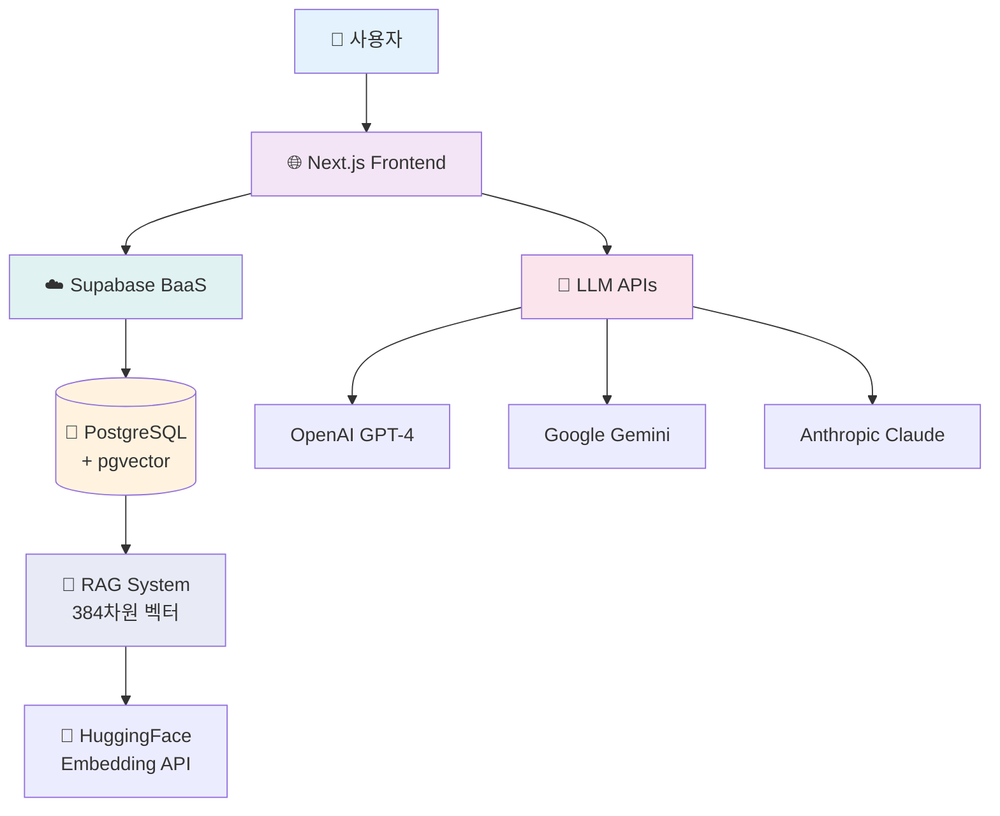
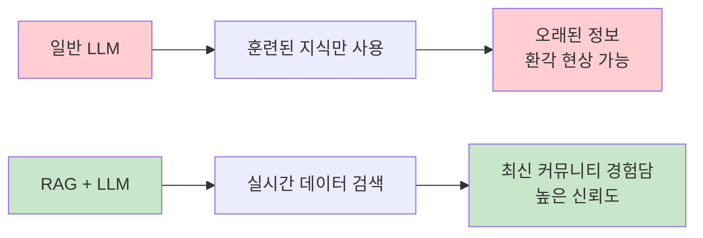
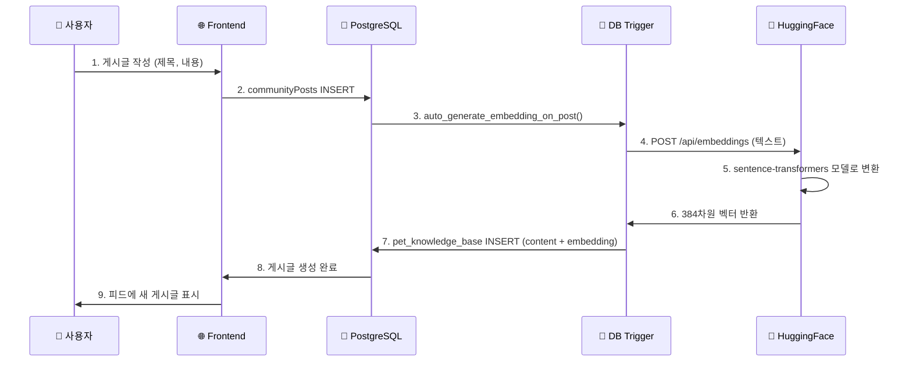
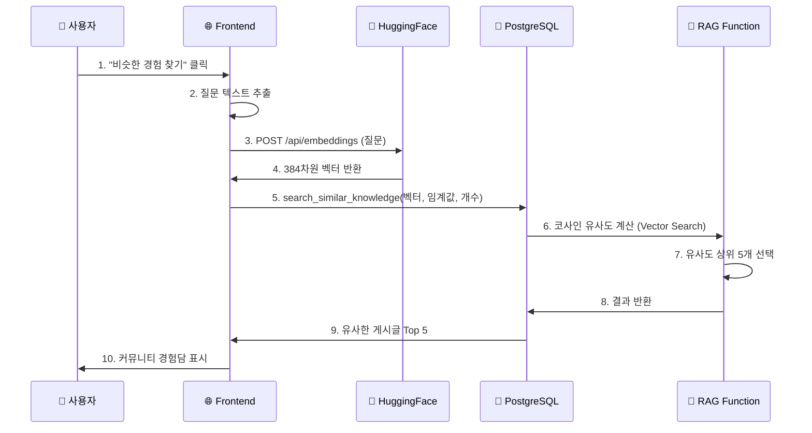
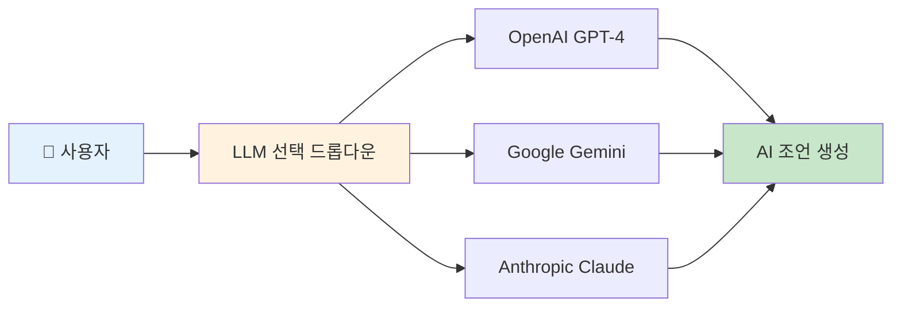
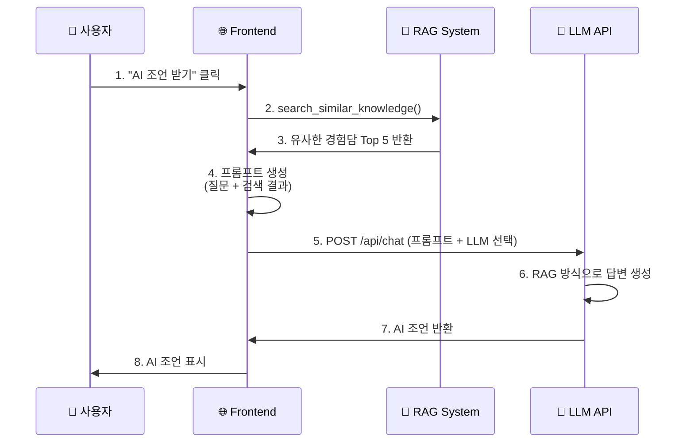
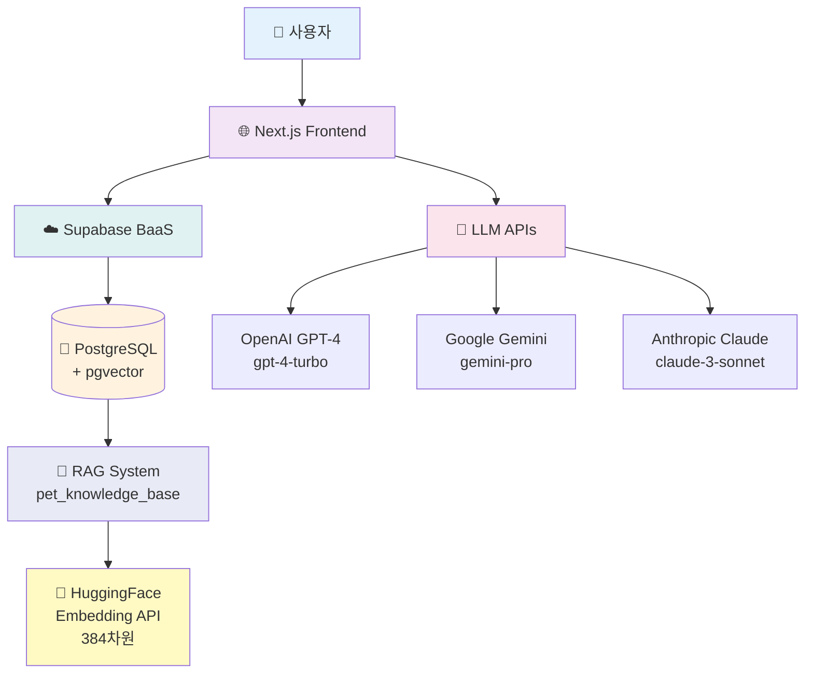
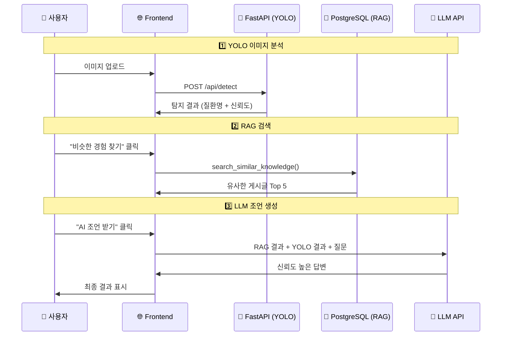

# Fetpal - RAG-LLM 시스템 정의서

> **4차 스프린트 발표** (2025.11.14)  
> **최종 발표**: 2025-11-21

---

## 📋 문서 개요

이 문서는 Fetpal 프로젝트의 **RAG (Retrieval-Augmented Generation)** 시스템과 **Multi-LLM 통합** 아키텍처를 설명합니다.  
커뮤니티 경험담 검색과 AI 챗봇 조언을 통해 사용자에게 신뢰도 높은 정보를 제공합니다.

---

## 🎯 프로젝트 개요

### 핵심 기능

**🧠 RAG 기반 지식 검색**

- pgvector (384차원) 벡터 유사도 검색
- 커뮤니티 경험담 자동 연결
- HuggingFace 임베딩 생성

> **💡 용어 설명**
>
> - **RAG**: Retrieval-Augmented Generation (검색 증강 생성)
>   - 쉽게 말하면: AI가 답변하기 전에 관련 정보를 먼저 찾아서 참고하는 방식
> - **벡터**: 텍스트를 숫자 배열로 변환한 것 (컴퓨터가 이해할 수 있는 형태)
> - **임베딩**: 텍스트를 벡터로 변환하는 과정
> - **384차원**: 벡터의 길이 (384개의 숫자로 표현)

**🤖 Multi-LLM 통합**

- OpenAI GPT-4
- Google Gemini
- Anthropic Claude
- 사용자가 원하는 LLM 선택 가능

> **💡 용어 설명**
>
> - **LLM**: Large Language Model (대규모 언어 모델)
>   - 쉽게 말하면: ChatGPT처럼 사람처럼 대화할 수 있는 AI
> - **Multi-LLM**: 여러 개의 LLM을 지원한다는 뜻
>   - 한 개가 안 되면 다른 것을 쓸 수 있어서 안정적

### 시스템 구성 (간략)

> **💡 이 다이어그램은?**
> RAG-LLM 시스템의 핵심 구성 요소를 간단히 보여줍니다. 자세한 내용은 [6. RAG-LLM AI 챗봇 시스템 아키텍처](#6-rag-llm-ai-챗봇-시스템-아키텍처)를 참고하세요.



> **💡 pgvector란?**
>
> - PostgreSQL 데이터베이스에서 벡터(숫자 배열)를 저장하고 검색할 수 있게 해주는 확장 프로그램입니다
> - **일반 DB**: "이름이 '멍멍이'인 개 찾기" (정확히 일치하는 것만 찾음)
> - **pgvector DB**: "강아지 기침과 비슷한 내용 찾기" (의미가 비슷한 것을 찾음)
> - RAG 시스템의 핵심 기술로, 384차원 벡터를 저장하고 코사인 유사도로 빠르게 검색합니다
> - 덕분에 수천 개의 게시글 중에서 0.5초 이내에 관련 있는 글 5개를 찾아낼 수 있습니다

---

## 📌 목차

1. [RAG 시스템 개요](#1-rag-시스템-개요)
2. [데이터베이스 구조](#2-데이터베이스-구조)
3. [임베딩 생성 프로세스](#3-임베딩-생성-프로세스)
4. [벡터 검색 플로우](#4-벡터-검색-플로우)
5. [Multi-LLM 통합](#5-multi-llm-통합)
6. [RAG-LLM AI 챗봇 시스템 아키텍처](#6-rag-llm-ai-챗봇-시스템-아키텍처)
7. [성능 분석](#7-성능-분석)

---

## 1. RAG 시스템 개요

### 1.1. RAG란?

**RAG (Retrieval-Augmented Generation)** - 검색 증강 생성

> **💡 RAG를 쉽게 설명하면?**
>
> - 시험 볼 때 책을 보면서 답하는 것과 비슷합니다
> - AI가 답변하기 전에 관련 자료(커뮤니티 게시글)를 먼저 찾아보고 참고해서 답변합니다
> - 그냥 외운 걸로 답하는 것보다 훨씬 정확합니다!

**작동 방식:**

1. 사용자 질문을 벡터로 변환 (HuggingFace 384차원)
   - 벡터: 텍스트를 숫자 배열로 바꾼 것 (예: [0.5, 0.8, 0.2, ...])
2. pgvector로 유사도 검색 (Cosine Similarity)
   - 유사도: 얼마나 비슷한지 0~1 사이 값으로 계산
3. 커뮤니티 게시글 중 유사한 경험담 Top 5 반환
4. LLM에게 검색 결과를 컨텍스트로 제공하여 신뢰도 높은 답변 생성

### 1.2. 왜 RAG를 사용하나?



**장점:**

- ✅ 최신 정보 활용 (커뮤니티 게시글)
- ✅ 환각(Hallucination) 현상 감소
- ✅ 출처 추적 가능 (source_url)
- ✅ 사용자 경험담 기반 답변

---

## 2. 데이터베이스 구조

### 2.1. pet_knowledge_base 테이블 구조

> **💡 pet_knowledge_base란?**
>
> - 커뮤니티 게시글을 AI가 검색할 수 있는 형태로 저장하는 테이블입니다
> - 각 게시글마다 384개의 숫자(벡터)로 변환해서 저장합니다
> - 이렇게 하면 의미가 비슷한 글을 빠르게 찾을 수 있습니다

```sql
-- RAG 지식 베이스 테이블
CREATE TABLE pet_knowledge_base (
  id UUID PRIMARY KEY DEFAULT uuid_generate_v4(),
  content TEXT NOT NULL,                    -- 게시글 내용
  embedding VECTOR(384),                    -- HuggingFace 임베딩 (384차원 벡터)
  source TEXT CHECK (source IN ('community', 'faq', 'youtube', 'manual')),
  source_url TEXT,                          -- 원본 게시글 URL
  quality_score NUMERIC(3,2) CHECK (quality_score >= 0 AND quality_score <= 1),
  is_verified BOOLEAN DEFAULT FALSE,        -- 수의사 검증 여부
  metadata JSONB,                           -- 추가 정보 (해시태그, 작성자 등)
  created_at TIMESTAMP WITH TIME ZONE DEFAULT TIMEZONE('utc', NOW()),
  updated_at TIMESTAMP WITH TIME ZONE DEFAULT TIMEZONE('utc', NOW())
);

-- Vector Similarity Search Index (pgvector)
-- 인덱스: 검색 속도를 빠르게 하기 위한 목차 같은 것
CREATE INDEX ON pet_knowledge_base USING ivfflat (embedding vector_cosine_ops);
```

### 2.2. 테이블 필드 설명

| 필드              | 타입         | 설명                                                  |
| ----------------- | ------------ | ----------------------------------------------------- |
| **id**            | UUID         | 고유 식별자                                           |
| **content**       | TEXT         | 게시글 내용 (임베딩 대상)                             |
| **embedding**     | VECTOR(384)  | HuggingFace 임베딩 벡터 (384차원 = 384개의 숫자 배열) |
| **source**        | TEXT         | 출처 (community, faq, youtube, manual)                |
| **source_url**    | TEXT         | 원본 게시글 URL                                       |
| **quality_score** | NUMERIC(3,2) | 품질 점수 (0.00~1.00, 높을수록 신뢰도 높음)           |
| **is_verified**   | BOOLEAN      | 수의사 검증 여부 (true면 전문가가 확인한 글)          |
| **metadata**      | JSONB        | 추가 정보 (해시태그, 작성자 등을 JSON 형태로 저장)    |

> **💡 VECTOR(384)가 뭔가요?**
>
> - "우리 강아지가 기침을 해요" 같은 텍스트를 [0.5, 0.8, 0.2, ..., 0.1] 이런 식으로 384개의 숫자로 변환
> - 비슷한 의미의 글은 비슷한 숫자 배열을 가짐
> - 예: "기침" 관련 글들은 비슷한 벡터 값을 가져서 찾기 쉬움

### 2.3. pgvector 확장 활성화

```sql
-- pgvector 확장 설치 (Supabase에서 자동 제공)
CREATE EXTENSION IF NOT EXISTS vector;
```

---

## 3. 임베딩 생성 프로세스

### 3.1. 임베딩이란?

**임베딩 (Embedding)** - 텍스트를 숫자 벡터로 변환하는 기술

> **💡 임베딩을 쉽게 설명하면?**
>
> - 사람의 말(텍스트)을 컴퓨터가 이해할 수 있는 숫자로 바꾸는 것입니다
> - 의미가 유사한 텍스트는 가까운 벡터 값을 가짐
> - 384차원 벡터로 표현 (HuggingFace sentence-transformers)

**예시:**

```
"강아지 기침" → [0.5, 0.8, 0.2, 0.1, ..., 0.3]  (384개)
"개 기침소리" → [0.5, 0.7, 0.2, 0.2, ..., 0.3]  (비슷한 숫자들!)
"고양이 밥"   → [0.1, 0.2, 0.9, 0.8, ..., 0.1]  (전혀 다른 숫자들)
```

- "강아지 기침"과 "개 기침소리"는 비슷한 의미라서 숫자 배열도 비슷함
- "고양이 밥"은 다른 주제라서 숫자 배열이 완전히 다름

### 3.2. 자동 임베딩 생성 플로우



### 3.3. 트리거 함수 예시

```sql
-- 게시글 작성 시 자동으로 임베딩 생성
CREATE OR REPLACE FUNCTION auto_generate_embedding_on_post()
RETURNS TRIGGER AS $$
BEGIN
  -- HuggingFace API 호출하여 임베딩 생성
  -- (실제 구현은 Next.js API Route에서 처리)

  INSERT INTO pet_knowledge_base (
    content,
    source,
    source_url,
    quality_score,
    metadata
  ) VALUES (
    NEW.title || ' ' || NEW.content,
    'community',
    '/community/post/' || NEW.id,
    0.80,
    jsonb_build_object('post_id', NEW.id, 'user_id', NEW.userId)
  );

  RETURN NEW;
END;
$$ LANGUAGE plpgsql;

-- 트리거 생성
CREATE TRIGGER trigger_auto_embedding
AFTER INSERT ON communityPosts
FOR EACH ROW
EXECUTE FUNCTION auto_generate_embedding_on_post();
```

### 3.4. HuggingFace Embedding API

```javascript
// Next.js API Route: /api/embeddings
export async function POST(req) {
  const { text } = await req.json();

  const response = await fetch(
    "https://api-inference.huggingface.co/models/sentence-transformers/all-MiniLM-L6-v2",
    {
      method: "POST",
      headers: {
        Authorization: `Bearer ${process.env.HUGGINGFACE_API_KEY}`,
        "Content-Type": "application/json",
      },
      body: JSON.stringify({ inputs: text }),
    }
  );

  const embedding = await response.json();

  return Response.json({ embedding }); // 384차원 벡터 반환
}
```

---

## 4. 벡터 검색 플로우

### 4.1. RAG 검색 프로세스



### 4.2. 벡터 검색 함수 (PostgreSQL)

> **💡 이 함수가 하는 일**
>
> - 사용자 질문(벡터)과 비슷한 게시글을 찾아줍니다
> - 유사도 0.7 이상인 것만 찾습니다 (70% 이상 유사)
> - 가장 비슷한 순서대로 5개만 반환합니다

```sql
-- 유사한 지식 검색 함수
CREATE OR REPLACE FUNCTION search_similar_knowledge(
  query_embedding VECTOR(384),              -- 질문을 벡터로 변환한 것
  similarity_threshold FLOAT DEFAULT 0.7,   -- 최소 유사도 (0.7 = 70%)
  match_count INT DEFAULT 5                 -- 반환할 개수 (Top 5)
)
RETURNS TABLE (
  id UUID,
  content TEXT,
  source TEXT,
  source_url TEXT,
  similarity FLOAT,                         -- 유사도 점수
  quality_score NUMERIC,
  is_verified BOOLEAN
)
AS $$
BEGIN
  RETURN QUERY
  SELECT
    pkb.id,
    pkb.content,
    pkb.source,
    pkb.source_url,
    1 - (pkb.embedding <=> query_embedding) AS similarity,  -- 코사인 유사도 계산
    pkb.quality_score,
    pkb.is_verified
  FROM pet_knowledge_base pkb
  WHERE 1 - (pkb.embedding <=> query_embedding) > similarity_threshold  -- 0.7 이상만
  ORDER BY pkb.embedding <=> query_embedding  -- 가장 가까운 순서
  LIMIT match_count;  -- 5개만
END;
$$ LANGUAGE plpgsql;
```

**사용 예시:**

```sql
-- "강아지 기침"에 대한 질문
SELECT * FROM search_similar_knowledge(
  '[0.5, 0.8, 0.2, ...]'::vector,  -- 질문 벡터
  0.7,                              -- 70% 이상 유사한 것만
  5                                 -- Top 5 개
);
```

### 4.3. 코사인 유사도란?

> **💡 코사인 유사도를 쉽게 설명하면?**
>
> - 두 벡터(숫자 배열)가 얼마나 비슷한지 계산하는 방법
> - 0.0 ~ 1.0 사이 값으로 나옴
> - 1.0에 가까울수록 "거의 똑같은 의미"
> - 0.0에 가까울수록 "전혀 관련 없음"

```
벡터 A = [0.5, 0.8, 0.2, ...]  (질문: "강아지 기침")
벡터 B = [0.6, 0.7, 0.3, ...]  (게시글: "개가 기침을 해요")

코사인 유사도 = (A · B) / (|A| × |B|)

결과: 0.0 ~ 1.0
- 0.9 이상: 거의 같은 내용 (매우 유사)
- 0.7 ~ 0.9: 관련 있는 내용
- 0.5 ~ 0.7: 약간 관련 있음
- 0.5 이하: 관련 없음
```

**실제 예시:**

```
질문: "강아지가 기침을 해요"
게시글1: "우리 개도 기침을 자주 해요" → 유사도 0.92 (선택됨!)
게시글2: "반려견 기관지염 증상" → 유사도 0.85 (선택됨!)
게시글3: "고양이 사료 추천" → 유사도 0.15 (제외됨)
```

---

## 5. Multi-LLM 통합

### 5.1. 지원 LLM 목록

| LLM        | 제공사    | 모델명          | 특징                          |
| ---------- | --------- | --------------- | ----------------------------- |
| **GPT-4**  | OpenAI    | gpt-4-turbo     | 높은 정확도, 긴 컨텍스트 지원 |
| **Gemini** | Google    | gemini-pro      | 빠른 응답, 무료 API 제공      |
| **Claude** | Anthropic | claude-3-sonnet | 안전성 높음, 긴 대화 지원     |

### 5.2. LLM 선택 UI



### 5.3. LLM API 호출 플로우



### 5.4. 프롬프트 구성 예시

```javascript
// RAG 기반 프롬프트 생성
const prompt = `
당신은 반려동물 건강 전문가입니다.
사용자의 질문에 대해 커뮤니티 경험담을 참고하여 답변해주세요.

【사용자 질문】
${userQuestion}

【커뮤니티 경험담 (참고용)】
${ragResults
  .map(
    (r, i) => `
${i + 1}. ${r.content}
   출처: ${r.source_url}
   신뢰도: ${r.quality_score}
`
  )
  .join("\n")}

【답변 요구사항】
1. 위 경험담을 참고하여 답변해주세요.
2. 출처를 명시해주세요.
3. 수의사 방문이 필요한 경우 권장해주세요.
4. 전문 용어는 쉽게 설명해주세요.
`;
```

### 5.5. LLM API 호출 예시

```javascript
// OpenAI GPT-4 호출
async function callGPT4(prompt) {
  const response = await fetch("https://api.openai.com/v1/chat/completions", {
    method: "POST",
    headers: {
      Authorization: `Bearer ${process.env.OPENAI_API_KEY}`,
      "Content-Type": "application/json",
    },
    body: JSON.stringify({
      model: "gpt-4-turbo",
      messages: [
        { role: "system", content: "당신은 반려동물 건강 전문가입니다." },
        { role: "user", content: prompt },
      ],
      temperature: 0.7,
      max_tokens: 1000,
    }),
  });

  const data = await response.json();
  return data.choices[0].message.content;
}

// Google Gemini 호출
async function callGemini(prompt) {
  const response = await fetch(
    `https://generativelanguage.googleapis.com/v1/models/gemini-pro:generateContent?key=${process.env.GEMINI_API_KEY}`,
    {
      method: "POST",
      headers: { "Content-Type": "application/json" },
      body: JSON.stringify({
        contents: [{ parts: [{ text: prompt }] }],
      }),
    }
  );

  const data = await response.json();
  return data.candidates[0].content.parts[0].text;
}

// Anthropic Claude 호출
async function callClaude(prompt) {
  const response = await fetch("https://api.anthropic.com/v1/messages", {
    method: "POST",
    headers: {
      "x-api-key": process.env.ANTHROPIC_API_KEY,
      "anthropic-version": "2023-06-01",
      "Content-Type": "application/json",
    },
    body: JSON.stringify({
      model: "claude-3-sonnet-20240229",
      messages: [{ role: "user", content: prompt }],
      max_tokens: 1000,
    }),
  });

  const data = await response.json();
  return data.content[0].text;
}
```

---

## 6. RAG-LLM AI 챗봇 시스템 아키텍처

### 6.1. RAG-LLM 통합 시스템 구조



### 6.2. AI Assistant 페이지 구조

```
📁 frontend/src/app/main/aiassistant/
├── page.tsx                        # 메인 페이지
├── aiassistant.module.css
├── hooks/
│   ├── useYoloDetection.js         # YOLO 분석
│   ├── useImageUpload.js           # 이미지 업로드
│   ├── useAIChat.js                # AI 챗봇 (Multi-LLM)
│   └── useRAGSearch.js             # RAG 검색 ⭐
└── _components/
    ├── LeftPanel/                  # 이미지 업로드 + YOLO 결과
    ├── RightPanel/                 # AI 챗봇 + RAG 검색 ⭐
    ├── PetHospital/                # 병원 찾기
    └── HashtagSuggestions/         # 해시태그 자동완성
```

### 6.3. 데이터 흐름 (통합)



---

## 7. 성능 분석

### 7.1. RAG 시스템 성능

| 지표               | 수치       | 비고                                           |
| ------------------ | ---------- | ---------------------------------------------- |
| **평균 검색 시간** | 0.5초 이내 | pgvector 인덱스 사용 (목차가 있어서 빠름)      |
| **임베딩 차원**    | 384차원    | HuggingFace sentence-transformers (384개 숫자) |
| **검색 결과 개수** | Top 5      | 유사도 상위 5개만 반환                         |
| **유사도 임계값**  | 0.7 이상   | 0.0~1.0 범위 (0.7 = 70% 이상 유사해야 함)      |

> **💡 성능 이해하기**
>
> - **0.5초**: 게시글이 많아도 빠르게 찾음 (인덱스 덕분)
> - **384차원**: 적당한 크기 (너무 크면 느리고, 너무 작으면 정확도 낮음)
> - **Top 5**: 너무 많으면 관련 없는 것도 나옴, 5개가 적당
> - **0.7 임계값**: 70% 이상 비슷한 것만 보여줌 (너무 관련 없는 건 제외)

### 7.2. LLM 응답 성능

| LLM        | 평균 응답 시간 | Token 제한     | 비용 (예상)           |
| ---------- | -------------- | -------------- | --------------------- |
| **GPT-4**  | 3~5초          | 8,192 tokens   | 높음 (유료)           |
| **Gemini** | 1~2초          | 32,000 tokens  | 무료 (하루 60회 제한) |
| **Claude** | 2~4초          | 100,000 tokens | 중간 (유료)           |

> **💡 Token이 뭔가요?**
>
> - Token: 단어의 작은 조각 (대략 1 token = 한글 1~2글자)
> - 8,192 tokens = 약 5,000~6,000 한글 글자
> - Token 제한: 한 번에 주고받을 수 있는 최대 글자 수
> - 제한 넘으면 잘리거나 오류 발생

**선택 기준:**

- **빠르게 답변 필요**: Gemini (1~2초, 무료)
- **정확도 중요**: GPT-4 (3~5초, 유료지만 가장 정확)
- **긴 대화**: Claude (100,000 tokens로 가장 긴 대화 가능)

### 7.3. 시스템 장점

**1. RAG 시스템**

- ✅ 최신 커뮤니티 경험담 활용
- ✅ 환각 현상 감소 (출처 명확)
- ✅ 빠른 검색 속도 (0.5초 이내)
- ✅ 자동 임베딩 생성 (트리거 기반)

**2. Multi-LLM 통합**

- ✅ 사용자 선택권 제공
- ✅ 장애 대응 (Fallback LLM)
- ✅ 비용 최적화 (Gemini 무료 사용)

**3. 통합 시스템**

- ✅ YOLO + RAG + LLM 통합
- ✅ 높은 신뢰도 (출처 + AI 분석)
- ✅ 사용자 친화적 UI

### 7.4. 개선이 필요한 부분

**1. 임베딩 생성**

- 게시글 작성 시 임베딩 생성 지연 가능 (HuggingFace API 호출)
- 대량 게시글 작성 시 부하 증가

**2. 검색 품질**

- 질문과 게시글의 문맥이 다를 경우 정확도 하락
- 유사도 임계값 조정 필요 (현재 0.7)

**3. LLM 비용**

- GPT-4 사용 시 높은 비용
- Gemini 무료 티어 제한 (일일 60회)

### 7.5. 개선 방안

**1. 임베딩 생성 최적화**

- 배치 처리 (여러 게시글 동시 임베딩)
- 캐싱 전략 (중복 임베딩 방지)

**2. 검색 품질 향상**

- 한국어 특화 임베딩 모델 사용
- 유사도 임계값 동적 조정

**3. LLM 비용 최적화**

- Gemini 우선 사용 (무료)
- GPT-4는 중요한 질문에만 사용
- Claude를 Fallback으로 설정

---

## 🔗 참고 자료

### 기술 문서

1. **pgvector 공식 문서**: https://github.com/pgvector/pgvector
2. **HuggingFace Embeddings**: https://huggingface.co/models?pipeline_tag=sentence-similarity
3. **OpenAI GPT-4**: https://platform.openai.com/docs
4. **Google Gemini**: https://ai.google.dev/docs
5. **Anthropic Claude**: https://docs.anthropic.com/

### RAG 관련 논문

1. **RAG 논문**: Lewis, P. et al. (2020). "Retrieval-Augmented Generation for Knowledge-Intensive NLP Tasks"
2. **Sentence Transformers**: Reimers, N. & Gurevych, I. (2019). "Sentence-BERT: Sentence Embeddings using Siamese BERT-Networks"

---

## ⚖️ 법적 고지사항

⚠️ **중요 안내**

1. **AI 조언의 한계**

   - RAG 시스템과 LLM의 답변은 **참고용**입니다.
   - 실제 진단 및 치료는 반드시 자격을 갖춘 수의사와 상담하세요.

2. **출처 신뢰도**

   - 커뮤니티 경험담은 일반 사용자 작성 내용입니다.
   - `is_verified = true` 표시가 있는 경우에만 수의사 검증 완료입니다.

3. **개인정보 보호**
   - RAG 검색 시 개인 식별 정보는 제공되지 않습니다.
   - 게시글 작성자의 동의 없이 외부 공유 금지

---

## 🏆 RAG-LLM 시스템 요약

**RAG + Multi-LLM 통합 완료**

✅ **pgvector 기반 RAG 시스템**

- 384차원 HuggingFace 임베딩
- 평균 0.5초 이내 검색
- 자동 임베딩 생성 (트리거 기반)

✅ **Multi-LLM 지원**

- OpenAI GPT-4
- Google Gemini (무료)
- Anthropic Claude
- 사용자 선택 가능

✅ **YOLO 통합**

- YOLO 분석 결과 + RAG 검색 + LLM 조언
- 높은 신뢰도 (출처 명시)

---

**📝 문서 정보**

- **작성일**: 2025-11-14
- **작성자**: LYSS with Claude
- **버전**: v2.0 (4차 스프린트 최종)
- **관련 문서**: [09_YOLO_모델_정의서.md](./09_YOLO_모델_정의서.md)
